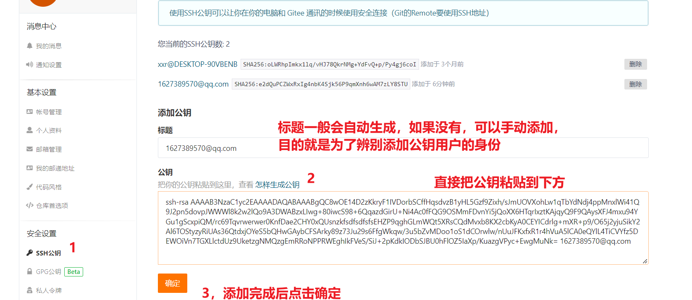
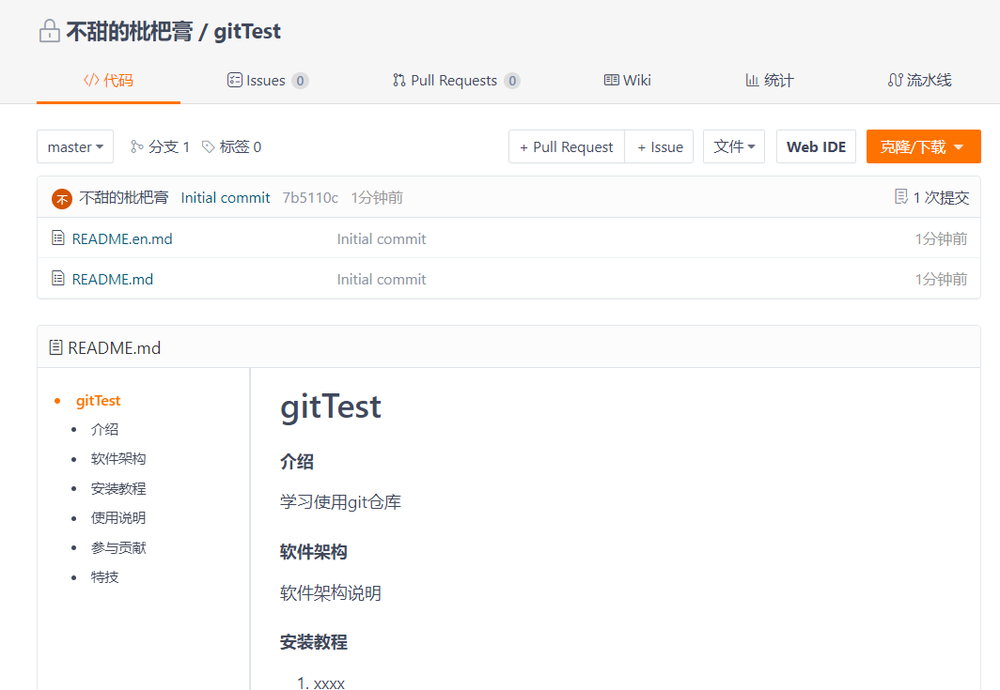
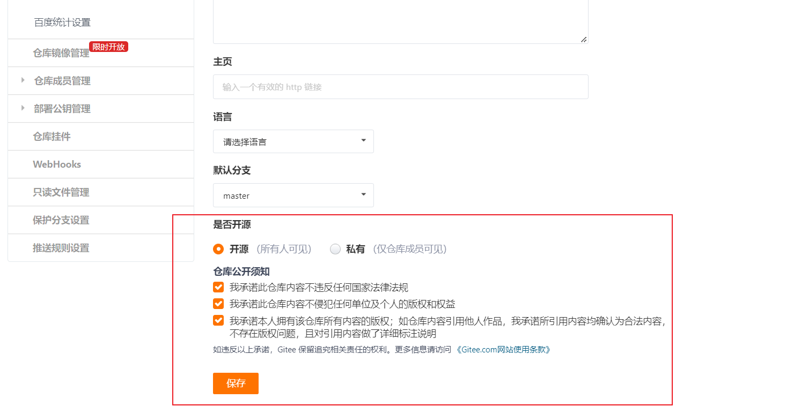
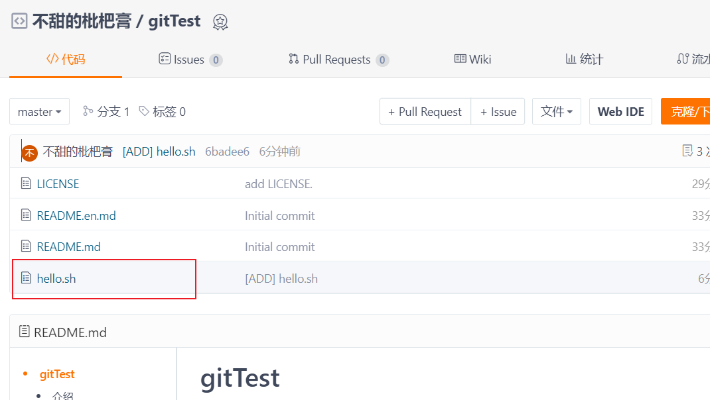
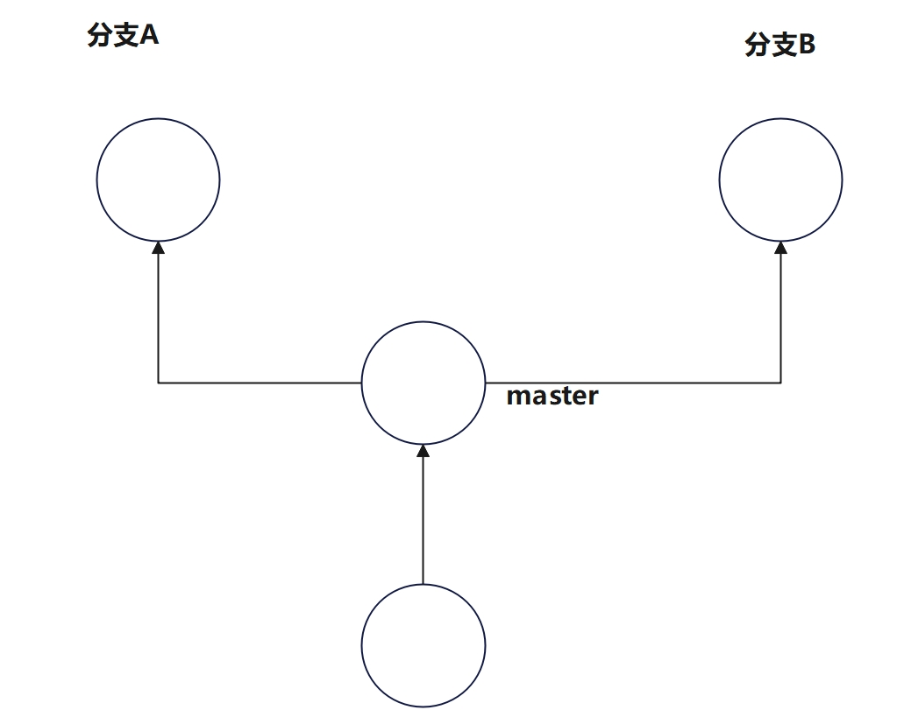
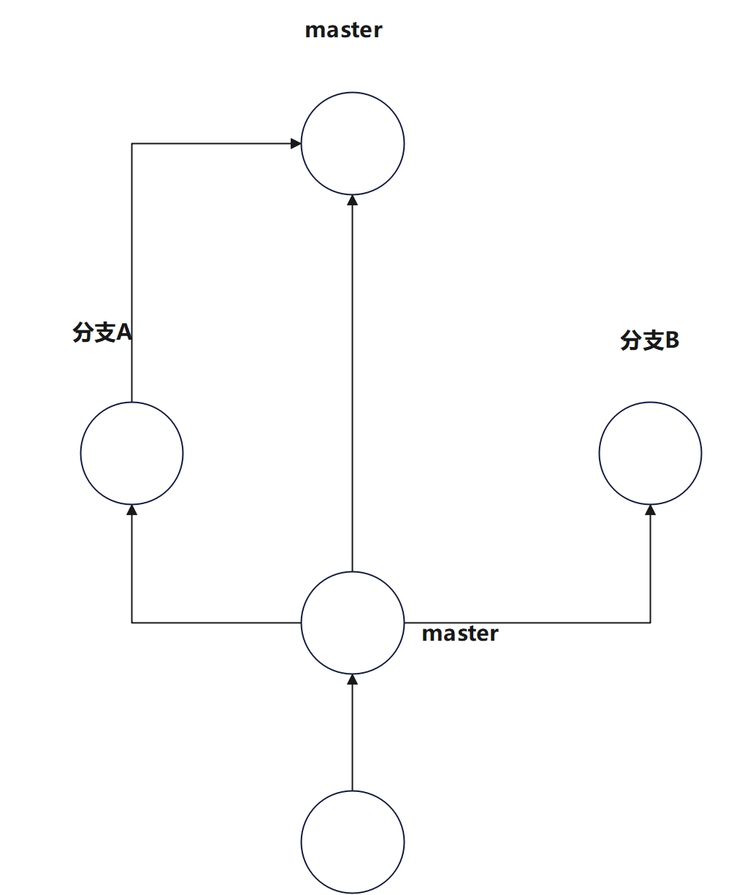
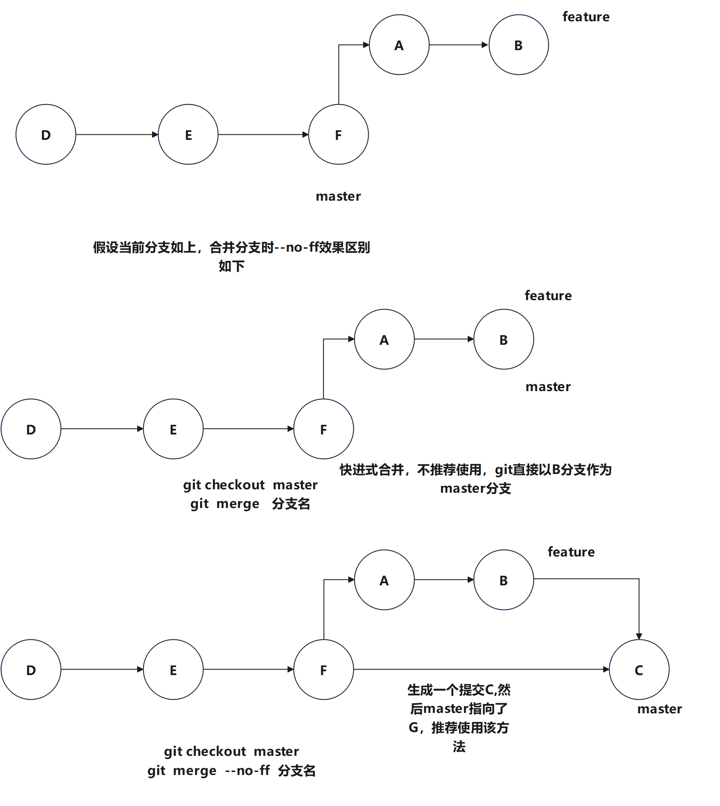
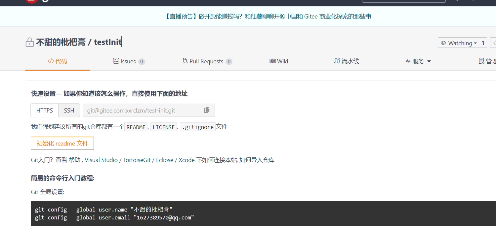
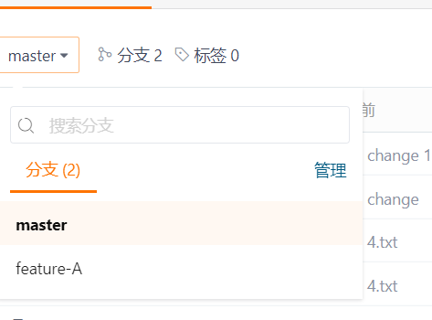

https://gitee.com/all-about-git (git教程参考)

# 1. github简介

此处的介绍以github参考进行讲解，国内的话就使用码云。


## 1.1 github的介绍

- github是为开放者提供git仓库托管服务，可以通过github和他人分享代表， 实现社会化编程。

- 其中git仓库的管理功能是github核心，所以学习使用github，最主要的知识就是掌握git的使用。

- git是Linux的创始人linus在2005开发了git的原型程序，目的就是为了解决linux内核开发中版本代码的版本管理问题。

- git本质上讲就是一个代码托管平台，可以根据你的提交记录来进行代码的管理，不同的代码分支完成不同版本的编写和版本的合并。

  

# 2. git的安装和使用

## 2.1 Linux环境

系统环境：Rocky 8.4

## 2.2 安装git

```bash
[root@localhost ~]# yum install -y git
Last metadata expiration check: 0:35:39 ago on Sun 24 Jul 2022 09:13:04 AM CST.
Dependencies resolved.
====================================================================================
 Package                Architecture Version                  Repository       Size
====================================================================================
Installing:
 git                    x86_64       2.31.1-2.el8             appstream       160 k
Installing dependencies:
 git-core               x86_64       2.31.1-2.el8             appstream       4.7 M
 git-core-doc           noarch       2.31.1-2.el8             appstream       2.6 M
 perl-Error             noarch       1:0.17025-2.el8          appstream        45 k
 perl-Git               noarch       2.31.1-2.el8             appstream        77 k
 perl-TermReadKey       x86_64       2.37-7.el8               appstream        39 k

Transaction Summary
====================================================================================
Install  6 Packages

Total download size: 7.7 M
Installed size: 38 M
Downloading Packages:
(1/6): git-2.31.1-2.el8.x86_64.rpm                  728 kB/s | 160 kB     00:00    
(2/6): perl-Error-0.17025-2.el8.noarch.rpm          990 kB/s |  45 kB     00:00    
(3/6): perl-Git-2.31.1-2.el8.noarch.rpm             1.5 MB/s |  77 kB     00:00    
(4/6): perl-TermReadKey-2.37-7.el8.x86_64.rpm       562 kB/s |  39 kB     00:00    
(5/6): git-core-doc-2.31.1-2.el8.noarch.rpm         4.7 MB/s | 2.6 MB     00:00    
(6/6): git-core-2.31.1-2.el8.x86_64.rpm             4.1 MB/s | 4.7 MB     00:01    
------------------------------------------------------------------------------------
Total                                               3.1 MB/s | 7.7 MB     00:02     
Running transaction check
Transaction check succeeded.
Running transaction test
Transaction test succeeded.
Running transaction
  Preparing        :                                                            1/1 
  Installing       : git-core-2.31.1-2.el8.x86_64                               1/6 
  Installing       : git-core-doc-2.31.1-2.el8.noarch                           2/6 
  Installing       : perl-TermReadKey-2.37-7.el8.x86_64                         3/6 
  Installing       : perl-Error-1:0.17025-2.el8.noarch                          4/6 
  Installing       : perl-Git-2.31.1-2.el8.noarch                               5/6 
  Installing       : git-2.31.1-2.el8.x86_64                                    6/6 
  Running scriptlet: git-2.31.1-2.el8.x86_64                                    6/6 
  Verifying        : git-2.31.1-2.el8.x86_64                                    1/6 
  Verifying        : git-core-2.31.1-2.el8.x86_64                               2/6 
  Verifying        : git-core-doc-2.31.1-2.el8.noarch                           3/6 
  Verifying        : perl-Error-1:0.17025-2.el8.noarch                          4/6 
  Verifying        : perl-Git-2.31.1-2.el8.noarch                               5/6 
  Verifying        : perl-TermReadKey-2.37-7.el8.x86_64                         6/6 
Installed products updated.

Installed:
  git-2.31.1-2.el8.x86_64                 git-core-2.31.1-2.el8.x86_64             
  git-core-doc-2.31.1-2.el8.noarch        perl-Error-1:0.17025-2.el8.noarch        
  perl-Git-2.31.1-2.el8.noarch            perl-TermReadKey-2.37-7.el8.x86_64       

Complete!


# 查看git的版本信息
[root@localhost ~]# git --version
git version 2.31.1

```

## 2.2 初始化设置

1. 设置使用git的用户姓名和邮箱地址（名字请使用英文）

   ```bash
   [root@localhost ~]# git config --global user.name "xxr"
   [root@localhost ~]# git config --global  user.email "1627389570@qq.com"
   [root@localhost ~]# cat ~/.gitconfig 
   [user]
   	name = xxr
   	email = 1627389570@qq.com
   
   ```

   注意：姓名和邮箱会保留在提交日志中。

2. 提高命令的输出可读性。

   - 根据输出的内容，加入语法高亮，增加可读性。

   ```bash
   [root@localhost ~]# git config --global  color.ui auto 
   [root@localhost ~]# cat ~/.gitconfig 
   [user]
   	name = xxr
   	email = 1627389570@qq.com
   [color]
   	ui = auto
   
   ```


## 2.3 使用github的前提准备

### 2.3.1 创建账号

https://blog.csdn.net/qq_41972686/article/details/118067139


### 2.3.2 设置ssh key

git的Remote仓库需要使用到ssh地址，设置了sshkey之后就可以让本地电脑和远程git仓库服务器建立安全的连接。

ssh密钥的作用

- 公钥是用来加密

- 私钥是用来解密

- 需要远程登录到哪台服务器，就把自己的公钥给谁


1. 创建ssh key

   ```bash
   # -t 指明加密的方式
   # -C 注释说明
   [root@localhost ~]# ssh-keygen -t rsa  -C "1627389570@qq.com"
   Generating public/private rsa key pair.
   Enter file in which to save the key (/root/.ssh/id_rsa): 
   Enter passphrase (empty for no passphrase): 
   Enter same passphrase again: 
   Your identification has been saved in /root/.ssh/id_rsa.
   Your public key has been saved in /root/.ssh/id_rsa.pub.
   The key fingerprint is:
   SHA256:e2dQuPCZWxRxIg4nbK4Sjk56P9qmXnh6wAM7zLY8STU 1627389570@qq.com
   The key's randomart image is:
   +---[RSA 3072]----+
   |       .o o +..  |
   |        o= o +   |
   |       o. o o    |
   |.  E.   .o *     |
   |o+.o.. .S * .    |
   |o=*.o .  . +     |
   |+=+oo.  . o o    |
   |.=o=+    . o     |
   | o**o.           |
   +----[SHA256]-----+
   
   # 注意：生成的密钥保存在~/.ssh/下，其中id_rsa是私钥，id_rsa.pub是公钥
   [root@localhost ~]# ls ~/.ssh/
   id_rsa  id_rsa.pub  known_hosts
   ```

   

2. 添加公钥

   - 查看并赋值公钥的内容

```bash
# 鼠标选中下方显示的公钥内容，右击复制
[root@localhost ~]# cat ~/.ssh/id_rsa.pub 
ssh-rsa AAAAB3NzaC1yc2EAAAADAQABAAABgQC8wOE14D2zKkryF1IVDorbSCffHqsdvzB1yHL5Gzf9Zixh/sJmUOVXohLw1qTbYdNdj4ppMnxlWi41Q9J2pn5dovpJWWWl8k2w2lQo9A3DWABzxLIwg+80iwcS98+6QqazdGirU+Ni4Ac0fFQG9OSMmFDvnYi5jQoXX6HTqrIxztKAjqyQ9F9QAysXFJ4mxu94YGu1gScxpiQM/rc69Tqvr0KnDae2CHY0xQUsnzkEHZP9qghGLmWQt5XRsCQdMvxb8KX2cbKyA0CEYICdrlg+mXR+p9/O65j2yjuSikY2Al6TOStyzyRiUAs36QtdxjOYeS5bQHwGAybCFSArky89z73Ju29s6FfgWkqw/3u5bZvMDoo1oS1dCOrwlw/nUuJFKxfxR1r4hVuA5lCA0eQYlL4TiCVYfz5DEWOiVn7TGXLlctdUz9UketzgNMQzgEmRRoNPPRWEghIkFVeS/SiJ+2pKdkIODbSJBU0hFlOZ5IaXp/KuazgVPyc+EwgMuNk= 1627389570@qq.com
      
```

- 将复制的内容粘贴至码云的ssh公钥管理设置界面




   

点击确定后，按照要求输入当前登录账号的密码即可完成添加。

- 测试ssh是否配置成功

```bash
[root@localhost ~]# ssh -T git@gitee.com
The authenticity of host 'gitee.com (212.64.63.190)' can't be established.
ECDSA key fingerprint is SHA256:FQGC9Kn/eye1W8icdBgrQp+KkGYoFgbVr17bmjey0Wc.
Are you sure you want to continue connecting (yes/no/[fingerprint])? yes
Warning: Permanently added 'gitee.com,212.64.63.190' (ECDSA) to the list of known hosts.
Hi 不甜的枇杷膏! You've successfully authenticated, but GITEE.COM does not provide shell access.

```


## 2.4 创建仓库


- 新建仓库


- 点击创建后，就可以进入创建的仓库，此处可以选择初始化README.md




## 2.5 码云的代码开源（需要审核，审核通过后开源）

- 点击仓库管理中的管理


-  鼠标下滑后，选择开源，并设置对应的开源协议，点击保存
- 注意：第一次开源时，会有一个选择开源开源协议的提示，点击选择，然后根据需求选择开源的协议。



- 开源的协议创建完成后，在仓库代码部分就会看到开源协议文件


## 2.6 公开代码

### 2.6.1 clone已有仓库

- 将远程仓库clone至本地开发环境中


- 配置本地开发环境

```bash
# 创建目录用来存放码云上的远程仓库
[root@localhost ~]# mkdir shell
[root@localhost ~]# cd shell/
[root@localhost shell]# ls

# 将远程仓库clone至本地目录中仓库名同名的目录下（该目录自动生成）
[root@localhost shell]# git  clone git@gitee.com:xxrclzm/git-test.git
Cloning into 'git-test'...
remote: Enumerating objects: 7, done.
remote: Counting objects: 100% (7/7), done.
remote: Compressing objects: 100% (7/7), done.
remote: Total 7 (delta 0), reused 0 (delta 0), pack-reused 0
Receiving objects: 100% (7/7), 6.45 KiB | 6.45 MiB/s, done.
[root@localhost shell]# ls
git-test

[root@localhost shell]# cd git-test/
[root@localhost git-test]# ls -a
.  ..  .git  LICENSE  README.en.md  README.md

```


### 2.6.2 编写代码

```bash
[root@localhost git-test]# ls -a
.  ..  .git  LICENSE  README.en.md  README.md
[root@localhost git-test]# vim hello.sh
[root@localhost git-test]# cat hello.sh 
#!/bin/bash
# date: 2022-7-24
# author: xxr
echo "hello"
[root@localhost git-test]# chmod u+x hello.sh 

[root@localhost git-test]# ls 
hello.sh  LICENSE  README.en.md  README.md
[root@localhost git-test]# ./hello.sh 
hello

```


### 2.6.3 提交

- git add . 命令：将当前路径下的文件加入到暂存区， 再通过git commit命令提交

- git  commit  -m   "提交的操作说明"： 该命令将暂存区的文件写入到git仓库里面

- git log   ： 该命令查看git提交的日志

- git  push  ： 将本地的git仓库中的代码提交到远程仓库中

  ```bash
  [root@localhost git-test]# ls
  hello.sh  LICENSE  README.en.md  README.md
  [root@localhost git-test]# git add .
  
  [root@localhost git-test]# git commit -m "[ADD] hello.sh"
  [master 6badee6] [ADD] hello.sh
   1 file changed, 4 insertions(+)
   create mode 100755 hello.sh
  [root@localhost git-test]# git log 
  commit 6badee67e7b0160e46f5c960d9a46f94c4053588 (HEAD -> master)
  Author: xxr <1627389570@qq.com>
  Date:   Sun Jul 24 11:20:08 2022 +0800
  
      [ADD] hello.sh
  
  commit defa1649a120b18a9eedc1141c292408d3e41c4e (origin/master, origin/HEAD)
  Author: 不甜的枇杷膏 <1627389570@qq.com>
  Date:   Sun Jul 24 02:57:03 2022 +0000
  
      add LICENSE.
  
  commit 7b5110ccf454b6e792191173eda3cb3842304c38
  Author: 不甜的枇杷膏 <1627389570@qq.com>
  Date:   Sun Jul 24 02:52:57 2022 +0000
  
      Initial commit
  
  # 使用git  push 推送到远程仓库中
  [root@localhost git-test]# git push 
  Warning: Permanently added the ECDSA host key for IP address '212.64.63.215' to the list of known hosts.
  Enumerating objects: 4, done.
  Counting objects: 100% (4/4), done.
  Delta compression using up to 2 threads
  Compressing objects: 100% (3/3), done.
  Writing objects: 100% (3/3), 324 bytes | 324.00 KiB/s, done.
  Total 3 (delta 1), reused 0 (delta 0), pack-reused 0
  remote: Powered by GITEE.COM [GNK-6.3]
  To gitee.com:xxrclzm/git-test.git
     defa164..6badee6  master -> master
  
  ```


- 远程仓库中就会发生更新

  


# 3. git的基本操作

## 3.1 git init ----初始化仓库

如果想使用git进行代码版本的管理，就必须先初始化仓库

- .git目录存储了当前目录中的仓库数据
- 文件的编辑操作都会被记录到.git目录中，如果不想使用git的化，只需要删除.git目录即可

```bash
[root@localhost shell]# ls -a
.  ..  git-test
[root@localhost shell]# mkdir test-Init
[root@localhost shell]# cd test-Init/

[root@localhost test-Init]# ls -a
.  ..
[root@localhost test-Init]# git init 
hint: Using 'master' as the name for the initial branch. This default branch name
hint: is subject to change. To configure the initial branch name to use in all
hint: of your new repositories, which will suppress this warning, call:
hint: 
hint: 	git config --global init.defaultBranch <name>
hint: 
hint: Names commonly chosen instead of 'master' are 'main', 'trunk' and
hint: 'development'. The just-created branch can be renamed via this command:
hint: 
hint: 	git branch -m <name>
Initialized empty Git repository in /root/shell/test-Init/.git/
[root@localhost test-Init]# ls -a
.  ..  .git

```


## 3.2 git status 

- 用于查看git仓库的状态，例如：当前目录下的文件是否被提交到仓库中

```bash
[root@localhost test-Init]# ls -a
.  ..  .git
[root@localhost test-Init]# git status 
On branch master

No commits yet

nothing to commit (create/copy files and use "git add" to track)
[root@localhost test-Init]# touch test.sh
[root@localhost test-Init]# git status 
On branch master

No commits yet

Untracked files:
  (use "git add <file>..." to include in what will be committed)
	test.sh

nothing added to commit but untracked files present (use "git add" to track)

```


## 3.3 git add

- 向暂存区中添加文件。暂存区是正式提交之前的一个临时区域

```bash
[root@localhost test-Init]# touch test.sh
[root@localhost test-Init]# git status 
On branch master

No commits yet

Untracked files:
  (use "git add <file>..." to include in what will be committed)
	test.sh

nothing added to commit but untracked files present (use "git add" to track)
[root@localhost test-Init]# git add test.sh 
[root@localhost test-Init]# git status 
On branch master

No commits yet

Changes to be committed:
  (use "git rm --cached <file>..." to unstage)
	new file:   test.sh


```


## 3.4 git commit

- 将当前暂存区中的文件实际保存到仓库的历史记录中，就可以对文件进行复原（注意： 每一次提交都先当于对代码创建了一份快照）

- -m  参数后面是提交的信息，是对提交文件的描述

  ```bash
  [root@localhost test-Init]# git status 
  On branch master
  
  No commits yet
  
  Changes to be committed:
    (use "git rm --cached <file>..." to unstage)
  	new file:   test.sh
  
  
  [root@localhost test-Init]# git commit -m "[ADD] test.sh"
  [master (root-commit) c7d84f7] [ADD] test.sh
   1 file changed, 0 insertions(+), 0 deletions(-)
   create mode 100644 test.sh
  [root@localhost test-Init]# git status 
  On branch master
  nothing to commit, working tree clean
  
  ```

题目: 创建文件1.txt，写入hello,然后将该文件提交到git仓库中。

```bash
[root@localhost test-Init]# echo "hello" > 1.txt
[root@localhost test-Init]# 
[root@localhost test-Init]# git status 
On branch master
Untracked files:
  (use "git add <file>..." to include in what will be committed)
	1.txt

nothing added to commit but untracked files present (use "git add" to track)
[root@localhost test-Init]# git add .
[root@localhost test-Init]# git status 
On branch master
Changes to be committed:
  (use "git restore --staged <file>..." to unstage)
	new file:   1.txt

[root@localhost test-Init]# git commit -m "[ADD] 1.txt"
[master ee87551] [ADD] 1.txt
 1 file changed, 1 insertion(+)
 create mode 100644 1.txt
[root@localhost test-Init]# git status 
On branch master
nothing to commit, working tree clean
[root@localhost test-Init]# git log 
commit ee87551f907ed632fdfef5fe4f98dfb24e3b166a (HEAD -> master)
Author: xxr <1627389570@qq.com>
Date:   Sun Jul 24 13:54:42 2022 +0800

    [ADD] 1.txt

commit c7d84f79c0641089bf21cae1c8efbd3c4625e7e5
Author: xxr <1627389570@qq.com>
Date:   Sun Jul 24 13:44:33 2022 +0800

    [ADD] test.sh

```


## 3.5 git  log

- git log 命令查看仓库中提交的日志信息

  ```bash
  [root@localhost test-Init]# git log 
  commit ee87551f907ed632fdfef5fe4f98dfb24e3b166a (HEAD -> master)
  Author: xxr <1627389570@qq.com>
  Date:   Sun Jul 24 13:54:42 2022 +0800
  
      [ADD] 1.txt
  
  commit c7d84f79c0641089bf21cae1c8efbd3c4625e7e5
  Author: xxr <1627389570@qq.com>
  Date:   Sun Jul 24 13:44:33 2022 +0800
  
      [ADD] test.sh
  
  ```

  

## 3.6 git  diff

- 查看更改前后区别（查看对于已提交的文件的内容改变情况）

```bash
[root@localhost test-Init]# git diff
[root@localhost test-Init]# touch 2.txt
[root@localhost test-Init]# git diff
[root@localhost test-Init]# git add .
[root@localhost test-Init]# git diff
[root@localhost test-Init]# git commit -m "[add] 2.txt"
[master 56b0d0f] [add] 2.txt
 1 file changed, 0 insertions(+), 0 deletions(-)
 create mode 100644 2.txt
[root@localhost test-Init]# git diff
[root@localhost test-Init]# echo "hello" > 2.txt 
# 注意，当提交的文件内容发生改变时，就可以使用git diff可以查看变化的内容
[root@localhost test-Init]# git diff
diff --git a/2.txt b/2.txt
index e69de29..ce01362 100644
--- a/2.txt
+++ b/2.txt
@@ -0,0 +1 @@
+hello
[root@localhost test-Init]# echo "world" > 1.txt 
[root@localhost test-Init]# git diff
diff --git a/1.txt b/1.txt
index ce01362..cc628cc 100644
--- a/1.txt
+++ b/1.txt
@@ -1 +1 @@
-hello
+world
diff --git a/2.txt b/2.txt
index e69de29..ce01362 100644
--- a/2.txt
+++ b/2.txt
@@ -0,0 +1 @@
+hello
[root@localhost test-Init]# git status
On branch master
Changes not staged for commit:
  (use "git add <file>..." to update what will be committed)
  (use "git restore <file>..." to discard changes in working directory)
	modified:   1.txt
	modified:   2.txt

no changes added to commit (use "git add" and/or "git commit -a")
[root@localhost test-Init]# git  add .
[root@localhost test-Init]# git status 
On branch master
Changes to be committed:
  (use "git restore --staged <file>..." to unstage)
	modified:   1.txt
	modified:   2.txt

[root@localhost test-Init]# git commit -m "[ADD] change"
[master f8ddd12] [ADD] change
 2 files changed, 2 insertions(+), 1 deletion(-)
[root@localhost test-Init]# git status 
On branch master
nothing to commit, working tree clean
[root@localhost test-Init]# git diff

```


题目： 再1.txt写入hello world内容，然后使用git diff查看提交前后的变化。 

```bash
[root@localhost test-Init]# git diff
[root@localhost test-Init]# echo "hello world" > 1.txt 
[root@localhost test-Init]# git diff
diff --git a/1.txt b/1.txt
index cc628cc..3b18e51 100644
--- a/1.txt
+++ b/1.txt
@@ -1 +1 @@
-world
+hello world
[root@localhost test-Init]# git add .
[root@localhost test-Init]# git commit -m "[ADD] change 1.txt"
[master bd4d38b] [ADD] change 1.txt
 1 file changed, 1 insertion(+), 1 deletion(-)
[root@localhost test-Init]# git diff

```


# 4. 分支操作



在并行开发时，就会涉及到分支的功能，以master作为模板，创建分支A和分支B，然后就可以在不同分支进行不同的功能的编写，然后等分支作业完成后，就可以于master分支进行合并。



## 4.1 git branch 

- git branch 显示分支，当前使用的分支前面会有* 

```bash
[root@localhost test-Init]# git branch 
* master
```


## 4.2 git  checkout  -b

-  git  checkout  -b 命令：创建并切换分支

- git  checkout -b  效果等同于git   branch 分支名（创建分支） 加上git  checkout 分支名（切换当前分支）

  ```bash
  [root@localhost test-Init]# git branch 
  * master
  [root@localhost test-Init]# git  branch feature-A
  [root@localhost test-Init]# git branch 
    feature-A
  * master
  [root@localhost test-Init]# git checkout feature-A 
  Switched to branch 'feature-A'
  [root@localhost test-Init]# git branch 
  * feature-A
    master
  [root@localhost test-Init]# ls 
  1.txt  2.txt  3.txt  test.sh
  
  ```

  题目：在分支A中，创建文件4.txt，并**提交至git仓库**，然后切换到master分支上，查看，master分支上是否有4.txt文档

  ```bash
  # 注意: 如果文件没有被提交到git仓库中，那么git仓库就不会对该文件进行管理，也就是git的命令不会影响到这些文件。
  
  [root@localhost test-Init]# git branch 
  * feature-A
    master
  [root@localhost test-Init]# ls
  1.txt  2.txt  3.txt  test.sh
  [root@localhost test-Init]# touch 4.txt
  [root@localhost test-Init]# ls
  1.txt  2.txt  3.txt  4.txt  test.sh
  [root@localhost test-Init]# git checkout  master 
  Switched to branch 'master'
  [root@localhost test-Init]# ls
  1.txt  2.txt  3.txt  4.txt  test.sh
  [root@localhost test-Init]# git checkout feature-A 
  Switched to branch 'feature-A'
  [root@localhost test-Init]# git add .
  [root@localhost test-Init]# git commit -m "[ADD] 4.txt"
  [feature-A 1c8251b] [ADD] 4.txt
   2 files changed, 1 insertion(+)
   create mode 100644 3.txt
   create mode 100644 4.txt
  
  [root@localhost test-Init]# ls 
  1.txt  2.txt  3.txt  4.txt  test.sh
  [root@localhost test-Init]# git branch master 
  fatal: A branch named 'master' already exists.
  [root@localhost test-Init]# git checkout  master 
  Switched to branch 'master'
  [root@localhost test-Init]# ls
  1.txt  2.txt  test.sh
  [root@localhost test-Init]# git branch 
    feature-A
  * master
  ```

  - 发现feature-A分支上做的修改，并没有影响到master分支的内容

- 补充说明

  删除分支: git  branch -d  分支名


## 4.3 git  merge 

- 分支的合并操作

  --no-ff 选项的作用： 进行快进式合并。

  


```bash
[root@localhost test-Init]# git branch 
  feature-A
* master
# 出现的文本编辑界面直接保存退出即可。
[root@localhost test-Init]# git merge --no-ff feature-A 
Merge made by the 'recursive' strategy.
 3.txt | 1 +
 4.txt | 0
 2 files changed, 1 insertion(+)
 create mode 100644 3.txt
 create mode 100644 4.txt
 
# feature-A中的内容已经和master合并
[root@localhost test-Init]# ls
1.txt  2.txt  3.txt  4.txt  test.sh

```


## 4.4  git log  --graph

- 以图形的方式来查看分支

```bash
[root@localhost test-Init]# git log --graph 
*   commit e264fbb8ee7d8dbc9d703fef541f58203ee640fa (HEAD -> master)
|\  Merge: bd4d38b 1c8251b
| | Author: xxr <1627389570@qq.com>
| | Date:   Sun Jul 24 15:02:21 2022 +0800
| | 
| |     Merge branch 'feature-A'
| | 
| * commit 1c8251bec5d0a31c68958aee5c5eef904d575fee (feature-A)
|/  Author: xxr <1627389570@qq.com>
|   Date:   Sun Jul 24 14:42:51 2022 +0800
|   
|       [ADD] 4.txt
| 
* commit bd4d38b9133691d968da45cac5def7f4812727f0
| Author: xxr <1627389570@qq.com>
| Date:   Sun Jul 24 14:09:16 2022 +0800
| 
|     [ADD] change 1.txt
| 
* commit f8ddd12d01c3628e421352725200ffe74b5978e2
| Author: xxr <1627389570@qq.com>
| Date:   Sun Jul 24 14:02:04 2022 +0800
| 
|     [ADD] change
| 

```


# 5. 更改提交的操作

## 5.1 git reset

- 回溯历史版本
- 回溯历史版本时，可以使用git  log  --graph命令查看到每一个提交记录后面都有一个哈希值，利用这些哈希值搭配使用 **git  reset --hard  哈希值**  可以回溯到指定时间的状态

```bash
[root@localhost test-Init]# git log --graph 
*   commit e264fbb8ee7d8dbc9d703fef541f58203ee640fa (HEAD -> master)
|\  Merge: bd4d38b 1c8251b
| | Author: xxr <1627389570@qq.com>
| | Date:   Sun Jul 24 15:02:21 2022 +0800
| | 
| |     Merge branch 'feature-A'
| | 
| * commit 1c8251bec5d0a31c68958aee5c5eef904d575fee (feature-A)
|/  Author: xxr <1627389570@qq.com>
|   Date:   Sun Jul 24 14:42:51 2022 +0800
|   
|       [ADD] 4.txt
| 
* commit bd4d38b9133691d968da45cac5def7f4812727f0
| Author: xxr <1627389570@qq.com>
| Date:   Sun Jul 24 14:09:16 2022 +0800
| 
|     [ADD] change 1.txt
| 
* commit f8ddd12d01c3628e421352725200ffe74b5978e2
| Author: xxr <1627389570@qq.com>
| Date:   Sun Jul 24 14:02:04 2022 +0800
| 
|     [ADD] change
| 
[root@localhost test-Init]# git branch 
  feature-A
* master


[root@localhost test-Init]# ls
1.txt  2.txt  3.txt  4.txt  test.sh
[root@localhost test-Init]# git reset --hard bd4d38b9133691d968da45cac5def7f4812727f0

HEAD is now at bd4d38b [ADD] change 1.txt
[root@localhost test-Init]# ls
1.txt  2.txt  test.sh

```

题目：将master分支回到  [ADD] change 1.txt的时间状态

- 补充点--利用git  reflog可以查看当前仓库执行过的操作日志，利用这些操作日志也可以进行恢复。

```bash
[root@localhost test-Init]# git reflog 
bd4d38b (HEAD -> master) HEAD@{0}: reset: moving to bd4d38b9133691d968da45cac5def7f4812727f0
1c8251b (feature-A) HEAD@{1}: reset: moving to 1c8251bec5d0a31c68958aee5c5eef904d575fee
e264fbb HEAD@{2}: merge feature-A: Merge made by the 'recursive' strategy.
bd4d38b (HEAD -> master) HEAD@{3}: checkout: moving from feature-A to master
1c8251b (feature-A) HEAD@{4}: commit: [ADD] 4.txt
bd4d38b (HEAD -> master) HEAD@{5}: checkout: moving from master to feature-A
bd4d38b (HEAD -> master) HEAD@{6}: checkout: moving from feature-A to master
bd4d38b (HEAD -> master) HEAD@{7}: checkout: moving from master to feature-A
bd4d38b (HEAD -> master) HEAD@{8}: commit: [ADD] change 1.txt
f8ddd12 HEAD@{9}: commit: [ADD] change
56b0d0f HEAD@{10}: commit: [add] 2.txt
ee87551 HEAD@{11}: commit: [ADD] 1.txt
c7d84f7 HEAD@{12}: commit (initial): [ADD] test.sh
[root@localhost test-Init]# git reset --hard e264fbb
HEAD is now at e264fbb Merge branch 'feature-A'
[root@localhost test-Init]# git log --graph 
*   commit e264fbb8ee7d8dbc9d703fef541f58203ee640fa (HEAD -> master)
|\  Merge: bd4d38b 1c8251b
| | Author: xxr <1627389570@qq.com>
| | Date:   Sun Jul 24 15:02:21 2022 +0800
| | 
| |     Merge branch 'feature-A'
| | 
| * commit 1c8251bec5d0a31c68958aee5c5eef904d575fee (feature-A)
|/  Author: xxr <1627389570@qq.com>
|   Date:   Sun Jul 24 14:42:51 2022 +0800
|   
|       [ADD] 4.txt
| 
* commit bd4d38b9133691d968da45cac5def7f4812727f0
| Author: xxr <1627389570@qq.com>
| Date:   Sun Jul 24 14:09:16 2022 +0800
| 
|     [ADD] change 1.txt
| 
* commit f8ddd12d01c3628e421352725200ffe74b5978e2
| Author: xxr <1627389570@qq.com>
| Date:   Sun Jul 24 14:02:04 2022 +0800
| 
|     [ADD] change
| 
* commit 56b0d0f45b622ce79e32f0adf283c11ccd6141aa

```

题目：利用git  reflog命令，将master分支回溯到合并分支的状态，完成后截个图。


## 5.2 git commit --amend

- 修改上一次提交的信息

- **git commit --amend**  执行命令后，就会进入编辑界面，对文档中的提交的内容进行修改保存即可

  ```bash
  [root@localhost test-Init]# touch 5.txt
  [root@localhost test-Init]# git add .
  [root@localhost test-Init]# git commit -m "[ADD] 4.txt"
  [master 39e4ce8] [ADD] 4.txt
   1 file changed, 0 insertions(+), 0 deletions(-)
   create mode 100644 5.txt
  [root@localhost test-Init]# git status 
  On branch master
  nothing to commit, working tree clean
  [root@localhost test-Init]# git log
  commit 39e4ce89ff95b61b752c33927a3de1de3a893bbd (HEAD -> master)
  Author: xxr <1627389570@qq.com>
  Date:   Sun Jul 24 15:34:37 2022 +0800
  
      [ADD] 4.txt
  
  commit e264fbb8ee7d8dbc9d703fef541f58203ee640fa
  Merge: bd4d38b 1c8251b
  Author: xxr <1627389570@qq.com>
  Date:   Sun Jul 24 15:02:21 2022 +0800
  
      Merge branch 'feature-A'
  
  commit 1c8251bec5d0a31c68958aee5c5eef904d575fee (feature-A)
  Author: xxr <1627389570@qq.com>
  Date:   Sun Jul 24 14:42:51 2022 +0800
  
      [ADD] 4.txt
  
  commit bd4d38b9133691d968da45cac5def7f4812727f0
  Author: xxr <1627389570@qq.com>
  Date:   Sun Jul 24 14:09:16 2022 +0800
  
      [ADD] change 1.txt
  
  commit f8ddd12d01c3628e421352725200ffe74b5978e2
  [root@localhost test-Init]# 
  # 执行命令后，就会进入编辑界面，对文档中的提交的内容进行修改保存即可
  [root@localhost test-Init]# git commit  --amend 
  [master 6966ad1] [ADD] 5.txt
   Date: Sun Jul 24 15:34:37 2022 +0800
   1 file changed, 0 insertions(+), 0 deletions(-)
   create mode 100644 5.txt
  [root@localhost test-Init]# git log
  commit 6966ad116350232a6cc93f66d9d5df0c7c3100a9 (HEAD -> master)
  Author: xxr <1627389570@qq.com>
  Date:   Sun Jul 24 15:34:37 2022 +0800
  
      [ADD] 5.txt
  ```

  题目： 在当前用户的家目录下自己创建目录gitTest02，然后完成git初始化，完成以下操作

  - 创建文件README.md
  - 然后写入hello word
  - 然后将该文件提交至git仓库
  - 查看提交前后的状态信息
  - 然后创建分支feature-A
  - 然后在feature-A中往README.md中写入hello,并创建文件1.txt
  - 将feature-A和并到master分支上（非快进方式）
  - 然后自己尝试回溯操作，分别切换至合并之前和合并之后

  

  # 6. 推送至远程仓库

- 首先在github上或者码云中创建一个远程仓库



## 6.1 git remote add

- 添加远程仓库

```bash
[root@localhost test-Init]# git remote add origin git@gitee.com:xxrclzm/test-init.git
[root@localhost test-Init]# pwd
/root/shell/test-Init

```

注意：此时只是将本地仓库和远程仓库关联起来，数据并没有整合


## 6.2 git  push

- git  push 推送至远程仓库，-u的作用：相当于记录了远端分支的默认值，使用了该选项之后，后续提交直接使用git  push就可以了。

```bash
[root@localhost test-Init]# git push -u origin "master"
Enumerating objects: 28, done.
Counting objects: 100% (28/28), done.
Delta compression using up to 2 threads
Compressing objects: 100% (23/23), done.
Writing objects: 100% (28/28), 5.83 KiB | 2.92 MiB/s, done.
Total 28 (delta 6), reused 0 (delta 0), pack-reused 0
remote: Powered by GITEE.COM [GNK-6.3]
To gitee.com:xxrclzm/test-init.git
 * [new branch]      master -> master
Branch 'master' set up to track remote branch 'master' from 'origin'.

```

注意：如果本地和远端有冲突，且想要使用本地去覆盖掉远端仓库内容，可以在推送时，使用--force选项

```bash
[root@localhost test-Init]# git push
To gitee.com:xxrclzm/test-init.git
 ! [rejected]        master -> master (fetch first)
error: failed to push some refs to 'gitee.com:xxrclzm/test-init.git'
hint: Updates were rejected because the remote contains work that you do
hint: not have locally. This is usually caused by another repository pushing
hint: to the same ref. You may want to first integrate the remote changes
hint: (e.g., 'git pull ...') before pushing again.
hint: See the 'Note about fast-forwards' in 'git push --help' for details.
# 注意如果想用本地仓库强制推送到远端可以使用--force
[root@localhost test-Init]# git push --force
Enumerating objects: 32, done.
Counting objects: 100% (32/32), done.
Delta compression using up to 2 threads
Compressing objects: 100% (27/27), done.
Writing objects: 100% (32/32), 6.18 KiB | 3.09 MiB/s, done.
Total 32 (delta 8), reused 0 (delta 0), pack-reused 0
remote: Powered by GITEE.COM [GNK-6.3]
To gitee.com:xxrclzm/test-init.git
 + 0be5784...004ff1b master -> master (forced update)
```


## 6.3 推送master以外的分支

- git  push  -u origin  分支名
- origin是远端仓库的路径别名（git remote add origin git@gitee.com:xxrclzm/test-init.git）

```bash
# 当前git仓库中有2个分支，另一个分支为feature-A
[root@localhost test-Init]# git branch 
  feature-A
* master
[root@localhost test-Init]# git push -u origin feature-A 
Total 0 (delta 0), reused 0 (delta 0), pack-reused 0
remote: Powered by GITEE.COM [GNK-6.3]
remote: Create a pull request for 'feature-A' on Gitee by visiting:
remote:     https://gitee.com/xxrclzm/test-init/pull/new/xxrclzm:feature-A...xxrclzm:master
To gitee.com:xxrclzm/test-init.git
 * [new branch]      feature-A -> feature-A
Branch 'feature-A' set up to track remote branch 'feature-A' from 'origin'.

```




# 7. 从远程仓库获取

## 7.1 git clone

- 远程获取仓库
- 使用git clone的好处： 执行git clone命令我们默认就在master分支下，同时系统会自动将origin设置为远程仓库的别名，也就是说使用git clone之后，本地仓库默认就和远端参考仓库关联起来，而且由于是克隆过来的，本地和远端不存在冲突的问题。

```bash
# 注意，克隆时，当前路径下不要出现和远程仓库同名的目录！！
[root@localhost shell]# mkdir testinit02
[root@localhost shell]# cd testinit02/
[root@localhost testinit02]# pwd
/root/shell/testinit02
[root@localhost testinit02]# ls
# 能使用clone推荐使用clone
[root@localhost testinit02]# git clone git@gitee.com:xxrclzm/test-init.git
Cloning into 'test-init'...
remote: Enumerating objects: 32, done.
remote: Counting objects: 100% (32/32), done.
remote: Compressing objects: 100% (27/27), done.
remote: Total 32 (delta 8), reused 0 (delta 0), pack-reused 0
Receiving objects: 100% (32/32), 6.18 KiB | 6.18 MiB/s, done.
Resolving deltas: 100% (8/8), done.
[root@localhost testinit02]# ls
test-init
[root@localhost testinit02]# cd test-init/
[root@localhost test-init]# ls
1.txt  2.txt  3.txt  4.txt  5.txt  6.txt  7.txt  8.txt  README.md
[root@localhost test-init]# ls -a
.  ..  1.txt  2.txt  3.txt  4.txt  5.txt  6.txt  7.txt  8.txt  .git  README.md
[root@localhost test-init]# rm -f 8.txt 
[root@localhost test-init]# git add .
[root@localhost test-init]# git commit -m "[RM] 8.txt"
[master ae000e3] [RM] 8.txt
 1 file changed, 0 insertions(+), 0 deletions(-)
 delete mode 100644 8.txt
[root@localhost test-init]# git push
Enumerating objects: 3, done.
Counting objects: 100% (3/3), done.
Delta compression using up to 2 threads
Compressing objects: 100% (1/1), done.
Writing objects: 100% (2/2), 220 bytes | 220.00 KiB/s, done.
Total 2 (delta 1), reused 1 (delta 1), pack-reused 0
remote: Powered by GITEE.COM [GNK-6.3]
To gitee.com:xxrclzm/test-init.git
   004ff1b..ae000e3  master -> master

```


## 7.2 获取远程的分支

- git checkout -b 本地分支名   远端分支路径
- git checkout -b feature-A origin/feature-A 

```bash
[root@localhost test-init]# git branch 
* master
[root@localhost test-init]# git checkout -b feature-A origin/feature-A 
Branch 'feature-A' set up to track remote branch 'feature-A' from 'origin'.
Switched to a new branch 'feature-A'
[root@localhost test-init]# ls
1.txt  2.txt  3.txt  4.txt  5.txt  test.sh
[root@localhost test-init]# ls
1.txt  2.txt  3.txt  4.txt  5.txt  test.sh
[root@localhost test-init]# git branch 
* feature-A
  master
```


## 7.3 git  pull

- 拉取远程分支的最新内容

  ```bash
  [root@localhost test-init]# git pull 
  remote: Enumerating objects: 4, done.
  remote: Counting objects: 100% (4/4), done.
  remote: Compressing objects: 100% (2/2), done.
  remote: Total 3 (delta 1), reused 0 (delta 0), pack-reused 0
  Unpacking objects: 100% (3/3), 966 bytes | 966.00 KiB/s, done.
  From gitee.com:xxrclzm/test-init
     ae000e3..0a2a10d  master     -> origin/master
  Updating ae000e3..0a2a10d
  Fast-forward
   pull.sh | 1 +
   1 file changed, 1 insertion(+)
   create mode 100644 pull.sh
  [root@localhost test-init]# ls
  1.txt  2.txt  3.txt  4.txt  5.txt  6.txt  7.txt  pull.sh  README.md
  
  ```


### 本地删除任意文件，然后尝试git  pull方法拉取，如果不行的话，请尝试进行回溯操作

```bash
[root@localhost test-init]# git  reflog 
0a2a10d (HEAD -> master, origin/master, origin/HEAD) HEAD@{0}: reset: moving to 0a2a10d
d6dc103 HEAD@{1}: commit: [RM] rm pull.sh
# 找到当时拉取时的操作
0a2a10d (HEAD -> master, origin/master, origin/HEAD) HEAD@{2}: pull: Fast-forward
ae000e3 (origin/origin/feature-A) HEAD@{3}: checkout: moving from feature-A to master
31ffc1f (origin/feature-A, feature-A) HEAD@{4}: checkout: moving from master to feature-A
ae000e3 (origin/origin/feature-A) HEAD@{5}: checkout: moving from feature-A to master
39d7bb2 HEAD@{6}: pull --rebase (finish): returning to refs/heads/feature-A
39d7bb2 HEAD@{7}: pull --rebase (pick): [RM] 8.txt
ff2bbfd HEAD@{8}: pull --rebase (pick): [ADD] 8.txt
08e1b41 HEAD@{9}: pull --rebase (pick): [ADD] 7.txt
04b42fa HEAD@{10}: pull --rebase (pick): 删除文件 test.sh
55d6fbb HEAD@{11}: pull --rebase (pick): [ADD] test.sh
7c357f0 HEAD@{12}: pull --rebase (pick): 删除文件 test.sh
f2391a6 HEAD@{13}: pull --rebase (pick): [ADD] test.sh
ac26e74 HEAD@{14}: pull --rebase (pick): 删除文件 test.sh
2defbc5 HEAD@{15}: pull --rebase (pick): add README.md.
31ffc1f (origin/feature-A, feature-A) HEAD@{16}: pull --rebase (start): checkout 31ffc1fe73e387efc1186b51e6c4fa251d3dc449
5b95dab HEAD@{17}: pull: Merge made by the 'recursive' strategy.
ae000e3 (origin/origin/feature-A) HEAD@{18}: checkout: moving from master[root@localhost test-init]# 
[root@localhost test-init]# git reset --hard 0a2a10d 
HEAD is now at 0a2a10d add pull.sh.
[root@localhost test-init]# ls
1.txt  2.txt  3.txt  4.txt  5.txt  6.txt  7.txt  pull.sh  README.md

```

补充 ：git log也可以查找对应的哈希值

补充：如果误删文件也可以直接在当前路径下使用**git checkout .**

checkout 本意是检出的意思，也就是将某次commit的状态检出到工作区；所以它的过程是先将`HEAD`指向某个分支的最近一次commit，然后从commit恢复index，最后从index恢复工作区。


windows使用git的方式和Linux基本一致，注意鼠标右击**git bash here**


注意：先git init初始化当前目录

然后使用git remote add origin git@gitee.com:xxrclzm/note.git

然后使用git add . 将所有文件加入到暂存区

然后使用git  commit -m  "[ADD] note" 提交到git仓库中

最后使用git push -u origin "master" 推送至远程仓库

将课程笔记添加到桌面，然后解压，将里面的pdf删除


休息15分钟，然后14点29继续

