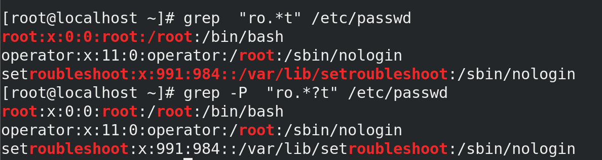
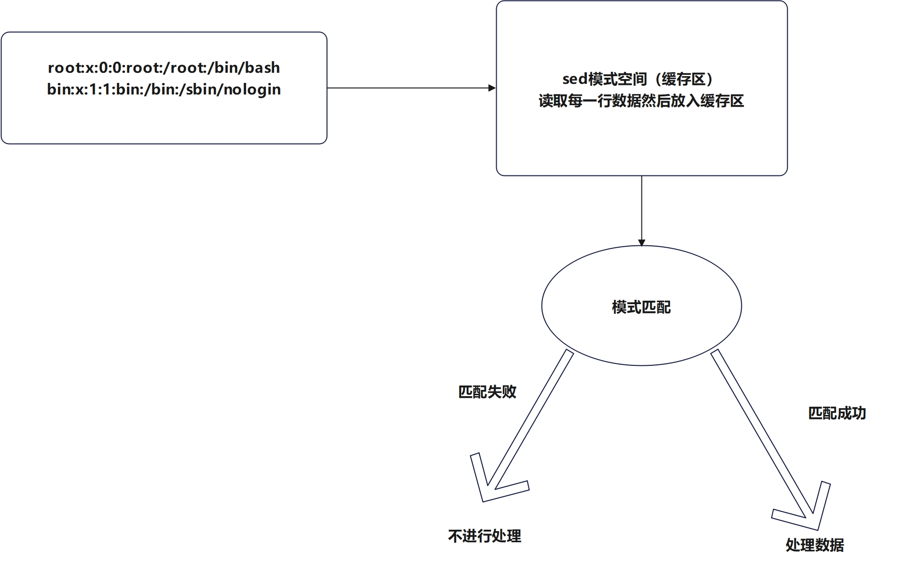

# 一. 正则表达式

## 1.1 正则表达式

正则表达式在线工具：https://c.runoob.com/front-end/854/

正则表达式：由一类特殊字符以及文本字符所编写的模式，其中有些字符不表示其字面含义，而是用于表示控制和通配的功能。

一般情况下分为两类

- 基本正则表达式：BRE
- 扩展正则表达式：ERE


## 1.2 正则表达式的意义

- 处理大量字符串
- 处理文本

通过使用正则表达式中特殊的符号，可以让linux的用户可以快速过滤，替换以及处理需要的字符串或文本，让工作更高效。

例如：

- 配置文件
- 程序的代码
- 命令输出的结果
- 日志文件

在上述文本内容中，想要找到指定的内容，就可以使用到正则表达式

- 在linux中，一般情况下，只有（grep，awk, sed）支持正则表达式，其他命令一般不支持。

  注意: 通配符和正则表达式是有区别的，大部分命令支持通配符不支持正则表达式

- 通配符一般在shell匹配文件名时用到，例如ls，cp,rm等。

### 1.2.1 shell常见的通配符

| 通配符                   | 含义                                       | 实例                                                         |
| ------------------------ | ------------------------------------------ | ------------------------------------------------------------ |
| *                        | 匹配0或多个字符                            | a*b a与b之间可以有任意长度的字符，例如aabb,ab                |
| ?                        | 匹配任意一个字符                           | a?b a与b之间必须且只能有一个任意字符，例如acb，adb，a0b      |
| [list]                   | 匹配任意单一字符                           | a[xyz]b,那么a与b之间只能有一个字符且必须来自[xyz]中的任意一个，例如axb,ayb等 |
| [!list]或者\[^list]      | 匹配除了list中的任意单一字符               | a[!0-9]b  a与b之间必须有一个字符，但不能是数字，例如axb，ayb |
| [c1-c2]                  | 匹配c1-c2中的任意单一字符，如：[0-9],[a-z] | a[0-9]b  a与b之间必须有一个字符，而且只能是数字，例如a9b，a2b |
| [!c1-c2]或者\[^c1-c2]    | 匹配不在c1-c2中的任意单一字符              | a[!0-9]b  a与b之间必须有一个字符，但不能是数字，例如axb，ayb |
| {string1,string2,......} | 匹配string1或者string2其字符串             | a{abc,xyz,123}b，列出aabcb,axyzb,a123b                       |

**题目：使用通配符查看/etc下host开头的文件**


### 1.2.2 正则表达式

- 正则表达式

  | 符号   | 作用                                                         |
  | ------ | ------------------------------------------------------------ |
  | ^      | 尖三角，用于模式的最左侧，如"^root",匹配root开头的行         |
  | $      | 美元符，用于模式的最右侧，如“bash$”,匹配以bash结尾的行       |
  | ^$     | 代表空行                                                     |
  | .      | 匹配任意一个且只有一个字符                                   |
  | \      | 转义符，让特殊意义的字符表示字符本身的含义，如果\\.就代表小数点 |
  | *      | 量词，匹配前一个字符（连续出现）0次或者1次以上，重复0次代表空（如果*前没有内容） |
  | .*     | 组合符，匹配所有内容                                         |
  | ^.*    | 组合符，匹配任意多个字符开头的内容                           |
  | .*$    | 组合符，匹配任意多个字符结尾的内容                           |
  | [abc]  | 匹配[]集合内的任意一个字符，a或c或b，也可以写成[a-c]，[0-9]  |
  | [^abc] | 除了^后面的任意字符                                          |

- 扩展正则表达式ERE

  扩展正则表达式必须使用grep -E 才能生效
  
  | 字符   | 作用                                                         |
  | ------ | ------------------------------------------------------------ |
  | +      | 匹配前一个字符1次或者多次                                    |
  | [ab]+  | 匹配括号内的a或者b字符1次或者多次                            |
  | ?      | 匹配前一个字符0次或者1次                                     |
  | \|     | 表示或者，可以同时过滤多个字符，注意两边如果有空格的话，也算匹配内容的一部分 |
  | a{n,m} | 匹配前一个字符串最少n次，最多m次                             |
  | a{n, } | 匹配前一个字符最少n次                                        |
  | a{n}   | 匹配前一个字符正好n次                                        |
  | a{,m}  | 匹配前一个字符最多m次                                        |


# 二. grep命令

## 2.1 命令格式

grep   [选项]   [匹配模式]   文件数据

- 匹配模式中，就是我们想要过滤获取的数据对象
- 常见选项：
  - -i: 忽略大小写
  - -o: 仅显示匹配到的字符串本身
  - -v： 反选，过滤出不含有指定字符的内容
  - -E：支持使用扩展正则表达式
  - -x:  只匹配过滤的内容，效果如下

```bash
[root@localhost ~]# touch 11.txt
[root@localhost ~]# ls | grep 1.txt
11.txt
1.txt
# 等同^关键字$
[root@localhost ~]# ls | grep  ^1.txt$
1.txt
[root@localhost ~]# ls | grep  -x  1.txt
1.txt

```

- -n ： 显示行号
- -c：统计匹配到的行数
- -P : 默认情况下grep是贪心匹配，使用-P之后支持非贪心匹配

贪心匹配和非贪心匹配

- 如果在量词后面加?代表非贪心匹配，默认是贪心匹配
- 贪心匹配: 会尽可能匹配符合条件的字符串
- 非贪心匹配：只要在匹配过程中，首次符合条件的就会把匹配过滤出来。



```bash
[root@localhost ~]# grep  "ro.*t" /etc/passwd
root:x:0:0:root:/root:/bin/bash
operator:x:11:0:operator:/root:/sbin/nologin
setroubleshoot:x:991:984::/var/lib/setroubleshoot:/sbin/nologin
[root@localhost ~]# grep -P  "ro.*?t" /etc/passwd
root:x:0:0:root:/root:/bin/bash
operator:x:11:0:operator:/root:/sbin/nologin
setroubleshoot:x:991:984::/var/lib/setroubleshoot:/sbin/nologin

```


## 2.2 实操案例

1. 列出不可以登录终端的用户信息

```bash
[root@localhost ~]# grep "nologin$" /etc/passwd
bin:x:1:1:bin:/bin:/sbin/nologin
daemon:x:2:2:daemon:/sbin:/sbin/nologin
adm:x:3:4:adm:/var/adm:/sbin/nologin
lp:x:4:7:lp:/var/spool/lpd:/sbin/nologin
mail:x:8:12:mail:/var/spool/mail:/sbin/nologin
operator:x:11:0:operator:/root:/sbin/nologin
games:x:12:100:games:/usr/games:/sbin/nologin
ftp:x:14:50:FTP User:/var/ftp:/sbin/nologin
nobody:x:65534:65534:Kernel Overflow User:/:/sbin/nologin
dbus:x:81:81:System message bus:/:/sbin/nologin
systemd-coredump:x:999:997:systemd Core Dumper:/:/sbin/nologin

```


2 . ^$ 列出文档中空行的行数

```bash
[root@localhost ~]# grep -n "^$" /etc/selinux/semanage.conf 
32:
38:
43:
55:

```


3. 匹配r开头，t结尾的字符，且r和t之间只有2个字符。

```bash
root@localhost ~]# grep "r..t" /etc/passwd
root:x:0:0:root:/root:/bin/bash
operator:x:11:0:operator:/root:/sbin/nologin
ftp:x:14:50:FTP User:/var/ftp:/sbin/nologin
clevis:x:994:988:Clevis Decryption Framework unprivileged user:/var/cache/clevis:/sbin/nologin

```

4. 列出/etc目录下以.d结尾的文件名 ，完成后截图

```bash
[root@localhost ~]# ls /etc/  | grep "\.d$"
bash_completion.d
binfmt.d
chkconfig.d
cron.d
depmod.d
dnsmasq.d
dracut.conf.d
exports.d
grub.d
init.d
issue.d

```


grep  -o选项的用法: 仅显示匹配到字符本身

5 .提取/etc/passwd中student01,student02类似的用户名，

以student开头，且后面为2位位数字结尾的字段

```bash
[root@localhost ~]# grep -o "^student[0-9][0-9]" /etc/passwd
student01
student02
student03
[root@localhost ~]# grep -o "student[0-9][0-9]" /etc/passwd
student01
student01
student02
student02
student03
student03
[root@localhost ~]# grep  "student[0-9][0-9]" /etc/passwd
student01:x:1002:1003::/home/student01:/bin/bash
student02:x:1003:1004::/home/student02:/bin/bash
student03:x:1004:1005::/home/student03:/sbin/nologin
[root@localhost ~]# grep  "^student[0-9][0-9]" /etc/passwd 
student01:x:1002:1003::/home/student01:/bin/bash
student02:x:1003:1004::/home/student02:/bin/bash
student03:x:1004:1005::/home/student03:/sbin/nologin

```

6.提取一下ifconfig中的广播地址，类似192.168. X.255 完成，

```bash
[root@localhost ~]# ifconfig | grep -o "192\.168\.[0-9]*\.255"
192.168.182.255
192.168.122.255

```


7. \+号的使用

```bash
[root@localhost ~]# grep -E  "ro+t" /etc/passwd
root:x:0:0:root:/root:/bin/bash
operator:x:11:0:operator:/root:/sbin/nologin


[root@localhost ~]# grep -E  "r[oO]+t" /etc/passwd
root:x:0:0:root:/root:/bin/bash
operator:x:11:0:operator:/root:/sbin/nologin

```

8. ？的使用

```bash
[root@localhost ~]# grep -E  "ro?t" /etc/passwd
rtkit:x:172:172:RealtimeKit:/proc:/sbin/nologin

```


9.| 的使用

```bash
[root@localhost ~]# grep -E  "root|bash" /etc/passwd
root:x:0:0:root:/root:/bin/bash
operator:x:11:0:operator:/root:/sbin/nologin
student:x:1000:1000:student:/home/student:/bin/bash
containers:x:1001:1001::/home/containers:/bin/bash
student01:x:1002:1003::/home/student01:/bin/bash
student02:x:1003:1004::/home/student02:/bin/bash

```


10. a{n,m}

```bash
[root@localhost ~]# grep -E  "ro{0,2}t" /etc/passwd
root:x:0:0:root:/root:/bin/bash
operator:x:11:0:operator:/root:/sbin/nologin
rtkit:x:172:172:RealtimeKit:/proc:/sbin/nologin

```


11. 不使用-i，完成root关键字忽略大小写的使用

    ```bash
    [root@localhost ~]# grep -E  "[Rr][Oo][Oo][Tt]" /etc/passwd
    root:x:0:0:root:/root:/bin/bash
    operator:x:11:0:operator:/root:/sbin/nologin
    
    ```

    

12. 查找/etc/selinux/semanage.conf 非空白行 (3分钟)，做完后截图 05继续

    ```bash
    # 方法1
    [root@localhost ~]# grep -v "^$" /etc/selinux/semanage.conf
    
    # 方法2
    [root@localhost ~]# grep -E  "^.+$" /etc/selinux/semanage.conf
    
    # 方法3
    [root@localhost ~]# grep -E  "." /etc/selinux/semanage.conf 
    
    # 方法4
    [root@localhost ~]# grep -E  "^[^$]" /etc/selinux/semanage.conf
    
    # 等其他方法，方法不唯一，但是一定要检查结果是不是自己想要的
    ```

13.  提取/etc/selinux/semanage.conf中不含空白行，不含注释的内容，并保存到当前用户的家目录路径下semanage.conf

    ```bash
    # 方法1
    [root@localhost ~]# grep  "^[^$]" /etc/selinux/semanage.conf | grep "^[^#]"   
    # 方法2
    grep  "^[^#]" /etc/selinux/semanage.conf
    # 方法3
    [root@localhost ~]# grep  "^[^#^$]" /etc/selinux/semanage.conf
    # 等其他方法
    ```

    

    

    

    14. 利用grep将里面的英文单词提取出来

    ```bash
    # 等其他方法，Other methods, methods are not unique, but be sure to check the result is not what you want方法不唯一，但是一定要检查结果是不是自己想要的 
    [root@localhost ~]# grep  -Eo "[a-zA-Z]+" 1.txt 
    Other
    methods
    methods
    are
    not
    unique
    but
    be
    sure
    to
    check
    the
    result
    is
    not
    what
    you
    want
    
    ```

    

15. 将里面的1.txt中的英文单词提取出来

    


# 三. awk命令

## 3.1 概述

awk是专门位文本处理设计的编程语句，其中文件的每行数据称之为记录，默认以空格或者制表符作为分隔符，每条记录被分隔成若干字段（列），awk每次文件中读取一条记录，然后进行分割处理。

## 3.2 基本语法

- 语法格式

```bash
awk  [选项]   '条件{动作} 条件{动作} ...  ...' 文件名
```


- print指令

  可以输入常量和变量，如果是字符串的话，需要用双引号括起来，数字常量可以直接打印

  - -F　指定分隔符，默认是空格，换行符，制表符。

  -Ｆ和 $n的使用($n代表是取的第n列)

  ```bash
  awk -F : '{print "username: " $1}' /etc/passwd
  ```

  题目： 将/etc/passwd中提取用户名和他的uid，完成后截图

```bash
[root@localhost ~]# awk -F : '{print "username: " $1 " uid: " $3}' /etc/passwd
```


## 3.3 内置变量

awk语法是由一系列的条件和动作组成，在花括号内可以由多个动作，多个动作之间用分号分隔，在多个条件和动作之间可以由若干空格，也可以没有。

如果没有指定条件则匹配所有数据，如果没有指定默认动作则默认为print打印。

- 常见的内置变量

| 变量     | 描述                                                         |
| -------- | ------------------------------------------------------------ |
| FILENAME | 当前输入文档的名字                                           |
| FNR      | 当前输入文档的当前行号，尤其由多个输入文档时可以用来分辨哪个文档中 |
| NR       | 当前输入数据流的当前行号                                     |
| $0       | 当前行的全部数据内容                                         |
| $n       | 当前行的第n个字段的内容(n>=1)                                |
| NF       | 当前记录（行）的字段(列个数)                                 |
| FS       | 字段分隔符，默认为空格或者Tab制表符                          |
| OFS      | 输出字段分隔符，默认空格                                     |
| ORS      | 输出记录的分隔符，默认为换行符\n                             |
| RS       | 输入记录分隔符，默认为换行符\n                               |


1. **FILENAME**

```bash
# 列出当前文件的名字
[root@localhost ~]# awk -F :  '{print "filename: " FILENAME }' /etc/passwd
filename: /etc/passwd
filename: /etc/passwd
filename: /etc/passwd
filename: /etc/passwd
filename: /etc/passwd
filename: /etc/passwd

```


2. FNR和NR

   本质上就是输出每个文件处理的行号，FNR是按文件来分，新读取一个文件时，行号从头开始，而NR可以理解成先将多个 文件整合成一个大文件，然后输出这个大文件内容的行号

```bash
[root@localhost ~]# awk -F :  '{print "filename: " FILENAME  "-----,FNR " FNR }' /etc/passwd /etc/hosts 
filename: /etc/passwd-----,FNR 1
filename: /etc/passwd-----,FNR 2
filename: /etc/passwd-----,FNR 3

........
filename: /etc/passwd-----,FNR 49
filename: /etc/passwd-----,FNR 50
filename: /etc/hosts-----,FNR 1
filename: /etc/hosts-----,FNR 2


[root@localhost ~]# awk -F :  '{print "filename: " FILENAME  "-----,NR " NR }' /etc/passwd /etc/hosts 
filename: /etc/passwd-----,NR 1
filename: /etc/passwd-----,NR 2
filename: /etc/passwd-----,NR 3
.......
filename: /etc/passwd-----,NR 49
filename: /etc/passwd-----,NR 50
filename: /etc/hosts-----,NR 51
filename: /etc/hosts-----,NR 52

```


3. **$0和$n**

   n代表的是一个数值，用来获取第n列的值

```bash
# 注意第0列指的显示该行的所有数据
[root@localhost ~]# awk -F :  '{print $1}' /etc/passwd
```


4. **NF** 

​	输出当前行有几个字段（利用这个特性，就可以去取文件的最后一列的值）

```bash
[root@localhost ~]# awk -F :  '{print NF}' /etc/passwd
7
7
7
7
7
7
7
7
7
7

# 结合使用$n的特性，就可以取出每一行的最后一列。
[root@localhost ~]# awk -F :  '{print $NF}' /etc/passwd
/bin/bash
/sbin/nologin
/sbin/nologin
/sbin/nologin
/sbin/nologin
/bin/sync
/sbin/shutdown
/sbin/halt


```


5. FS

   打印当前字段的分隔符，默认是空格或者tab制表符

```bash
[root@localhost ~]# awk -F : '{print FS}' /etc/passwd
:
:
:
:
:
```


6. RS,ORS,FS,OFS

   - RS和ORS

   RS保存的是输入数据的行分隔符，默认\n，当然也可以指定其他字段作为行分隔符，ORS保存的是输出字段的行分隔符。

   ```bash
   [root@localhost ~]# awk '{print RS}' /etc/passwd
    
    
    
   [root@localhost ~]# awk -v ORS="<----->"  '{print $1}' /etc/passwd
   root:x:0:0:root:/root:/bin/bash<----->bin:x:1:1:bin:/bin:/sbin/nologin<----->daemon:x:2:2:daemon:/sbin:/sbin/nologin<----->adm:x:3:4:adm:/var/adm:/sbin/nologin<----->
    
    
    
    [root@localhost ~]# cat /etc/hosts 
   127.0.0.1   localhost localhost.localdomain localhost4 localhost4.localdomain4
   ::1         localhost localhost.localdomain localhost6 localhost6.localdomain6
   [root@localhost ~]# awk    '{print $1}' /etc/hosts 
   127.0.0.1
   ::1
   [root@localhost ~]# awk -v RS='.'   '{print $1}' /etc/hosts 
   127
   0
   0
   1
   localdomain
   localdomain4
   localdomain
   localdomain6
   [root@localhost ~]# awk -v RS='.'   '{print $0}' /etc/hosts 
   127
   0
   0
   1   localhost localhost
   localdomain localhost4 localhost4
   localdomain4
   ::1         localhost localhost
   localdomain localhost6 localhost6
   localdomain6
   
    
   
   ```

   

   - OFS和FS

   OFS保存的是输出字段的分隔符，默认是空格，FS是输入字段的分隔符（效果和-F是一样的）

   ```bash
   [root@localhost ~]# awk -v FS=:  '{print $1}' /etc/passwd
   root
   bin
   daemon
   adm
   lp
   sync
   shutdown
   
   
   [root@localhost ~]# awk -v OFS="_" -v FS=":"  '{print $1 OFS $2}' /etc/passwd
   root_x
   bin_x
   daemon_x
   adm_x
   lp_x
   sync_x
   shutdown_x
   
   ```

   题目：过滤出ens160的IP地址 ，15点10继续，完成后截图

```bash
[root@localhost ~]#ip address  | grep ens160 | awk -F " " '{print $2}' | grep '^[0-9]' | awk -F '/' '{print $1}'

192.168.182.100

[root@localhost ~]# ip address  | grep ens160 | grep inet | awk -F ' ' '{print $2}' | awk -F '/' '{print $1}'
192.168.182.100
```


## 3.4 条件匹配

常见的匹配符合

| 比较符号   | 描述                     |
| ---------- | ------------------------ |
| /匹配值/   | 全行数据的正则匹配       |
| !/匹配值/  | 对全行数据正则匹配后取反 |
| ~/匹配值/  | 对特定数据正则匹配       |
| !~/匹配值/ | 对特定数据正则匹配后取反 |
| ==         | 等于                     |
| !=         | 不等于                   |
| >          | 大于                     |
| <          | 小于                     |
| <=         | 小于等于                 |
| &&         | 逻辑与                   |


```bash
# 从所有行中过滤出含有字段的行
[root@localhost ~]# awk '/root/'  /etc/passwd
root:x:0:0:root:/root:/bin/bash
operator:x:11:0:operator:/root:/sbin/nologin

# $1~/student/ 指定第一列也就是用户名中含有student字段的行
[root@localhost ~]# awk -F : '$1~/student/' /etc/passwd
student:x:1000:1000:student:/home/student:/bin/bash
student01:x:1002:1003::/home/student01:/bin/bash
student02:x:1003:1004::/home/student02:/bin/bash
student03:x:1004:1005::/home/student03:/sbin/nologin

#过滤出uid >=1000的用户信息
[root@localhost ~]# awk -F : '$3>=1000' /etc/passwd
nobody:x:65534:65534:Kernel Overflow User:/:/sbin/nologin
student:x:1000:1000:student:/home/student:/bin/bash
containers:x:1001:1001::/home/containers:/bin/bash
student01:x:1002:1003::/home/student01:/bin/bash
student02:x:1003:1004::/home/student02:/bin/bash
student03:x:1004:1005::/home/student03:/sbin/nologin

# 根据最后一列，查看用户是可以登录终端的用户信息
[root@localhost ~]# awk -F : '$NF~/bash/' /etc/passwd
root:x:0:0:root:/root:/bin/bash
student:x:1000:1000:student:/home/student:/bin/bash
containers:x:1001:1001::/home/containers:/bin/bash
student01:x:1002:1003::/home/student01:/bin/bash
student02:x:1003:1004::/home/student02:/bin/bash


[root@localhost ~]# awk -F : '$NF!~/nologin/' /etc/passwd
root:x:0:0:root:/root:/bin/bash
sync:x:5:0:sync:/sbin:/bin/sync
shutdown:x:6:0:shutdown:/sbin:/sbin/shutdown
halt:x:7:0:halt:/sbin:/sbin/halt
student:x:1000:1000:student:/home/student:/bin/bash
containers:x:1001:1001::/home/containers:/bin/bash
student01:x:1002:1003::/home/student01:/bin/bash
student02:x:1003:1004::/home/student02:/bin/bash

```

将里面的1.txt中的英文单词提取出来

```bash
# 方法1
[root@localhost ~]# awk -F ', '  '{print $2}'  1.txt  | awk -F '  ' '{print $1}' | grep "^[^$]"

# 方法2
[root@localhost ~]# grep "^[0-9]" 1.txt   | awk '{print $2}'
simplify
usage
synopsis
argument
directory
image
assemble
automate
pin
familiar
decode
method
hence
platform's
subarray
represent
finalize
acquire
cleanup
subclass
character
be

```


##  3.5 BEGIN和END

BEGIN导致动作指令仅在读取任何数据记录之前执行一次。END在所有数据记录读取处理完成后执行一次。

简单来说，BEGIN可以对数据进行初始化，END可以用作数据的汇总。

```bash
[root@localhost ~]# awk -v FS=":" 'BEGIN{print("用户名      uid        解释器类型")} {printf("%-20s %-10s %-20s\n", $1,$3,$NF)} END{print "共有"NR"个账号"}'  /etc/passwd
用户名      uid        解释器类型
root                 0          /bin/bash           
.......           
student03            1004       /sbin/nologin       
共有50个账号
```


## 3.6 数字计算

```bash
# 加法
[root@localhost ~]# awk '{print(2+3)}' /etc/hosts 
5
5
[root@localhost ~]# awk 'BEGIN{print(2+3)}' /etc/hosts 
5
# 减法
[root@localhost ~]# awk 'BEGIN{print(3-2)}' /etc/hosts 
1
# 乘法
[root@localhost ~]# awk 'BEGIN{print(3*2)}' /etc/hosts 
6
# 除法
[root@localhost ~]# awk 'BEGIN{print(3/2)}' /etc/hosts 
1.5
# 取余
[root@localhost ~]# awk 'BEGIN{print(3%2)}' /etc/hosts 
1
# 利用内置变量进行数值计算

[root@localhost ~]# awk '{print(NF)}' /etc/hosts 
5
5
[root@localhost ~]# awk '{print(NF+2)}' /etc/hosts 
7
7

```

请取出/etc/passwd倒数第二列，并加上列名，完成后截图

```bash
[root@localhost ~]# awk -F ":" 'BEGIN{print("homedir")} {print($(NF-1))}' /etc/passwd
homedir
/root
/bin
/sbin
/var/adm
/var/spool/lpd
....
/var/cache/clevis
/
/etc/unbound
/run/gluster
/var/lib/rpcbind

```


## 3.7 循环计算

```bash
# 逐行读取/etc/passwd的值，匹配含有bash字段的行，如果有符合条件的x的值就加1，等全部匹配完，利用END只打印最终x的值。
[root@localhost ~]# awk "/bash/{x++} END{print x}"  /etc/passwd 
5

# 符合条件的内容
[root@localhost ~]# awk "/bash/"  /etc/passwd 
root:x:0:0:root:/root:/bin/bash
student:x:1000:1000:student:/home/student:/bin/bash
containers:x:1001:1001::/home/containers:/bin/bash
student01:x:1002:1003::/home/student01:/bin/bash
student02:x:1003:1004::/home/student02:/bin/bash


```

题目： 统计凡是用户名含有student的用户数量，完成后截图

```bash
[root@localhost ~]# awk -F : '$1~/student/{x++;print(NR,$1)} END{print(x)}' /etc/passwd 
46 student
48 student01
49 student02
50 student03
4
```


## 3.8 awk条件判断

if 判断如果后面只有一个动作指令，则花括号可以省略，如果if判断后面的指令为多条指令，则需要使用花括号括起来，多个指令之间用分号进行分隔。

### 3.8.1 单分支语句

语法：

```bash
if(判断条件){
	动作指令1;
	动作指令2
}
```

```bash
[root@localhost ~]# awk -F : '{if($3>1000){print $0}}' /etc/passwd
nobody:x:65534:65534:Kernel Overflow User:/:/sbin/nologin
containers:x:1001:1001::/home/containers:/bin/bash
student01:x:1002:1003::/home/student01:/bin/bash
student02:x:1003:1004::/home/student02:/bin/bash
student03:x:1004:1005::/home/student03:/sbin/nologin
```

题目：查看内存占用率，大于0.3的进程信息

```bash
[root@localhost ~]# ps aux | awk '{if($4>0.3){print $0}}'
polkitd      986  0.0  0.4 1639584 8248 ?        Ssl  09:24   0:01 /usr/lib/polkit-1/polkitd --no-debug
root        1084  0.0  0.7 303780 13252 ?        Ssl  09:24   0:00 /usr/libexec/platform-python -s /usr/sbin/firewalld --nofork --nopid
root        1086  0.0  0.4 227112  7468 ?        S    09:24   0:00 /usr/libexec/sssd/sssd_nss --uid 0 --gid 0 --logger=files
root        1191  0.0  0.5 414592  9168 ?        Ssl  09:24   0:00 /usr/libexec/platform-python -Es /usr/sbin/tuned -l -P
root        2522  0.3  6.8 848140 125072 ?       Ssl  09:24   0:19 /usr/libexec/packagekitd
root        2824  0.7  4.4 3171800 82444 tty2    Sl+  09:27   0:38 /usr/bin/gnome-shell

```


### 3.8.2 多分支语句

```bash
if(判断条件){
	动作指令1;
	动作指令2;
}else if(判断条件) {
	动作指令;
}else{
	动作指令
}
```

需求： 根据/etc/passwd中的用户信息来判断哪些用户是可以登录的（/bin/bash），哪些用户是不可以登录的(/sbin/nologin)，其余的输出其shell类型

输出内容要求如下

用户root可以登录

用户bin不可以登录

其余用户halt的shell类型为/sbin/halt

```bash
[root@localhost ~]# awk -F : '{if($NF=="/bin/bash"){print("用户"$1"可以登录")}else if($NF=="/sbin/nologin"){print("用户"$1"不可以登录");}else{print("其余用户"$1"的shell类型为"$NF)}}' /etc/passwd
用户root可以登录
用户bin不可以登录
用户daemon不可以登录
用户adm不可以登录
用户lp不可以登录
其余用户sync的shell类型为/bin/sync
其余用户shutdown的shell类型为/sbin/shutdown
其余用户halt的shell类型为/sbin/halt
用户mail不可以登录
用户operator不可以登录

```


## 3.9 awk数据与循环

### 3.9.1 定义数组

注意：数组定义时要用等号赋值，且中间用;隔开

```bash
[root@localhost ~]# awk 'BEGIN{a[0]=1;a[1]=2;a[2]=3;print a[2]}'
3
```


### 3.9.2 遍历数组

语法：

```bash
for(变量  in  数组名){
	动作指令;
}
```

示例：

```bash
[root@localhost ~]# awk 'BEGIN{a[0]=1;a[1]=2;a[2]=3;for(i in a){print(i,a[i])}}'
0 1
1 2
2 3

```

判断元素是否在数组中

```bash
[root@localhost ~]# awk 'BEGIN{a[0]=1;a[1]=2;a[2]=3;if(1 in a){print("在a里面")}else{print("不在a里面")}}'
在a里面
[root@localhost ~]# awk 'BEGIN{a[0]=1;a[1]=2;a[2]=3;if(9 in a){print("在a里面")}else{print("不在a里面")}}'
不在a里面

```


### 3.9.3 for循环

采用的是类似C语言一样的格式

```bash
for(表达式1;表达式2;表达式3){
	动作指令
}

[root@localhost ~]# awk  'BEGIN{for(i=0;i<10;i++){print(i)}}'
0
1
2
3
4
5
6
7
8
9
```


### 3.9.4 while循环

```bash
while(判断条件){
	动作指令;
}

[root@localhost ~]# awk 'BEGIN{i=1;while(i<5){print(i);i++}}'
1
2
3
4


[root@localhost ~]# awk 'BEGIN{i=1;while(i<=5){print(i);i++}{print("===="i)}}'
1
2
3
4
5
====6

```


### 3.9.5 中断语句

awk提供了continue，break等循环中断语句

```bash
[root@localhost ~]# awk 'BEGIN{i=1;while(1){print("hello");i++;if(i==5){print("stop");break;}}}'
hello
hello
hello
hello
stop

```

##  3.10 awk函数

###  3.10.1 内置函数

#### split(字符串,数组,分隔符)

将字符串按照特定的分隔符切片后存储到数组里，如果没有指定分隔符的话，则使用FS定义的。

```bash
# 注意数据的索引值从1开始
[root@localhost ~]# awk 'BEGIN{split("hello world",test);print(test[1])}'
hello

# 指定分隔符
[root@localhost ~]# awk 'BEGIN{split("hello:world",test,":");print(test[1])}'
hello
```

题目： 利用split的内置函数，来取出/etc/passwd中的用户名。

```bash
[root@localhost ~]# awk '{split($0,test,":");print(test[1])}' /etc/passwd
root
bin
daemon
adm
lp
sync
shutdown
halt
mail


```

根据/etc/passwd中的用户信息来判断哪些用户是可以登录的（/bin/bash），并计算出可登录用户的数量

输出内容要求如下

用户root可以登录

总共有n个用户可以登录终端  x++,注意：x不要给初始值，

```bash
[root@localhost ~]# awk  -F :  '{split($0,test,":");if(test[NF]=="/bin/bash"){print("用户"test[1]"可以登 录");x++}} END{print("总共有"x"个用户可以登录终端")}' /etc/passwd
用户root可以登录
用户student可以登录
用户containers可以登录
用户student01可以登录
用户student02可以登录
总共有5个用户可以登录终端

```

**6分钟时间，尝试将x++，放在不同的地方，从而查看x指定 变化。**

### 3.10.2 用户自定义函数

语法：

```bash
function 函数名(参数列表) {命令序列}

# 自定义函数，比较2个数值的大小，取出最大的值
[root@localhost ~]# awk 'function max(x,y){if(x>y){print(x);}else{print(y)}} BEGIN{max(7,2)}'
7

```


**题目：统计/etc/命令下普通文件的总大小，最终结果是多少M的**

```bash
# 注意此处^-代表只计算普通文件的大小。
[root@localhost ~]# ls -l /etc/ | awk '/^-/{sum+=$5} END{print(sum/1024/1024 "M")}'
0.961207M

```


# 四. sed命令

sed 是一款非交互的文本处理工具，逐行读取数据。

## 4.1 sed基本指令

sed会逐行扫描输入的数据，并将读取的数据内容复制到模式空间，然后拿模式空间中的数据和给定的条件去匹配，如果匹配成功则执行特定的sed指令，否则的话跳过输入的数据行，继续读取后面的数据。

默认情况下，sed会把最终的数据结果标准输出到显示终端上。

输入文件----->sed模式空间------>显示器




## 4.2 sed语法格式

- 命令  | sed  [选项]   '匹配条件和操作指令'
- sed  [选项]   '匹配条件和操作指令'   输入文件


### 4.2.1  命令选项

| 命令选项   | 功能描述                                                  |
| ---------- | --------------------------------------------------------- |
| -n         | 屏蔽默认输出功能，默认sed会把匹配的结果输出到终端上面     |
| -r         | 支持扩展正则                                              |
| -i[SUFFIX] | 直接修改源文件，如果设置了SUFFIX后缀名后，sed会将数据备份 |
| -e         | 指定需要执行的sed指令，支持使用多个-e参数                 |
| -f         | 指定需要执行的脚本文件，需要提前将sed指令写入文件中。     |


### 4.2.2 基本指令操作

| 操作指令                   | 功能描述                                       |
| -------------------------- | ---------------------------------------------- |
| p                          | 打印当前匹配的数据行                           |
| l                          | 小写的L,打印当前匹配的数据行（会显示特殊字符） |
| =                          | 打印当前读取数据所在的行数                     |
| a 文本内容                 | 在匹配的数据行后追加文本内容                   |
| i 文本内容                 | 在匹配的数据行前插入文本内容                   |
| d                          | 删除匹配的数据所在行的内容（行删除）           |
| c 文本内容                 | 将匹配到的数据所在行都替换成指定内容           |
| r 文件名                   | 从指定文件中读取数据并追加到匹配的树行后面     |
| w 文件名                   | 将当前匹配的数据写入特定文件中                 |
| s/匹配的内容/替换后的内容/ | 使用正则匹配，将匹配的内容替换成指定内容。     |


### 4.2.3 sed支持的匹配方式

| 格式       | 功能描述                                                     |
| ---------- | ------------------------------------------------------------ |
| number     | 直接根据行号来匹配数据                                       |
| first~step | 从first开始，步长为step，匹配所有满足条件的数据行            |
| $          | 匹配最后一行                                                 |
| /regexp/   | 使用正则表达式匹配数据行                                     |
| \cregexpc  | 使用正则表达式匹配数据行，c可以是任意字符（不能使用匹配关键字中出现的字符） |
| add1,add2  | 直接使用行号定位，匹配从add1到add2行的所有行，1,$,从第一行到最后一行 |
| add1,+N    | 使用行号定位，匹配从addr1开始及后面的N行                     |


## 4.3 示例

### 4.3.1 p指令

```bash
[root@localhost ~]# sed p /etc/hosts 
127.0.0.1   localhost localhost.localdomain localhost4 localhost4.localdomain4
127.0.0.1   localhost localhost.localdomain localhost4 localhost4.localdomain4
::1         localhost localhost.localdomain localhost6 localhost6.localdomain6
::1         localhost localhost.localdomain localhost6 localhost6.localdomain6
[root@localhost ~]# sed -n  p /etc/hosts 
127.0.0.1   localhost localhost.localdomain localhost4 localhost4.localdomain4
::1         localhost localhost.localdomain localhost6 localhost6.localdomain6

```

补充说明：

- 如果没有指定条件，默认匹配所有行
- 如果不使用-n将sed默认输出的功能屏蔽掉。sed默认也会输出内容到终端上，从而终端显示2份数据。

```bash
[root@localhost ~]# sed   1p /etc/hosts 
127.0.0.1   localhost localhost.localdomain localhost4 localhost4.localdomain4
127.0.0.1   localhost localhost.localdomain localhost4 localhost4.localdomain4
::1         localhost localhost.localdomain localhost6 localhost6.localdomain6
[root@localhost ~]# sed   2p /etc/hosts 
127.0.0.1   localhost localhost.localdomain localhost4 localhost4.localdomain4
::1         localhost localhost.localdomain localhost6 localhost6.localdomain6
::1         localhost localhost.localdomain localhost6 localhost6.localdomain6


```

- 直接使用行号匹配

```bash
# 打印第1到第5行的内容
[root@localhost ~]# sed -n   '1,5p' /etc/passwd
root:x:0:0:root:/root:/bin/bash
bin:x:1:1:bin:/bin:/sbin/nologin
daemon:x:2:2:daemon:/sbin:/sbin/nologin
adm:x:3:4:adm:/var/adm:/sbin/nologin
lp:x:4:7:lp:/var/spool/lpd:/sbin/nologin

# 打印第一行的内容
[root@localhost ~]# sed -n   '1p' /etc/passwd
root:x:0:0:root:/root:/bin/bash

# 输出第一行到底单行的内容，并显示行号
[root@localhost ~]# cat -n /etc/passwd | sed -n "1,3p"
     1	root:x:0:0:root:/root:/bin/bash
     2	bin:x:1:1:bin:/bin:/sbin/nologin
     3	daemon:x:2:2:daemon:/sbin:/sbin/nologin

# 输出46行到最后一行的内容
[root@localhost ~]# sed  -n  '46,$p'  /tmp/passwd 
    46	student:x:1000:1000:student:/home/student:/bin/bash
    47	containers:x:1001:1001::/home/containers:/bin/bash
    48	student01:x:1002:1003::/home/student01:/bin/bash
    49	student02:x:1003:1004::/home/student02:/bin/bash
    50	student03:x:1004:1005::/home/student03:/sbin/nologin


# 从第底行开始以及后面3行的内容进行输出
[root@localhost ~]# sed -n '1,+3p' /tmp/passwd 
     1	root:x:0:0:root:/root:/bin/bash
     2	bin:x:1:1:bin:/bin:/sbin/nologin
     3	daemon:x:2:2:daemon:/sbin:/sbin/nologin
     4	adm:x:3:4:adm:/var/adm:/sbin/nologin

# 从第一行开始，步长为5输出内容
[root@localhost ~]# sed -n '1~5p' /tmp/passwd 
     1	root:x:0:0:root:/root:/bin/bash
     6	sync:x:5:0:sync:/sbin:/bin/sync
......
# 显示文件的最后一行
[root@localhost ~]# sed -n '$p' /tmp/passwd 
    50	student03:x:1004:1005::/home/student03:/sbin/nologin

# 显示文件第一行到最后一行的内容
[root@localhost ~]# sed -n '1,$p' /tmp/passwd 
     1	root:x:0:0:root:/root:/bin/bash
     2	bin:x:1:1:bin:/bin:/sbin/nologin
.......
    50	student03:x:1004:1005::/home/student03:/sbin/nologin

```

- 使用正则表达式匹配

```bash
# 匹配包含含有root字段的行
[root@localhost ~]# sed -n '/root/p' /tmp/passwd 
     1	root:x:0:0:root:/root:/bin/bash
    10	operator:x:11:0:operator:/root:/sbin/nologin

# 匹配以bash结尾的行
[root@localhost ~]# sed -n '/bash$/p' /tmp/passwd 
     1	root:x:0:0:root:/root:/bin/bash
    46	student:x:1000:1000:student:/home/student:/bin/bash
    47	containers:x:1001:1001::/home/containers:/bin/bash
    48	student01:x:1002:1003::/home/student01:/bin/bash
    49	student02:x:1003:1004::/home/student02:/bin/bash

# 匹配含有r开头，中间任意2个字符，且以t结尾字符串的行
[root@localhost ~]# sed -n '/r..t/p' /tmp/passwd 
     1	root:x:0:0:root:/root:/bin/bash
    10	operator:x:11:0:operator:/root:/sbin/nologin
    12	ftp:x:14:50:FTP User:/var/ftp:/sbin/nologin
    25	clevis:x:994:988:Clevis Decryption Framework unprivileged user:/var/cache/clevis:/sbin/nologin

# 匹配含有r开头，中间任意字符，且以t结尾字符串的行
root@localhost ~]# sed -n '/r.*t/p' /tmp/passwd 
     1	root:x:0:0:root:/root:/bin/bash
    10	operator:x:11:0:operator:/root:/sbin/nologin
    12	ftp:x:14:50:FTP User:/var/ftp:/sbin/nologin
    15	systemd-coredump:x:999:997:systemd Core Dumper:/:/sbin/nologin
    16	systemd-resolve:x:193:193:systemd Resolver:/:/sbin/nologin
    18	polkitd:x:998:996:User for polkitd:/:/sbin/nologin
    20	rtkit:x:172:172:RealtimeKit:/proc:/sbin/nologin
    21	pipewire:x:996:992:PipeWire System Daemon:/var/run/pipewire:/sbin/nologin

# 匹配包含数字的行，基本正则
[root@localhost ~]# sed -n '/[0-9][0-9][0-9][0-9]/p' /tmp/passwd 
    13	nobody:x:65534:65534:Kernel Overflow User:/:/sbin/nologin
    46	student:x:1000:1000:student:/home/student:/bin/bash
    47	containers:x:1001:1001::/home/containers:/bin/bash
  	
# 利用扩展正则，可以实现任意数字重复出现4次
[root@localhost ~]# sed -rn '/[0-9]{4,4}/p' /tmp/passwd 
    13	nobody:x:65534:65534:Kernel Overflow User:/:/sbin/nologin
    46	student:x:1000:1000:student:/home/student:/bin/bash
    47	containers:x:1001:1001::/home/containers:/bin/bash

# 利用扩展正则，可以实现任意数字重复出现4次
[root@localhost ~]# sed -rn '/[0-9]{4}/p' /tmp/passwd 
    13	nobody:x:65534:65534:Kernel Overflow User:/:/sbin/nologin
    46	student:x:1000:1000:student:/home/student:/bin/bash
    47	containers:x:1001:1001::/home/containers:/bin/bash


# 匹配以root开头的行
[root@localhost ~]# sed -n '/^root/p' /etc/passwd 
root:x:0:0:root:/root:/bin/bash

```

默认sed不支持扩展正则，如果希望使用扩展正则匹配数据可以使用-r参数

```bash
# 匹配含有root或者bash字段的行
[root@localhost ~]# sed -rn '/root|bash/p' /tmp/passwd 
     1	root:x:0:0:root:/root:/bin/bash
    10	operator:x:11:0:operator:/root:/sbin/nologin
    46	student:x:1000:1000:student:/home/student:/bin/bash
    47	containers:x:1001:1001::/home/containers:/bin/bash
    48	student01:x:1002:1003::/home/student01:/bin/bash
    49	student02:x:1003:1004::/home/student02:/bin/bash

# 匹配含有root字段行
[root@localhost ~]# sed -n '\#root#p'  /tmp/passwd 
1	root:x:0:0:root:/root:/bin/bash
10	operator:x:11:0:operator:/root:/sbin/nologin
[root@localhost ~]# sed -n '\prootpp'  /tmp/passwd 
1	root:x:0:0:root:/root:/bin/bash
10	operator:x:11:0:operator:/root:/sbin/nologin

# 打印特殊字符
[root@localhost ~]# sed -n '1l'  /tmp/passwd 
     1\troot:x:0:0:root:/root:/bin/bash$

# 使用=显示行号
[root@localhost ~]# sed -n '/root/='  /tmp/passwd 
1
10
```

- 使用感叹号！可以对匹配条件进行取反
- 注意：感叹号放在p之前

```bash
[root@localhost ~]# sed -n '1,46!p' /tmp/passwd
    47	containers:x:1001:1001::/home/containers:/bin/bash
    48	student01:x:1002:1003::/home/student01:/bin/bash
    49	student02:x:1003:1004::/home/student02:/bin/bash
    50	student03:x:1004:1005::/home/student03:/sbin/nologin

# 匹配不含有root字段的行
[root@localhost ~]# sed -n '/root/!p' /tmp/passwd
     2	bin:x:1:1:bin:/bin:/sbin/nologin
     3	daemon:x:2:2:daemon:/sbin:/sbin/nologin
     4	adm:x:3:4:adm:/var/adm:/sbin/nologin
     5	lp:x:4:7:lp:/var/spool/lpd:/sbin/nologin
     6	sync:x:5:0:sync:/sbin:/bin/sync

```


### 4.3.2 a指令,i指令

```bash
# 在第一行后添加一行数据hello   world
[root@localhost ~]# sed '1a hello world' /tmp/passwd 
     1	root:x:0:0:root:/root:/bin/bash
hello world
     2	bin:x:1:1:bin:/bin:/sbin/nologin
     3	daemon:x:2:2:daemon:/sbin:/sbin/nologin
     4	adm:x:3:4:adm:/var/adm:/sbin/nologin
     5	lp:x:4:7:lp:/var/spool/lpd:/sbin/nologin

# 在含有root字段的行下另起一行插入数据hello
[root@localhost ~]# sed '/root/a hello world' /tmp/passwd 
     1	root:x:0:0:root:/root:/bin/bash
hello world
     2	bin:x:1:1:bin:/bin:/sbin/nologin
     3	daemon:x:2:2:daemon:/sbin:/sbin/nologin
     4	adm:x:3:4:adm:/var/adm:/sbin/nologin
     5	lp:x:4:7:lp:/var/spool/lpd:/sbin/nologin
     6	sync:x:5:0:sync:/sbin:/bin/sync
     7	shutdown:x:6:0:shutdown:/sbin:/sbin/shutdown
     8	halt:x:7:0:halt:/sbin:/sbin/halt
     9	mail:x:8:12:mail:/var/spool/mail:/sbin/nologin
    10	operator:x:11:0:operator:/root:/sbin/nologin
hello world

# 在第一行前一行添加输入
[root@localhost ~]# sed '1i hello world' /tmp/passwd 
hello world
     1	root:x:0:0:root:/root:/bin/bash
     2	bin:x:1:1:bin:/bin:/sbin/nologin

# 在含有root字段前一行加入数据hello world
[root@localhost ~]# sed '/root/i hello world' /tmp/passwd 
hello world
     1	root:x:0:0:root:/root:/bin/bash
     2	bin:x:1:1:bin:/bin:/sbin/nologin
     3	daemon:x:2:2:daemon:/sbin:/sbin/nologin
     4	adm:x:3:4:adm:/var/adm:/sbin/nologin
     5	lp:x:4:7:lp:/var/spool/lpd:/sbin/nologin
     6	sync:x:5:0:sync:/sbin:/bin/sync
     7	shutdown:x:6:0:shutdown:/sbin:/sbin/shutdown
     8	halt:x:7:0:halt:/sbin:/sbin/halt
     9	mail:x:8:12:mail:/var/spool/mail:/sbin/nologin
hello world
    10	operator:x:11:0:operator:/root:/sbin/nologin
```

复制/etc/hosts到/tmp目录下，然后在/tmp/hosts最后一行插入数据自己的ip   主机名,完成后截图

```bash
[root@localhost ~]# sed '$a 192.168.182.100   localhost' /tmp/hosts 
127.0.0.1   localhost localhost.localdomain localhost4 localhost4.localdomain4
::1         localhost localhost.localdomain localhost6 localhost6.localdomain6
192.168.182.100   localhost

```

### 4.3.3 s指令，替换操作

- s/替换对象/替换后的内容/

```bash
[root@localhost ~]# cat /tmp/test.txt 
HELLO the world
world  world

# 将每一行匹配到的第一个the替换成hi
[root@localhost ~]# sed 's/the/hi/' /tmp/test.txt 
HELLO hi world
world  world

# 加上g之后，将每一行匹配到的对象都进行替换
[root@localhost ~]# sed 's/world/hi/g' /tmp/test.txt 
HELLO the hi
hi  hi

# 将第二行中world替换成hi
[root@localhost ~]# sed '2s/world/hi/g' /tmp/test.txt 
HELLO the world
hi  hi
# 将1行到第二行的world替换成hi
[root@localhost ~]# sed '1,2s/world/hi/g' /tmp/test.txt 
HELLO the hi
hi  hi

# 
[root@localhost ~]# sed '1,$s/world/hello/g' /tmp/test.txt 
HELLO the hello
hello  hello

```


将/etc/selinux/config文件复制到/tmp目录下，然后将enforcing换成permissive

```bash
[root@localhost ~]# sed  's/^SELINUX=enforcing/SELINUX=permissive/g' /tmp/config 

# This file controls the state of SELinux on the system.
# SELINUX= can take one of these three values:
#     enforcing - SELinux security policy is enforced.
#     permissive - SELinux prints warnings instead of enforcing.
#     disabled - No SELinux policy is loaded.
SELINUX=permissive
# SELINUXTYPE= can take one of these three values:
#     targeted - Targeted processes are protected,
#     minimum - Modification of targeted policy. Only selected processes are protected. 
#     mls - Multi Level Security protection.
SELINUXTYPE=targeted

```

- i 忽略大小

```bash
[root@localhost ~]# cat /tmp/test.txt 
HELLO the world
world  world
[root@localhost ~]# sed 's/l/H/g'  /tmp/test.txt 
HELLO the worHd
worHd  worHd
[root@localhost ~]# sed 's/l/H/ig'  /tmp/test.txt 
HEHHO the worHd
worHd  worHd


```

- 利用替换将要 替换的对象设置为空，也就是删除对象

  ```bash
  [root@localhost ~]# cat /tmp/test.txt 
  HELLO the world
  world  world
  [root@localhost ~]# sed  's/HELLO//' /tmp/test.txt 
   the world
  world  world
  ```

  将临时目录中passwd前面的空格去掉，完成后截图,然后尝试把行号和内容之间用空格代替制表符

### 4.3.4 c指令

替换指定行的内容

```bash
[root@localhost ~]# cat /tmp/test.txt 
HELLO the world
world  world
[root@localhost ~]# sed '/world/c hello' /tmp/test.txt 
hello
hello
[root@localhost ~]# sed '1c hello' /tmp/test.txt 
hello
world  world
```

将临时目录中的config目录里的SELINUX=enforcing改为permissive模式，完成后截图

```bash
[root@localhost ~]# sed '/^SELINUX=/c SELINUX=permissive' /tmp/config 

# This file controls the state of SELinux on the system.
# SELINUX= can take one of these three values:
#     enforcing - SELinux security policy is enforced.
#     permissive - SELinux prints warnings instead of enforcing.
#     disabled - No SELinux policy is loaded.
SELINUX=permissive
# SELINUXTYPE= can take one of these three values:
#     targeted - Targeted processes are protected,
#     minimum - Modification of targeted policy. Only selected processes are protected. 
#     mls - Multi Level Security protection.
SELINUXTYPE=targeted
```


### 4.3.5 d指令

删除指定行

```bash
# 删除所有内容
[root@localhost ~]# sed 'd' /tmp/hosts
# 删除第一行内容
[root@localhost ~]# sed '1d' /tmp/passwd 
     2	bin:x:1:1:bin:/bin:/sbin/nologin
     3	daemon:x:2:2:daemon:/sbin:/sbin/nologin
     
# 删除含有root用户以外的行   
[root@localhost ~]# sed '/root/d' /tmp/passwd 
     2	bin:x:1:1:bin:/bin:/sbin/nologin
     3	daemon:x:2:2:daemon:/sbin:/sbin/nologin
     4	adm:x:3:4:adm:/var/adm:/sbin/nologin

# 如果指令前面加上!代表取反操作
[root@localhost ~]# sed '/root/!d' /tmp/passwd 
     1	root:x:0:0:root:/root:/bin/bash
    10	operator:x:11:0:operator:/root:/sbin/nologin
```

删除/tmp/config中的所有注释内容以及空白行（完成后截图） 5分钟 13点03继续

```bash
# 利用-e连接多条指令
[root@localhost ~]# sed -e '/^#/d' -e '/^$/d' /tmp/config 
SELINUX=enforcing
SELINUXTYPE=targeted

# 利用扩展正则里的|或
[root@localhost ~]# sed  -r '/^#|^$/d' /tmp/config 
SELINUX=enforcing
SELINUXTYPE=targeted

```

### 4.3.6 r指令

- 将r后面的文件内容放到指定文件中

```bash
# 每读取/tmp/hosts文件中一行就会执行一次'r /tmp/test.txt'
[root@localhost ~]# sed 'r /tmp/test.txt' /tmp/hosts 
127.0.0.1   localhost localhost.localdomain localhost4 localhost4.localdomain4
HELLO the world
world  world
::1         localhost localhost.localdomain localhost6 localhost6.localdomain6
HELLO the world
world  world

# 指定在最后一行追加数据
[root@localhost ~]# sed '$r /tmp/test.txt' /tmp/hosts 
127.0.0.1   localhost localhost.localdomain localhost4 localhost4.localdomain4
::1         localhost localhost.localdomain localhost6 localhost6.localdomain6
HELLO the world
world  world

# 匹配指定行，追加数据
[root@localhost ~]# sed '/127/r /tmp/test.txt' /tmp/hosts 
127.0.0.1   localhost localhost.localdomain localhost4 localhost4.localdomain4
HELLO the world
world  world
::1         localhost localhost.localdomain localhost6 localhost6.localdomain6

```


### 4.3.7 w指令

将匹配的数据写入新文件。

```bash
[root@localhost ~]# sed -i  '/127/w ./1.txt' /tmp/hosts 
[root@localhost ~]# cat 1.txt 
127.0.0.1   localhost localhost.localdomain localhost4 localhost4.localdomain4

```


### 4.3.8 指令分组

将分号放到花括号内可以实现指令的分组

```bash
[root@localhost ~]# cat /tmp/test.txt 
hello add
HELLO word
HELLo dd

# 不用分组的话，第一个匹配和第二匹配是相互独立的，默认都是全局匹配
[root@localhost ~]# sed '/HELL/s/word/WORD/;s/d//' /tmp/test.txt 
hello ad
HELLO WORD
HELLo d

# 使用分组后，花括号内的指令共用外面的匹配条件,注意推荐使用下方-e选项！！在使用i,a等插入插入指令时会报错
[root@localhost ~]# sed '/HELL/{s/word/WORD/;s/d//}' /tmp/test.txt 
hello add
HELLO WORD
HELLo d

# 效果等同下方指令
[root@localhost ~]# sed -e'/HELL/s/word/WORD/'  -e '/HELL/s/d//' /tmp/test.txt 
hello add
HELLO WORD
HELLo d

```


### 4.3.9 -f 选项

- 读取指令文件

```bash
[root@localhost ~]# vim script.sed
[root@localhost ~]# cat script.sed 
/root/p
[root@localhost ~]# sed -n -f script.sed  /tmp/passwd 
     1	root:x:0:0:root:/root:/bin/bash
    10	operator:x:11:0:operator:/root:/sbin/nologin

```


### 4.3.10 -e选项 

- 编写多条指令

- -e  指令1   -e   指令2

```bash
[root@localhost ~]# sed -r -e  's/^ +//' -e 's/\t/ /g'  /tmp/passwd 
1 root:x:0:0:root:/root:/bin/bash
2 bin:x:1:1:bin:/bin:/sbin/nologin
3 daemon:x:2:2:daemon:/sbin:/sbin/nologin

```


### 4.3.11 -i 选项

   上述的方法不会对源文件进行修改，如果想对源文件进行修改的话，那么必须使用-i，注意：可以使用-i.后缀名的方式，对源文件进行备份。

```bash
[root@localhost ~]# sed  -i.bak  '/^SELINUX=/s/enforcing/permissive/' /tmp/config 
[root@localhost ~]# cat /tmp/config

# This file controls the state of SELinux on the system.
# SELINUX= can take one of these three values:
#     enforcing - SELinux security policy is enforced.
#     permissive - SELinux prints warnings instead of enforcing.
#     disabled - No SELinux policy is loaded.
SELINUX=permissive
# SELINUXTYPE= can take one of these three values:
#     targeted - Targeted processes are protected,
#     minimum - Modification of targeted policy. Only selected processes are protected. 
#     mls - Multi Level Security protection.
SELINUXTYPE=targeted

[root@localhost ~]# ls /tmp/config
config      config.bak  
[root@localhost ~]# ls /tmp/config.bak 
/tmp/config.bak
[root@localhost ~]# cat /tmp/config.bak 

# This file controls the state of SELinux on the system.
# SELINUX= can take one of these three values:
#     enforcing - SELinux security policy is enforced.
#     permissive - SELinux prints warnings instead of enforcing.
#     disabled - No SELinux policy is loaded.
SELINUX=enforcing
# SELINUXTYPE= can take one of these three values:
#     targeted - Targeted processes are protected,
#     minimum - Modification of targeted policy. Only selected processes are protected. 
#     mls - Multi Level Security protection.
SELINUXTYPE=targeted
```


题目：安装httpd，然后将它的默认端口由80改为8899，注意原80端口不删除，注释该内容。（记得备份）完成后截图 **sed命令完成**

 /etc/httpd/conf/httpd.conf


```bash
[root@localhost ~]# sed  -e '/^Listen 80/a Listen 8899' -e 's/^Listen 80/#Listen 80/' /etc/httpd/conf/httpd.conf | grep -i listen
# Listen: Allows you to bind Apache to specific IP addresses and/or
# Change this to Listen on specific IP addresses as shown below to 
#Listen 12.34.56.78:80
#Listen 80
Listen 8899


[root@localhost ~]# sed -i.bak  -e '/^Listen 80/a Listen 8899' -e 's/^Listen 80/#Listen 80/' /etc/httpd/conf/httpd.conf | grep -i listen

```


在/var/www/html目录下创建文件index.html，然后写入hello，保证在强制模式和防护墙开启状态下，可以在windows浏览器中访问到hello页面，完成后截图
