https://app2XT2STya5276.h5.xiaoeknow.com/v2/course/alive/l_62c42381e4b00a4f37226f8c?app_id=app2XT2STya5276&alive_mode=0&pro_id=p_62c42020e4b050af23982ec6&type=2

红帽官网的文档链接：https://access.redhat.com/documentation/en-us/red_hat_enterprise_linux/8

课程内容（30天，上午9点半11点半，下午1点半到4点半）：

- Linux基础
- shell脚本
- ansible自动化运维

任务安排

- linux的安装
  - 利用vmware创建一台空白的虚拟机
  - 在空白虚拟机上安装操作系统
- 终端介绍，介绍常见的快捷键，命令的格式，命令的帮助（man,help）
- ls，cd,mkdir,touch,rm,mv，cp,tar


# 1． 操作系统安装

具体流程参考文件－－详细版操作系统安装.docx（另附）

如果在启动时，弹出该界面

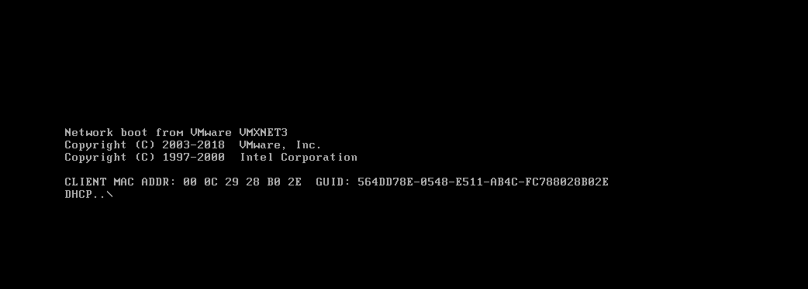

代表没有安装系统，注意红色部分CD/DVD的修改

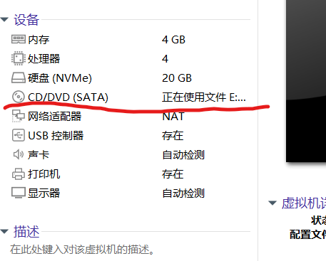

- 登录界面使用root登录
  - 在登录界面选择not listed
  - 然后手动输入root---》next
  - 然后输入密码

系统的简单介绍

# 2． VMware软件的一些功能介绍

- 快照功能（建议在关机状态下，创建快照）：当系统出现问题时，可以利用快照恢复至拍摄快照的时的系统状态。

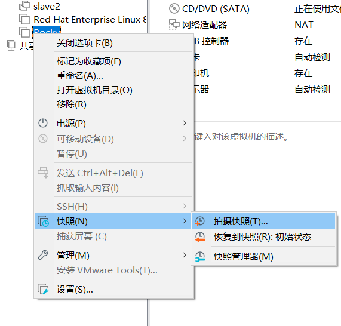

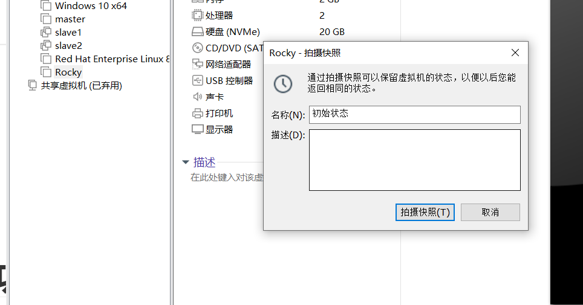


- 克隆功能：关机状态下

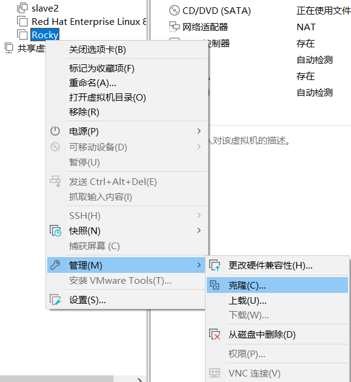

​	 注意： 链接克隆和完整克隆的区别。

- 删除功能，注意：**移除并没有从磁盘中删除该虚拟机！**

  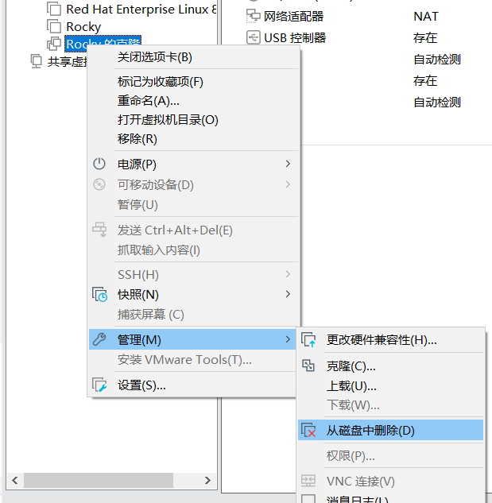
  
  

# ３. Linux目录介绍
## 3.1 目录树的结构

2. 介绍一下Linux系统中的文件目录结构

   - 图形界面

   1. windows是一个多根结构的目录树，它的根目录就是他的盘符。
   2.  linux 是一个单根结构的目录树，它的根目录是"/"
   - 命令行来看

     1. C:\Users\xxr\Desktop： 注意：window中根目录是判断，然后文件之间是用”\“，进行分隔。

     2. Linux下目录的起点是”/",然后目录之间用“/",注意在linux中，/有两个作用，如果出现在目录的起点，那么它就代表根目录，如果在文件之间，那么起到分隔的作用。

        ```bash
        [root@localhost Desktop]# pwd
        /root/Desktop
        ```


## 3.2 常见目录的功能

   - /bin和/sbin: 都是用来存放命令的，一般情况下，bin是用来存放普通用户使用的命令（不会对操作系统造成不可逆更改的命令），sbin目录存放的一般会对操作系统造成不可逆更改的命令。

   - /boot存放的是和启动相关的一些文件

   - **/dev 存储的是设备文件，例如磁盘等**

   - **/etc 一般存放全局生效的配置文件。**

   - **/home和/root目录:  home是普通用户家目录，而root目录是root的家目录，家目录就是用来存放用户个人的数据和配置文件。**

   - /lib和/lib64: 存放的是库函数

   - /media和/mnt: 这两个目录都是和挂载相关的，media目录一般用来存放自动挂载的设备，而mnt一般是用来存放手动挂载的设备

   - /opt 和 /usr  :opt 用来存放第三方数据资源，usr存放的是系统数据资源，

   - /proc 存放的是进程和cpu启动运行时生成的一些数据,cat /proc/version  查看版本信息

   - /run 存放的系统运行时产生的数据

   - /srv和/var都是存放的是软件运行产生的数据。/var可以用来查看软件的日志信息

   - /tmp临时目录：一般用来存放临时文件，隔一段时间可以会自动清空里面的内容。

   

# 4. 终端介绍

（ctrl shift + 放大终端 ctrl - 缩小终端）

   [root@localhost ~]#

   - 命令提示符root@localhost ~

     - root: 用户名：哪一个用户正在使用这个**终端**

     - localhost:  主机名（一般是用来和ip地址做映射，识别主机身份的作用。）

       ```bash
       # 查看完整主机名
       [root@localhost ~]# hostname
       localhost.localdomain
       # 修改主机名
       [root@localhost ~]# hostnamectl  set-hostname  xxr
       [root@localhost ~]# 
       ```

       **注意：修改完主机名后，需要重新登录终端才会生效。**
       
     - ~所处的位置：代表当前用户所处的当前路径。~本身的含义是当前终端用户的家目录。pwd可以查看当前路径的绝对路径
     
     - 前缀：强调当前用户身份的作用：#代表当前用户是管理员，$代表的是普通用户。
     
       注意：在输入命令时一定要先搞清楚三件事
     
       - 我是谁（root）：终端用户是谁？不同的用户权限，效果是不一样的。
       - 我在哪（localhost ~）：确定执行命令的主机，确定执行命令的所在路径。
       - 我要做什么：要对执行的命令足够的了解（特别是它的危害性，特别是会对操作系统造成不可逆更改的命令，建议现在测试环境中测试一下。注意：做好快照和备份。）

# 5. 终端快捷键的使用

| ctrl  shift  =      | 放大终端                                                     |
| ------------------- | ------------------------------------------------------------ |
| ctrl   -            | 缩小终端                                                     |
| ctrl   l（小写的L） | 清屏（等同命令clear）                                        |
| ctrl c              | 杀死当前终端上运行在前台的进程（注意：一个终端前台只能运行一个进程） |
| 上下方向键          | 调用历史命令                                                 |
| **tab**             | **对命令和路径进行补全**                                     |

history  查看历史命令 （默认最多保存1000条）

```bash
[root@localhost ~]# history 
    1  ls
    2  poweroff 
    3  pwd
    4  ls
```

显示的结果由 **编号  命令**组成，如果想要调用历史命令可以使用 **!命令编号**


# 6.命令的格式： 

主命令      [选项]        [参数]  （中括号代表是一个可选项）

主命令：一般代表操作的行为

选项：一般是对主命令功能的扩充，选项有2种格式,选项前面如果是“-”，代表的是短选项，如果选项前面是“--”代表的是长选项。（注意: 选项功能不冲突，是可以搭配使用）

参数：一般是操作的对象，例如：文件，用户，目录和进程。

注意： 主命令，选项和参数之间要用空格隔开


如何去查看命令的帮助

- 主命令  --help   一般用来查看简要的帮助信息
- man 主命令    可以查看具体的一些信息（例如查看例子）
  - man  vdo   (以vdo为例)
  - /EXAMPLE   (回车跳转到例子使用部分)
  - 退出man手册是 q

**下课休15分钟，课间可以使用man手册看一下之前使用的一些命令**(例如 history ,pwd, ls, clear ,hostnamectl ,hostname等命令)


# 7. 基本命令讲解

## 7.1 ls 

ls  查看目录下的内容，默认当前目录

ls  -l   目录路径  （查看指明目录下的详细内容）

ls   -a    查看隐藏文件  （凡是以.开头的文件都是隐藏文件）

ls  -lh    当文件大于1k时，文件的大小会加上单位

ls  -ld   目录路径   （查找指定目录本身的信息）


## 7.2 cd 

cd 切换当前的工作目录

- 绝对路径：凡是以根目录/开头的路径都是绝对路径，绝对路径的特点：起点是根目录 （~也是绝对路径）
- 相对路径：相对于你当前路径而表示出来的下一条路径，相对路径的起点是从当前路径开始，不是以根目录开始（**使用相对路径一定要搞清楚当前路径下，有哪些目录可供选择**）

注意：　凡是相对路径能表达出来的，绝对路径肯定可以表达出来，一般情况下，凡是第三方需要的路径，都是写成绝对路径。

cd  ..    返回上一级目录

cd .     返回当前目录

（注意：凡是看到../代表上一级目录，./代表的是当前目录）

cd  -   返回上一次使用的目录

cd  ~或者cd   (返回当前用户的家目录：一般情况下，如果切换了工作目录，不在进行后续操作，那么就要养成切换回家目录的习惯。)


## 7.3 mkdir

mkdir  目录名 （创建目录）

mkdir -p  目录/子目录  （创建多级目录）


## 7.4 touch

touch  文件名   （创建文件）

```bash
[root@localhost ~]# mkdir dirA
[root@localhost ~]# mkdir dirA/dirB
[root@localhost ~]# mkdir -p  dirA/dirB
[root@localhost ~]# touch dirA/dirB/1.txt
[root@localhost ~]# cd dirA/dirB/
[root@localhost dirB]# touch 1.txt
[root@localhost dirB]# ls 
1.txt

```


## 7.5 rm

注意：rm删除的文件是不看恢复的，没有回收站的功能，所以要慎用。

- rm   文件路径    （删除普通文件，此方式会询问是否删除文件，输入y，才会删除）

- rm  -f  文件路径  （-f 强制删除文件，不会以交互的方式来询问）

- rm  -rf  目录路径  （强制删除目录下的内容。-r 针对目录进行操作，-f强制操作）

- 如果想要清空目录中内容，但是保留目录本身，那么可以使用**rm   -rf   目录路径/***

注意：千万不要去执行**rm  -rf /*** (该命令会删除根目录下的所有内容)，当然为了防止误删内容，也不要使用**rm -rf ./***（该命令是清空当前目录下的所有内容，可以使用rm -rf *代替）


## 7.6 mv 

mv   移动文件或者重命名

- mv  源文件(目录)       目的目录（将源文件移动到指定的目录中）
- mv    源文件(目录)       目的目录/新的文件名 （将源文件移动到指定目录，并给文件重新命名）

```bash
[root@localhost ~]# ls
1.txt            initial-setup-ks.cfg
A                Music
anaconda-ks.cfg  Pictures
Desktop          Public
Documents        Templates
Downloads        Videos
[root@localhost ~]# mv 1.txt  A/2.txt
[root@localhost ~]# ls 
A                     Music
anaconda-ks.cfg       Pictures
Desktop               Public
Documents             Templates
Downloads             Videos
initial-setup-ks.cfg
[root@localhost ~]# ls A/
2.txt
```


- mv   旧文件名   新的文件名 （重命名）

```bash
[root@localhost ~]# mv B C
[root@localhost ~]# ls
1.txt            initial-setup-ks.cfg
anaconda-ks.cfg  Music
C                Pictures
Desktop          Public
Documents        Templates
Downloads        Videos

```

注意：移动或者复制文件时，同一目录下，不能出现同名的文件!  移动文件时，一定要注意前后文件的变化


##  7.7  cp

cp 复制拷贝

- cp  源普通文件      目的目录  （将文件复制到指定目录下）

- cp   -r  源目录    目的目录  （注意：复制目录时需要加上-r）

- cp   源文件    目录目录/新的文件名 （复制并且重命名，注意：复制目录时需要加-r ）

cp命令会改变文件的原属性，如果想要保留文件的原属性，可以加上-p选项，mv 不会改变文件的原属性。


##  7.8 tar(打包压缩)

打包的作用：将多个文件整合成一个大文件，保证传输的稳定性，将文件打包之后，必须解压后才能执行，一定程度上防止不明文件对系统造成危害。

打包时：要把打包的文件同一整合到一个目录下， 然后对该目录进行打包。

- tar   -cvf   打包后的包名  打包的对象 （打包对象一般采用相对路径， -c  创建  -v显示打包的过程，-f后面要给一个参数就是打包后的包名）
- tar  -tvf   包的路径  （查看包里面的内容）
- tar   -xvf   包的路径   （对包进行解压，默认解压到当前路径）
- tar  -xvf   包的路径   -C   目的目录  （将包解压到指定目的目录中）

如果选项记不住的话，可以使用--help查使用看案例

注意：在Linux系统中，不要单纯的通过文件后缀名来判断文件的类型，如果想确切知道文件的类型可以使用file  文件路径来判断

```bash
[root@localhost ~]# touch 1.tar
[root@localhost ~]# ls
1.tar            A.txt    dirA.tar              Music      Videos
1.txt            B        Documents             Pictures
A                Desktop  Downloads             Public
anaconda-ks.cfg  dirA     initial-setup-ks.cfg  Templates
[root@localhost ~]# file 1.tar
1.tar: empty
[root@localhost ~]# file dirA.tar 
dirA.tar: POSIX tar archive (GNU)

```


压缩文件：

- tar -压缩格式的选项cvf   打包后的包名  打包的对象 （平时用的最多的压缩算法是gzip）

注意：压缩格式对应的选项没必要去背，要学会根据压缩算法使用man手册查找对应的压缩选项。

1.  man tar 

2. /压缩格式  -->回车  （例如/gzip）

3.    -z, --gzip, --gunzip, --ungzip  （找到对应选项-z）

4. q退出

5. 利用得到的压缩选项进行打包压缩

   ```bash
   [root@localhost ~]# tar -zcvf A.tar.gz  A/
   [root@localhost ~]# file A.tar.gz 
   A.tar.gz: gzip compressed data, last modified: Thu Jul  7 08:13:17 2022, from Unix, original size 10240
   ```

注意： 解压时可以不指定解压的算法，让系统自行判断解压即可。

题目：将B目录进行打包压缩，要求包名为B.tar.bzip2 ，压缩算法为bzip2,然后解压到 A目录中。完成截图。


## 7.9 查看文档内容

### 7.9.1 cat

cat  文本文件的路径：特点是：cat命令会将文本中的内容按照正序的方式一次性的输出到终端上。（所以适合查看小文件）


#### 7.9.2 tac

tac  文件文件的路径： 特点是：tac命令会将文本中的内容按照反序的方式一次性输出到终端上。


### 7.9.3 more

more   文件路径  特点是：将文件内容按页输出（不支持按行输出），翻页通过空格键进行，b键向上返回，输出完毕后，会自动退出，显示的数据会留在终端上。


### 7.9.4 less

less  文件路径  特点：将文件的内容按页输入（支持通过上下方向键按行输出），翻页通过空格键进行，b键向上返回，并且可以通过“/关键字” ,来对指定字段进行查找，其中n键是向下查找，N键（shift  n）是向上查找 ,退出的话就是q，（man手册默认调用的less命令）


### 7.9.5 head

head   -n  指定行数  文件的路径  （用来查看文件的前几行，默认是前10行）

```bash
[root@localhost ~]# head -n 5 /etc/passwd
root:x:0:0:root:/root:/bin/bash
bin:x:1:1:bin:/bin:/sbin/nologin
daemon:x:2:2:daemon:/sbin:/sbin/nologin
adm:x:3:4:adm:/var/adm:/sbin/nologin
lp:x:4:7:lp:/var/spool/lpd:/sbin/nologin
```


### 7.9.6  tail

tail  -n   指定的行数  文件路径   （用来查看文件的末尾几行，默认是尾部10行）

```bash
[root@localhost ~]# tail  -n 2 /etc/passwd
tcpdump:x:72:72::/:/sbin/nologin
student:x:1000:1000:student:/home/student:/bin/bash

```

tail   -f  文件的路径  （-f   用来监测动态文件的内容变化，例如日志等）

**题目：走一下下面监测安全的日志的流程，完成后截图发群里面！**

```bash
[root@localhost ~]# tail -f /var/log/secure 
Jul  8 09:34:27 localhost polkitd[1013]: Unregistered Authentication Agent for unix-session:c1 (system bus name :1.66, object path 
......
Jul  8 10:10:47 localhost su[3782]: pam_unix(su-l:session): session opened for user student by (uid=0)
Jul  8 10:11:02 localhost su[3782]: pam_unix(su-l:session): session closed for user student
^C

#然后再打开一个新的终端执行
[root@localhost ~]# su - student 
[student@localhost ~]$ exit
logout
```


```bash
# 利用输出重定向符>将ping显示的消息保存到1.txt中
[root@localhost ~]# ping 127.0.0.1 >  1.txt

# 然后在新的终端中，检测数据流的变化
[root@localhost ~]# tail -f 1.txt 

# 退出都是ctrl c
```


## 7.10 find

find     查找的范围   查找的方式

（1）根据文件名查找

find     查找范围    -iname   文件名  （-i  是忽略大小写，-name默认使用的是精确匹配，如果想进行模糊查询的话可以搭配*使用）

```bash
# 如果想要查找含有空格文件，那么必须加上引号
[root@localhost ~]# mkdir  hello\ 1
[root@localhost ~]# ls
'hello 1'            
[root@localhost ~]# find ./  -iname hello 1
find: paths must precede expression: 1
Usage: find [-H] [-L] [-P] [-Olevel] [-D help|tree|search|stat|rates|opt|exec] [path...] [expression]
[root@localhost ~]# find ./  -iname "hello 1"
./hello 1

```


1. 在/etc目录下查找pass开头的文件

```bash
[root@localhost ~]# find /etc -name "pass*"
/etc/pam.d/passwd
/etc/pam.d/password-auth
/etc/passwd
/etc/passwd-
/etc/authselect/password-auth

```

2. 在/etc目录下查找wd结尾的文件

   ```bash
   [root@localhost ~]# find  /etc   -name  "*wd"
   /etc/pam.d/passwd
   /etc/security/opasswd
   /etc/passwd
   
   ```

   

3. 在/etc目录下查找文件名中含有ss字段的文件

   ```bash
   [root@localhost ~]# find /etc/  -name  "*ss*"
   /etc/fonts/conf.d/65-0-lohit-assamese.conf
   /etc/fonts/conf.d/49-sansserif.conf
   /etc/fonts/conf.d/66-sil-abyssinica.conf
   /etc/ssh
   /etc/ssh/ssh_config
   /etc/ssh/ssh_config.d
   /etc/ssh/sshd_config
   /etc/ssh/ssh_host_ed25519_key
   /etc/ssh/ssh_host_ed25519_key.pub
   /etc/ssh/ssh_host_ecdsa_key
   /etc/ssh/ssh_host_ecdsa_key.pub
   /etc/ssh/ssh_host_rsa_key
   
   ```
   

   (2) 根据文件大小范围查找
   
   find   查找范围    -size   指定文件的大小  （例如：+200M ,大于200M，-100M ：小于100M的文件 ，直接跟200M，那么就是查找大小正好等于200M的文件）
   
   1. 查找大于200M的文件
   
   ```bash
   [root@localhost ~]# find /   -size +200M
   ```
   
   2.  查找等于317M大小的文件
   
   ```bash
   [root@localhost ~]# find  /   -size 317M
   
   ```
   
   3. 查找大于100M小于200M的文件
   
   ```bash
   [root@localhost ~]# find  /  -size +100M  -size  -200M
   x86_64-dvd/BaseOS/Packages/linux-firmware-20201218-102.git05789708.el8.noarch.rpm
   /sys/devices/pci0000:00/0000:00:0f.0/resource1
   /sys/devices/pci0000:00/0000:00:0f.0/resource1_wc
   /var/lib/rpm/Packages
   /var/cache/PackageKit/8.4/metadata/appstream-8-x86_64/packages/firefox-91.11.0-2.el8_6.x86_64.rpm
   /var/cache/PackageKit/8.4/metadata/baseos-8-x86_64/packages/linux-firmware-20220210-107.git6342082c.el8.noarch.rpm
   /usr/lib64/firefox/libxul.so
   
   ```
   
   4.查找文件大于100M并且文件名是lib开头的文件
   
   ```bash
   [root@localhost ~]# find /  -size +100M  -name "lib*"
   
   /run/media/root/Rocky-8-4-x86_64-dvd/AppStream/Packages/libreoffice-core-6.4.7.2-5.el8.1.x86_64.rpm
   /usr/lib64/firefox/libxul.so
   [root@localhost ~]# ls -lh /run/media/root/Rocky-8-4-x86_64-dvd/AppStream/Packages/libreoffice-core-6.4.7.2-5.el8.1.x86_64.rpm
   -r--r--r--. 1 root root 109M Jun 20  2021 /run/media/root/Rocky-8-4-x86_64-dvd/AppStream/Packages/libreoffice-core-6.4.7.2-5.el8.1.x86_64.rpm
   
   ```
   
   
   
   （3）根据文件的所有者查找
   
   find    查找范围  -user  用户名
   
   ```bash
   [root@localhost ~]# find /  -user student
   ```
   
   
   
   (4)  根据文件的权限来查找-per
   
   补充：连接文件的权限是由源文件决定的。

- find  查找范围   -perm  权限的数值（精确查找）

查找文件权限为777的文件

```bash
find / -perm  777
```

- find 查找范围  -perm  -权限数值（查找文件权限是大于等于指定权限的文件）

示例：查找含有特殊权限sgid的文件

```bash
[root@localhost ~]# find / -perm  -2000
find: ‘/proc/1451/task/1451/net’: Invalid argument
find: ‘/proc/1451/net’: Invalid argument
find: ‘/proc/4067/task/4067/fd/5’: No such file or directory
find: ‘/proc/4067/task/4067/fdinfo/5’: No such file or directory
find: ‘/proc/4067/fd/6’: No such file or directory
find: ‘/proc/4067/fdinfo/6’: No such file or directory
/run/log/journal
/run/log/journal/eab560eff64a4598a5f3cd37e0708b48
/usr/bin/write
/usr/bin/locate
/usr/sbin/lockdev
/usr/libexec/utempter/utempter
/usr/libexec/openssh/ssh-keysign

```

找一下含有suid权限的文件，截图

```bash
[root@localhost ~]# find / -perm -4000
```


​	   (5) 根据文件的类型进行查找

​		find   查找范围   -type  指定的类型

​		-type  能指定的类型有

| d    | 目录       |
| ---- | ---------- |
| f    | 普通文件   |
| l    | 链接文件   |
| c    | 字符文件   |
| b    | 块设备文件 |


（6）find重点：针对查找到的文件进行批量操作

find   查找范围   查找方式   -exec    执行的方式    \; (\;代表的是结束符, {} 代指前面find找到的文件)

1. 在当前用户的家目录下创建目录studentInfo,然后查找student用户相关的所有文件，并复制保存到studentInfo目录下

```bash
[root@localhost ~]# find / -user student  -exec cp -rp {} /root/studentInfo \; 
```

2. 题目：在当前用户的家目录下，查找文件名为student开头的目录，找到之后，删除该目录。

```bash
[root@localhost ~]# find ~/   -iname "student*" -type d -exec rm -rf  {} \;
```


## 7.11 grep

grep      文本过滤命令

grep  "关键字"   文本路径   （从指定文本中，过滤出含有关键字的行）

- -i   忽略大小写
- -n  显示关键字所在的行数
- -v  反选，过滤出不含有指定字段的行

```bash
[root@localhost ~]# grep -inv  "ROOT"  /etc/passwd
2:bin:x:1:1:bin:/bin:/sbin/nologin
3:daemon:x:2:2:daemon:/sbin:/sbin/nologin
4:adm:x:3:4:adm:/var/adm:/sbin/nologin
```


## 7.12 管道符（|=shift \） 

​    管道符可以连接命令用，它的作用: 将前一个命令的**正确输出**，作为后一个命令的输入参数用（后一个命令一般是文本处理命令。）

```
[root@localhost ~]# ls | grep  "1" 
1
12.txt
1.text
1.txt
hello 1
```

题目：从/etc/passwd中过滤出同时含有root字段和bash的行

```bash
[root@localhost ~]# cat /etc/passwd  | grep -n "bash"  | grep  "root"
1:root:x:0:0:root:/root:/bin/bash

```

注意： 如果要给过滤的内容加上行号，那么再第一次过滤使就要加上，如果再过滤之后的加上-n显示行号，那么就是再过滤之后的文本内容中加上行号，和原始文本的内容行号使不一致的。

管道符最常的搭配就是 **命令1  | grep  "关键字"


补充命令： wc可用用来统计文本的行数（-l），单词(-w)和字节数(-c)

```bash
[root@localhost ~]# wc -l /etc/passwd
46 /etc/passwd
[root@localhost ~]# wc  /etc/passwd
  46  105 2557 /etc/passwd
[root@localhost ~]# wc -w /etc/passwd
105 /etc/passwd
[root@localhost ~]# wc -c /etc/passwd
2557 /etc/passwd

```


## 7.13 重定向符

重定向符分为2类（输入重定向符和输出重定向符）

- 标准输入：从键盘输入的内容显示在终端上面，就是标准输入，而输入重定向就是将原本从键盘输入的内容，改完从文本或者其他地方获取，符号为<
- 标准输出：命令或者软件进程运行的结果输出在终端上，那么就是标准输出，而输出重定向，就是将原本输出到终端上的内容。重新定向到其他地方。（例如本地文本，输出重定向符号是 > ,>>）
  
  区别
  - \>会将原文件的内容覆盖
  - \>\>不会将原文件进行覆盖，而是在原文件末尾追加。

题目： 查看/etc目录的文件名，然后过滤出含有conf的文件名，并将过滤出的文件名保存到当前用户的家目录下中的fileConf.txt文件中，完成后截图。

```bash
[root@localhost ~]# ls /etc/ | grep  "conf" > fileConf.txt
[root@localhost ~]# cat fileConf.txt 
asound.conf
brltty.conf
chkconfig.d

```

\> 文件名 （如果直接>文件名，那么会起到清空文件的效果。）

输出重定向中的三种

（1）正确输出重定向（>,>>,1>,1>>）只有当命令运行结果是正确的情况下，才会进行重定向。

（2）错误输出重定向（2>,2>>）只有当命令运行结果是错误的情况下，才会进行重定向。

（3）混合输出重定向（&>,&>>） 无论命令运行的结果是正确还是错误，都会进行重定向。

- 重定向符中有一个特殊的路径：**/dev/null** ，不管什么输出信息，重定向到此路径下都会消失，不会保留在磁盘上面（如果输出的信息，既不想打印在终端，又不想保留在本地，那么就可以输入到此路径下。）


## 7.14 vim 

vim是Linux中文本编辑器

​    vim是vi的升级版，如果系统比较老旧，或者安装的是阉割过的一些版本，那么可能只有vi命令，没有vim,vim会根据文件的位置，后缀或者文件名等，来增加语法的高亮。

vim   文件路径名（如果文件存在，那么就会直接打开，如果文件不存在，那么会自行创建一个空文件。并打开。）

vim 常见的3种模式

（1）命令模式 （vim打开文件后，默认进入的就是命令模式，在命令模式下，所有从键盘输入的字符，都会被解读成有特殊功能的命令,不能直接进行编辑操作）

| ndd        | 从光标出删除n行，n是行数        |      |
| ---------- | ------------------------------- | ---- |
| nyy        | 从光标出复制n行，n是行数        |      |
| p          | 粘贴                            |      |
| **u**      | **撤销（类似windows中ctrl z）** |      |
| **ctrl r** | **反撤销**                      |      |

（2）编辑模式（在命令模式按i/o/a/s中的任意一个，即可进入编辑模式，推荐i，注意：在编辑模式下左下方会有-- INSERT --  的提示，在任意模式下，按esc键可用返回命令模式）

| i    | 从光标处进入编辑模式（推荐）     |
| ---- | -------------------------------- |
| o    | 从光标处另起一行进入编辑模式     |
| a    | 从光标处的后一个字符进入编辑模式 |
| s    | 删除光标处的字符，并进入编辑模式 |

注意：在vim中，光标默认只能随上下左右方向键移动。

（3）底行命令模式

在命令模式下，按：即可进入底行命令模式，左下方就会有一个:

:w 保存

:wq 保存退出

:wq！ 强制保存退出（!代表强制）

:q!  强制退出不保存

注意:模式之间的切换必须通过命令模式才能完成。


- 查找功能

:/关键字    （凡是能和关键字匹配的字段都会被加上底色）n向下查找，N向上查找

如何取消匹配字段的底色

:/输入一个无法被匹配的字段  （当无法匹配时，就会取消底色。）


- 替换功能：

  :1,2s/root/noroot/g

  - 1,2代表的是替换的范围，1，2代表的是第一行到第二行，如果是第一行到最好一行可用使用%来替换。（例示：%s/root/noroot/g）
  - /root代表的是替换的目标
  - /noroot代表的是替换后的字段
  - /g  如果没有g的话，那么只会替换每一行匹配到的第一个对象。

  最常见的全局替换的格式：

  :%s/替换的内容/替换后的内容t/g

  
  
- 设置命令

  **:set number  显示行号**
  
  :set nonumber 取消显示行号
  
  :set list  显示特殊符号
  
  :set paste （设置号粘贴模式后，再编辑模式下会有paste提示，此模式下，会尽可能的保留原文件的格式）
  
  
  

注意：使用vim时，一定要使用命令正常的关闭，不要直接关闭终端。如果编辑文档后，没有正常关闭终端就会出现以下情况

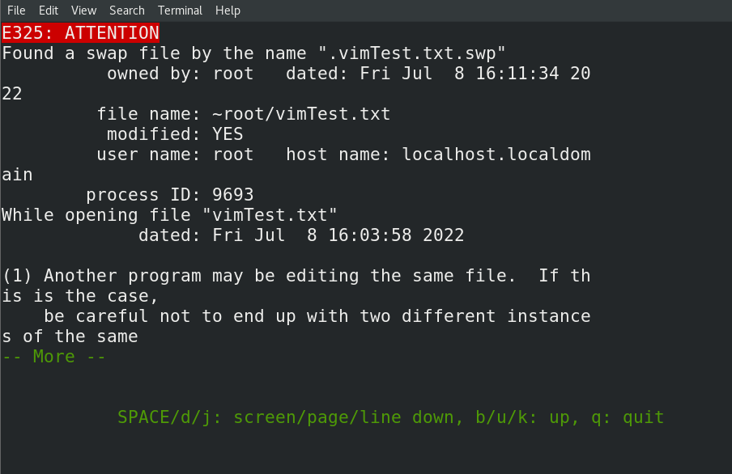

  出现该情况后

首先按**r**进行恢复，然后保存退出，再次打开文件，此时输入**d**，删除生成的交换文件即可


## 7.15 链接命令

ln  链接命令  

链接的作用：1. 节省磁盘空间。  2.实时的更新

在Linux中，链接分为2种，一个是硬链接，一个是软链接

- 硬链接： ln   链接目标    链接文件
- 软链接：ln  -s  链接目标    链接文件

注意： 创建链接时，为了保证链接路径的准确无误，一定要使用绝对路径！

1. 硬链接和软连接的区别

- 创建时：软链接需要加上选项-s，而硬链接不需要。

  硬链接相当于给源文件起了一个别名，可以视为对源文件的一个备份，而软链接类似windows中的快捷方式，是通过创建一个空文件指向了源文件：注意：硬链接不可以对目录进行连接，软连接可以对目录进行连接。

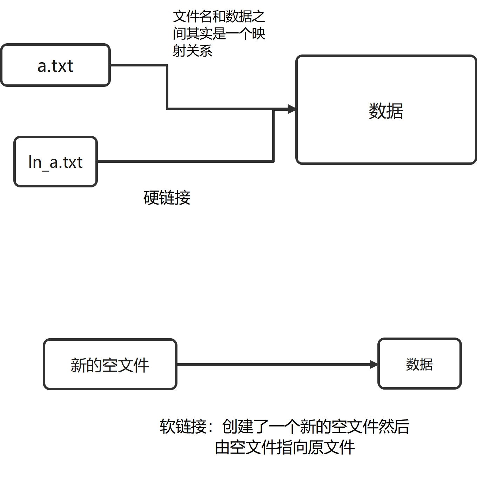

2. 使用时：当我源文件发生变化之后，链接文件也随之发生改变
3. 删除后：硬链接还保留了源文件的数据，但是软连接失效，如果重新创建一个和源文件同名通路径的新文件，那么软连接会自动关联。

什么使用用链接？1. 更新比较频繁的文件，可以用链接，让文件自动跟新   2. 通过链接文件节省磁盘空间


# 8. 管理本地用户

## 8.1 用户概念

1. 什么是用户？

   用户其实是一种身份，让我们在操作系统中的所有行为都是有迹可循，可以找到负责的用户，同样我们也可可以给不同的用户设置不同的权限，从而保证系统安全。

   

   

2.  在Linux系统中有哪些用户？

   - 超级用户：管理员账号，默认是root，权限最大，uid为0

   - 系统用户：系统用户是给软件进程使用的，权限也是比较大的。软件的资源调度也会用到系统用户，（0<uid<1000）

   - 普通用户：是由管理员创建的，用来日常使用，权限是比较低的。uid>=1000

     

3. 用户信息的存放位置？

   用户信息存放在/etc/passwd文件中，每一行代表一个用户，不同的字段使用：分隔。

   ```bash
   root:x:0:0:root:/root:/bin/bash
   
   ```

   （1）root: 用户名

   （2）x: 密码的占位符，早期的密码是写在passwd中，但是由于passwd的权限是任意用户可读，就会导致密码安全隐患，所以现在密码都是存放在/etc/shadow中

   （3）0: uid，系统不是根据用户名来识别用户身份的，而是根据uid来识别用户身份的，root用户uid=0,   0<系统用户<1000，普通用户uid>=1000

   （4） 0: gid,用户的主组id

   （5）root：解释说明用的，一般默认和用户名一样，在登录界面出现用户名其实就是这个字段的内容

   （6）/root： 用户的家目录，是用来和存储用户个人的一些数据和配置文件

   （7）/bin/bash:  shell类型，shell是介于用户和操作系统之间的命令解释器，它将用户输入的命令翻译成系统能够理解的语言。/bin/bash最常见的shell类型，如果shell类型是/sbin/nologin，那么代表是用户无法登录到终端（无法登录到服务器上）


## 8.2 创建用户

注意：虽然可以直接编辑用户的信息文件（/etc/passwd）,但为了防止对文件进行误操作，优先推荐使用命令的方式来对用户进行操作！

**useradd  [选项]   用户名**

- -u   指定用户的uid
- -g   指定用户的主组id（指定用户主组时,该组必须事先存在）
- -c  修改用户的注释说明
- -d   指明用户的家目录（如果不指明的话，默认就是/home/student）
- -s   指定用户的shell类型
- -G   指明用户的附加组

创建用户student01,要求uid为1666，完成后截图

```bash
[root@localhost ~]# useradd -u 1666 student01
[root@localhost ~]# tail -n 2 /etc/passwd
student:x:1000:1000:student:/home/student:/bin/bash
student01:x:1666:1666::/home/student01:/bin/bash

```


## 8.3 设置密码


在root用户下，可以使用**passwd  用户名**  这种方式来设置用户密码，且密码格式不受限制。

```bash
[root@localhost ~]# passwd student01
Changing password for user student01.
New password: 
BAD PASSWORD: The password is a palindrome
Retype new password: 
passwd: all authentication tokens updated successfully.
```


如果是普通用户下，那么只能使用passwd来修改自己的密码，而且普通用户设置密码是有格式的强制要求，不可以是简单的密码，连续的密码，而且密码必须是8位以上

```bash
[student01@localhost ~]$ passwd 
Changing password for user student01.
Current password: 
New password: 
Retype new password: 
passwd: all authentication tokens updated successfully.
```


## 8.4 修改用户信息

**usermod   [选项]   用户名**

- -u   修改用户的uid
- -g  修改用户的主组id（指定用户主组时,该组必须事先存在）
- -c  修改用户的注释说明
- -d   修改用户的家目录（如果不指明的话，默认就是/home/student）
- -s   修改用户的shell类型，如果shell类型为/sbin/nologin，那么用户无法登录终端
- -G   修改用户的附加组，如果直接使用-G，会将原先的附加组都覆盖掉，如果不想覆盖的话，可以使用-aG，就会原有组的基础上进行追加。

**题目： 将用户student01的uid改为1667，并且要求student01用户无法登录到终端。完成后，请使用su  -   student01，看一下能否登录终端**

```bash
[root@localhost ~]# usermod -u 1667 -s /sbin/nologin student01
[root@localhost ~]# tail -n 2 /etc/passwd
student:x:1000:1000:student:/home/student:/bin/bash
student01:x:1667:1666::/home/student01:/sbin/nologin
[root@localhost ~]# su - student01
This account is currently not available.

```


## 8.5 删除用户

**userdel   -r  用户名**  

（注意：除非需求明确说明，删除用户时，保留用户的数据，否则在删除用户时，一般都要加上-r，如果没有加上-r,那么删除用户后，用户的家目录，邮箱目录里的数据依然会残留在系统中，导致数据安全的问题。）

- 如果忘记使用了-r，怎么补救

  - 使用find命令，找出之前用户所有文件，并删除。

    删除用户后，可以查看用户的残留数据上的uid的值来确定 find 里面-uid选项后面的值

    ```bash
    [root@localhost ~]# ls -l /home/
    total 4
    drwx------. 15 student student 4096 Jul  9 11:18 student
    drwx------.  3    1001    1001   78 Jul  9 14:19 student01
    [root@localhost ~]# userdel -r student01
    userdel: user 'student01' does not exist
    [root@localhost ~]# find / -uid 1001 
    find: ‘/proc/1447/task/1447/net’: Invalid argument
    find: ‘/proc/1447/net’: Invalid argument
    find: ‘/proc/15157/task/15157/net’: Invalid argument
    find: ‘/proc/15157/net’: Invalid argument
    find: ‘/proc/20101/task/20101/fd/5’: No such file or directory
    find: ‘/proc/20101/task/20101/fdinfo/5’: No such file or directory
    find: ‘/proc/20101/fd/6’: No such file or directory
    find: ‘/proc/20101/fdinfo/6’: No such file or directory
    /var/spool/mail/student01
    /home/student01
    /home/student01/.mozilla
    /home/student01/.mozilla/extensions
    /home/student01/.mozilla/plugins
    /home/student01/.bash_logout
    /home/student01/.bash_profile
    /home/student01/.bashrc
    [root@localhost ~]# find / -uid 1001  -exec  rm -rf  {} \; 
    find: ‘/proc/1447/task/1447/net’: Invalid argument
    find: ‘/proc/1447/net’: Invalid argument
    find: ‘/proc/15157/task/15157/net’: Invalid argument
    find: ‘/proc/15157/net’: Invalid argument
    find: ‘/proc/20135/task/20135/fd/5’: No such file or directory
    find: ‘/proc/20135/task/20135/fdinfo/5’: No such file or directory
    find: ‘/proc/20135/fd/6’: No such file or directory
    find: ‘/proc/20135/fdinfo/6’: No such file or directory
    find: ‘/home/student01’: No such file or directory
    [root@localhost ~]# ls /home/
    student
    
    ```

- 创建一个**uid与用户名**和之前用户一样的新用户，让新用户继承之前用户的数据，然后再一并使用-r将新用户删除。

  **14点52继续，走一遍第二个方法，完成后群里发2**

```bash
[root@localhost ~]# useradd student01
[root@localhost ~]# passwd student01
Changing password for user student01.
New password: 
BAD PASSWORD: The password is a palindrome
Retype new password: 
passwd: all authentication tokens updated successfully.
[root@localhost ~]# userdel student01
[root@localhost ~]# ls /home/
student  student01
[root@localhost ~]# ls -l /home/
total 4
drwx------. 15 student student 4096 Jul  9 11:18 student
drwx------.  3    1001    1001   78 Jul  9 14:46 student01
[root@localhost ~]# useradd  -u 1001 student01
useradd: warning: the home directory already exists.
Not copying any file from skel directory into it.
Creating mailbox file: File exists
[root@localhost ~]# ls -l /home/
total 4
drwx------. 15 student   student   4096 Jul  9 11:18 student
drwx------.  3 student01 student01   78 Jul  9 14:46 student01
[root@localhost ~]# userdel -r student01
[root@localhost ~]# ls /home/
student

```


# 9.组概念

## 9.1 什么是组？

组是具有相同特征的一类用户的集合。作用：便于对用户的批量管理。


## 9.2 在Linux中的2种组

- 主组：用户有且只有一个主组，在创建用户时，如果没有指定用户的主组。那么系统会自动创建一个和用户名同名的组，作为用户的主组。
- 附加组： 除了主组以外的组都是附加组。

凡是用户只要在组内，那么就会享有和组一样的权限。


## 9.3 判断用户的主组和附加组

使用id命令

```bash
[root@localhost ~]# id student
uid=1000(student) gid=1000(student) groups=1000(student),10(wheel)
# uid 用户唯一编号
# gid  用户的主组id,对应的主组时student
# groups 用户加入的组（主组+附加组）
# student用户的附加组就是wheel，从groups组中，减去主组，剩下的就是附加组。

```


## 9.4  组的信息存放位置

以后看到类似student等名字时，首先要先判断它代表的是组还是用户！

- 组的信息存放在/etc/group
  每一行代表一个组，不同字段通过冒号进行分隔

  ```bash
  student01:x:1001:
  ```

  （1）student01： 组名

  （2）x：密码占位符

  （3）1001： gid

  （4）附加组成员

  

  

## 9.5 创建组

  groupadd [选项]   组名

  - -g  指明gid

  ```bash
  [root@localhost ~]# groupadd -g 6666 students
  [root@localhost ~]# tail -n 2 /etc/group
  student01:x:1001:
  students:x:6666:
  ```

  创建一个组students，gid为6666 ,创建好发1

  补充：在使用路径时，目录默认最后是带/,只不过如果目录处在路径最后，这个/是可以省略的,但是如果是普通文件是没有/的，如果你在普通文本文件后强制加上/，那么就相当于，你告诉系统，现在你操作的对象是一个目录

  

## 9.6 修改组的信息

  **groupmod   [选项]  组名**

  - -g  修改gid
  - -n   修改组名

- 把用户加入附加组

  **usermod   用户名   -aG   附加组名**

  （-aG： 如果只有一个-G,那么会将原先的附加组进行覆盖，如果使用-aG，那么就是在原先的附加组上继续追加）


题目：创建用户student02，密码为1，然后将student02加入到students组中，然后提供**id student02**和**tail -n 3  /etc/grou**p的截图 

```bash
[root@localhost ~]# useradd  student02
[root@localhost ~]# passwd student02
Changing password for user student02.
New password: 
BAD PASSWORD: The password is a palindrome
Retype new password: 
passwd: all authentication tokens updated successfully.
[root@localhost ~]# usermod student02 -G  students
[root@localhost ~]# id student02
uid=1002(student02) gid=1002(student02) groups=1002(student02),6677(students)
[root@localhost ~]# tail -n 3 /etc/group
student01:x:1001:
students:x:6677:student01,student02
student02:x:1002:

```


## 9.7 删除组

**groupdel 组名**

注意：删除组后，如果是附加组的话，那么原先在附加组里的成员都会脱离这个组。如果该组已经作为用户的主组，那么是不能直接删除的，要么更换主组后，进行删除，要么连同用户一起删除。

```bash
# 删除主组后，会报以下错误。
[root@localhost ~]# groupdel student02
groupdel: cannot remove the primary group of user 'student02'
```


题目： 创建用户teacher01,teacher02,其中teacher02不可以登录终端，密码都是123，然后再创建组teachers，把teacher01，teacher02加入teachers组中，便于对用户的管理。

```bash
[root@localhost ~]# useradd teacher01
[root@localhost ~]# useradd -s /sbin/nologin  teacher02
[root@localhost ~]# passwd teacher01
Changing password for user teacher01.
New password: 
BAD PASSWORD: The password is shorter than 8 characters
Retype new password: 
passwd: all authentication tokens updated successfully.
[root@localhost ~]# passwd teacher02
Changing password for user teacher02.
New password: 
BAD PASSWORD: The password is shorter than 8 characters
Retype new password: 
passwd: all authentication tokens updated successfully.
[root@localhost ~]# groupadd teachers
[root@localhost ~]# id teacher01
uid=1002(teacher01) gid=1002(teacher01) groups=1002(teacher01)
[root@localhost ~]# usermod teacher01 -G  teachers
[root@localhost ~]# id teacher01
uid=1002(teacher01) gid=1002(teacher01) groups=1002(teacher01),1004(teachers)
[root@localhost ~]# usermod -aG teachers teacher02
[root@localhost ~]# id teacher02
uid=1003(teacher02) gid=1003(teacher02) groups=1003(teacher02),1004(teachers)
[root@localhost ~]# su - teacher02
This account is currently not available.
```


# 10. 普通用户提权

如果在操作系统中操作时出现下面的报错信息，基本就是由于权限不足导致的。

```bash
[student01@localhost ~]$ useradd teacher03
useradd: Permission denied.
useradd: cannot lock /etc/passwd; try again later.
```

(1) su  - 用户名  （切换用户）

​     当普通用户权限不够时，可以使用su - root 切换到管理员（su - 后面如果不加指定用户，默认就是管理员），然后由管理员执行。该方式，需要知道管理员的密码。

- 注意点1：使用su - 切换用户后，返回之前的用户时，不要使用su - 进行切换，而是使用exit退出！（解决办法: 使用ps 查看当前终端下有几个su，有几个su就输入几次exit,退出即可）
- 注意点2：su 和su - 的区别，su 只是切换了用户，没有加载用户的配置环境，而su - 不仅切换了用户，还加载了用户的对应的配置环境。配置环境主要指的就是bashrc和profile(全局的配置环境)，用户个人的配置文件指的是.bashrc和.bash_profile， 推荐使用su - 


（2）sudo  要提权的命令

​      普通用户时不能直接使用sudo来提权的，必须先由root用户将普通用户规范到sudoers文件中，然后由普通用户才可以使用sudo提权。 

   在root用户下，执行visudo，然后就可以编辑sudoers文件（命令模式下按i）

```bash
## Allow root to run any commands anywhere
root    ALL=(ALL)       ALL
student01  ALL=(ALL)       ALL
# 仿照root的写法，把要加入的用户另起一行写上去即可
# 主要如果名字前面有%，那么代表这是一个组
#  %wheel        ALL=(ALL)       NOPASSWD: ALL   如果第二个ALL前面是NOPASSWD,那么在使用sudo时，不需要输入密码
```

补充说明：vim打开文档后，在命令模式下按G,可以快速到达文件底部，g就是文档开头

- 除了直接编辑sudoers文件以外，还可以将用户加入wheel组中，同样也可以使用sudo获取管理员的权限.

```bash
[root@localhost ~]# usermod teacher03 -aG wheel
```


# 11. 权限管理

## 11.1 基本权限

权限管理是针对普通用户来进行的，在权限管理中首先要确定用户，然后再看用户对应的权限。权限管理的目的：通过给不同用户设置不同的权限，从而限制某些用户的行为，从而保证系统的安全。


## 11.2 如何查看文件的权限

ls  -l  可以用来查看文件的信息，从而可以查看用户对文件的权限

```bash
[root@localhost ~]# ls -l 
-rw-r--r--. 1 root root  2557 Jul  8 16:11 passwd 
```

- \-rw-r--r--.

  - \- :代表文件的属性（-代表普通文件，d代表目录，l代表的是一个软连接，b代表块设备，例如磁盘， c代表的是字符设备，例如鼠标，键盘）

  - rw-  r--   r--

    在Linux系统中，普通用户一共有三种权限，分别是r,w，x

    

| 权限 | 普通文件                                                     | 目录                                                         |
| ---- | ------------------------------------------------------------ | ------------------------------------------------------------ |
| r    | 能否查看文件里面的内容，会受影响的命令（cat,head,more,less等） | 能否查看目录下文件的信息，受影响的命令：ls等                 |
| w    | 能否修改文件里的内容，会受影响的命令（例如vim等）            | 能否在此目录下，删除或者创建文件，受影响的命令（rm,mkdir，touch等） |
| x    | 运行脚本时，才会使用到执行权限，一般情况下，为了保证系统的安全，普通用户时不给执行权限的。 | 能否将此目录作为用户的工作目录（用户能否进入此目录！）受影响的命令最直接的就是cd，甚至也会影响到目录下文件的删除和创建（因为无法进入此目录，那么也就无法在此目录进行删除创建文件这些操作），所以对于目录而言，执行权限很重要。 |

如果用户没有相应的权限，那么就会使用“-"代替。

在权限管理中，普通用户又被分为3类：文件的所有者，文件所属组和其他用户

\-  rw-   r--   r--   root（文件所有者） root（文件所属组）passwd

- rw-r--r--的9个字符可以分为3组，每组代表的权限如下

- rw- :第一组代表的是文件所有者root用户的权限为rw-

- r--:第二组代表的是文件所属组root组的权限r--

- r--:第三组 代表是其他用户的权限为r--（teacher用户既不是root用户也不在root组里面，就代表其他用户）

补充说明：

1. 文件所有者：默认情况下，谁创建了这个文件，他就是文件的所有者
2. 文件所属组：默认情况下，文件所有者的主组就是文件的所属组。
3. 其他用户：如果一个用户既不是文件所有者，也不在文件所属组内，那么他就是其他用户。


​	第十一个字符”."代表的是acl（访问控制列表）权限的标识符,“."代表没有设置acl权限，如果是”+“则代表设置了acl权限。


1：如果是普通文件的话，代表的是硬链接数，如果是目录的话，代表的是子目录数。

root:  文件所有者

root: 文件所属组

2557： 代表文件的大小（ls  -lh 查看文件大小时，如果文件大于1kb，会加上单位）

Jul  8 16:11 ：文件最后一次被修改的时间

passwd： 文件名


- 补充：**ls -ld  目录路径** （可以用来查看目录本身的文件信息）


## 11.3 修改文件的权限

### 11.3.1 符号法

**chmod whowhatwhich  文件的路径**

- who：代表要修改的用户，u（文件所有者），g(文件所属组)，o(其他用户)，a（所有用户）
- what: 要进行的操作，+（赋予权限），-（去除权限），=（精确赋予权限）
- which：代表要操作的权限，r,w,x，X（只会给目录赋予执行权限，而不会给普通文件设置执行权限。

```bash
[root@localhost ~]# chmod u+x passwd
```

**题目： 创建文件1.txt，对该文件权限需求如下：**

**文件所有者拥有读写执行的权限**

**文件所属组有读写权限**

**其他用户没有任何权限。**

```bash
[root@localhost ~]# touch 1.txt
[root@localhost ~]# ls -l
total 24
-rw-r--r--. 1 root root     0 Jul 10 13:57 1.txt
[root@localhost ~]# chmod u+x,g+w,o-r  1.txt
[root@localhost ~]# ls -l
total 24
-rwxrw----. 1 root root     0 Jul 10 13:57 1.txt
```

cd /home/student

首先使用root用户在普通用户student的家目录下创建文件1.txt.

然后再切换到student用户，以student用户删掉尝试删除1.txt文件！


**首先以root用户身份在root目录下，创建目录A,然后再A目录中创建文件1.txt，**

**然后以student普通用户的身份往/root/A/1.txt文件中写入hello。**

**要求以最少的权限进行分配**，完成后提供ls -ld /root ,ls -ld /root/A和ls -ld /root/A/1.txt权限的截图

student对于这3个目录都是属于其他用户，先把其他用户的rwx权限都拿走，然后思考怎么划分权限

```bash
[root@localhost ~]# mkdir A
[root@localhost ~]# touch A/1.txt
[root@localhost ~]# chmod o-rwx /root/
[root@localhost ~]# chmod o-rwx /root/A/
[root@localhost ~]# chmod o-rwx /root/A/1.txt 
[root@localhost ~]# ls -ld /root/
dr-xr-x---. 17 root root 4096 Jul 10 14:49 /root/
[root@localhost ~]# ls -ld /root/A/
drwxr-x---. 2 root root 19 Jul 10 14:49 /root/A/
[root@localhost ~]# ls -ld /root/A/1.txt 
-rw-r-----. 1 root root 0 Jul 10 14:49 /root/A/1.txt

# 最终的结果
[student@localhost ~]$ echo "hello"  >> /root/A/1.txt
[student@localhost ~]$ ls -ld /root/
dr-xr-x--x. 17 root root 4096 Jul 10 14:49 /root/
[student@localhost ~]$ ls -ld /root/A
drwxr-x--x. 2 root root 19 Jul 10 14:49 /root/A
[student@localhost ~]$ ls -l /root/A/1.txt
-rw-r---w-. 1 root root 12 Jul 10 15:02 /root/A/1.txt

```

补充：如果想要对目录下文件批量的设置权限，可以使用-R

注意：X执行权限的使用,大写的X只会给目录赋予执行权限，而普通文件不会给执行权限

```bash
[root@localhost ~]# chmod -R a+X  B/
[root@localhost ~]# ls -l B/
total 0
-rw-r--r--. 1 root root 0 Jul 10 15:08 1.txt
drwxr-xr-x. 2 root root 6 Jul 10 15:09 dirA

```

### 11.3.2 数值法

- **同样可以用-R批量设置权限**

**chmod    ###  文件路径**

每一个#代表一个数值，其中第一个#代表的时文所有者的权限，第二个#代表的是文件所属组的权限，第三个#代表的是其他用户的权限。

数值表示法，就是将rwx转化成对应的数值，有此权限，就加上相应的值

r=4

w=2

x=1

没有权限就用数字0代替


示例：

\-rwx  rw-   rw-  root    root    passwd

文件所有者为root用户  权限是rwx=4+2+1=7

文件所属组为root组 权限是rw=4+2+0=6

其他用户的权限为 rw=4+2+0=6

chmod 766  passwd

题目：用数值表示法来给passwd设置权限，要求如下，做完截图

文件所有者有rw权限 4+2=6

文件所属组有r的权限  4

其他用户没有任何权限 0

```bash
[root@localhost ~]# chmod 640 passwd 
[root@localhost ~]# ls -l passwd 
-rw-r-----. 1 root root 2557 Jul  8 16:11 passwd
```

补充：符号法适用于给单个用户来设置权限，数值法适合三种用户都需要修改权限的情况。

## 11.4 修改文件所有者，所属组

- 命令

  **chown  文件所有者   文件路径名 （修改文件的所有者）**

  **chown   : 文件所属组   文件路径名 （修改文件的所属组）**

  **chown   文件所有者:文件所属组  文件路径名（同时修改文件的所有者和所属组）**

```bash
[root@localhost ~]# ls -l 1.txt 
-rw-r-----. 1 student student 0 Jul 12 09:36 1.txt
[root@localhost ~]# chown root:root 1.txt 
[root@localhost ~]# ls -l 1.txt 
-rw-r-----. 1 root root 0 Jul 12 09:36 1.txt
```

注意： 修改文件所有或者所属组，重点关心的是修改完毕后对应的权限产生的变化。

补充：如果想批量的修改目录下的文件所有者或者所属组可以使用**-R**选项


## 11.5 特殊权限

是除了rwx三种基本权限以外的第四种权限。

| 特殊权限    | 文件                                                         | 目录                                                         |
| ----------- | ------------------------------------------------------------ | ------------------------------------------------------------ |
| suid（u+s） | 凡是设置了suid权限的文件，在它文件所有者的执行位置上会用s来代替（执行权限x用s大小写来表示，小写s代表有执行权限,大写S代表没有执行权限）注意：suid一般情况下设置的对象是二进制文件，就是命令文件。当前文件设置好suid后，运行命令时，不会以运行该命令的用户身份来执行命令，而是以文件的所有者的身份来执行命令。 | 无影响                                                       |
| sgid（g+s） | 凡是设置了sgid权限的文件，再它所属组的执行位置上，会用s来代替（执行权限x用s大小写来表示，小写s代表有执行权限,大写S代表没有执行权限）。注意：sgid一般情况下设置的对象是二进制文件，就是命令文件。当文件设置好sgid之后，运行命令时，不会以当前运行该命令的用户身份来执行，而是以文件所属组的身份来执行 | **凡是设置了sgid权限的目录，那么在此目录下创建文件时，会自动继承该目录的所属组** |
| sticky(o+t) | 文件无影响                                                   | 凡是设置了sticky权限的目录，再其他用户的执行位置上会用t来表示（用t的大小写来表示执行权限，小写t代表有执行权限，大写的T代表没有执行权限）凡是设置了sticky权限的目录，除了root用户和文件所有者以外，其他用户没有权限删除该文件，目的:防止文件被误删。 |

**题目： 再当前用户的家目录下创建目录dirA，要求如下，文件所属组为student，并且再该目录下创建文件时，文件会自动继承dirA目录的所属组。**

```bash
[root@localhost ~]# mkdir dirA
[root@localhost ~]# ls -ld dirA
drwxr-xr-x. 2 root root 6 Jul 12 10:38 dirA
[root@localhost ~]# chown :student dirA/
[root@localhost ~]# ls -ld dirA
drwxr-xr-x. 2 root student 6 Jul 12 10:38 dirA
[root@localhost ~]# chmod g+s dirA
[root@localhost ~]# ls -ld dirA
drwxr-sr-x. 2 root student 6 Jul 12 10:38 dirA
[root@localhost ~]# touch dirA/1.txt
[root@localhost ~]# ls -l dirA/
total 0
-rw-r--r--. 1 root student 0 Jul 12 10:40 1.txt
[root@localhost ~]# rm -f dirA/1.txt 
[root@localhost ~]# ls -l dirA/
total 0

```

补充说明：文件设置权限时，文件的所有者也可以对文件修改权限，也可以修改文件的所属组（但是修改的组一定是文件所有者的附加组）

chmod数值表示法如果写完整，其实是由4个数字构成，第一个数字代表特殊权限（suid=4,sgid=2,sticky=1）,后面三个数字才是基本权限（rwx构成）

chmod   **#**###   文件路径（推荐使用符号发法来设置特殊权限）

```bash
[root@localhost ~]# ls -ld A
drwxr-sr-x. 2 root student 45 Jul 12 10:17 A
[root@localhost ~]# chmod 7777 A/
[root@localhost ~]# ls -ld A
drwsrwsrwt. 2 root student 45 Jul 12 10:17 A

```

## 11.6 umask（设置默认权限）

设定创建文件时的默认权限。

022如果用符号表示话。写一下

最大权限=777= rwx  rwx   rwx

umask   =022= ---    -w-      -w-

注意：

- 普通文件的默认权限，是最大权限（rwxrwxrwx）先减去执行权限x（rw-rw-rw-）然后再去剪掉umask（022=----w--w-）的权限得到最终的默认权限（rw-r--r--）
- 对于目录而言，执行权限很重要，所以目录的默认权限是最大权限（rwxrwxrwx）直接减去umask（022=----w--w-）的权限，得到最终的默认权限（rwxr-xr-x）

**如何修改umask的值： umask  要减去的权限值**

题目：修改当前umask的值，要求如下，

创建文件时: 文件所有者具有rw权限，文件所属组也有rw权限，其他用户没有任何权限。

创建目录时，文件所有者具有rwx权限，文件所属组也有rwx权限，其他用户没有任何权限。

```bash
[root@localhost ~]# umask 007  
[root@localhost ~]# umask 
0007
[root@localhost ~]# touch 4.txt
[root@localhost ~]# ls -l 4.txt 
-rw-rw----. 1 root root 0 Jul 12 13:53 4.txt
[root@localhost ~]# mkdir E
[root@localhost ~]# ls -ld E
drwxrwx---. 2 root root 6 Jul 12 13:53 E

```


如何修改umask的值？

- 临时修改：在终端中写入umask  要减去的权限值
- 永久修改
  - 全局生效：可以将umask的值写入/etc/bashrc
  - 针对某个用户生效：将umask的权限数值写入/home/用户名/.bashrc

注意**：对于普通用户而言，如果用户名和主组名一致，那么默认umask的值002，如果用户名和主组名不一致，那么默认umask的值时022**


## 11.7 访问控制列表

可以单独给具体的某一个用户或组来设置权限。

(1)查看acl权限

getfacl  文件的路径

```bash
[root@localhost ~]# touch 1.txt
[root@localhost ~]# ls -l 1.txt 
-rw-r--r--. 1 root root 0 Jul 12 14:24 1.txt
[root@localhost ~]# getfacl 1.txt 
# file: 1.txt
# owner: root
# group: root
user::rw-
group::r--
other::r--

```

（2）设置acl权限

setfacl  -m  u:用户名:权限   文件名（-m代表修改 ，u代表用户，g代表组）

```bash
[root@localhost ~]# setfacl -m u:student:rw 1.txt
[root@localhost ~]# ls -l 1.txt 
-rw-rw-r--+ 1 root root 0 Jul 12 14:24 1.txt
[root@localhost ~]# getfacl 1.txt 
# file: 1.txt
# owner: root
# group: root
user::rw-
user:student:rw-
group::r--
mask::rw-
other::r--

```


（3）删除acl权限

1.如果只是想要删除现有acl权限，可以使用setfacl -m修改即可

```bash
[root@localhost ~]# setfacl -m u:student01:r  1.txt 
[root@localhost ~]# getfacl 1.txt 
# file: 1.txt
# owner: root
# group: root
user::rw-
user:student:rw-
user:student01:r--
group::r--
mask::rw-
other::---
```

2. 删除某一个用户的acl权限

   **setfacl -x u:用户名   文件路径**

```bash
[root@localhost ~]# setfacl -x u:student01  1.txt
[root@localhost ~]# getfacl 1.txt 
# file: 1.txt
# owner: root
# group: root
user::rw-
user:student:rw-
group::r--
mask::rw-
other::---

```

3. 删除文件上的所有acl权限

   **setfacl  -b  文件路径**

   ```bash
   [root@localhost ~]# setfacl -b 1.txt 
   [root@localhost ~]# getfacl 1.txt 
   # file: 1.txt
   # owner: root
   # group: root
   user::rw-
   group::r--
   other::---
   
   [root@localhost ~]# ls -l 1.txt 
   -rw-r-----. 1 root root 0 Jul 12 14:24 1.txt
   
   ```

4. facl中mask

   用来限制acl权限，代表你当前使用acl权限的用户最大权限

   注意：mask的值会随着新进入用户的权限发生改变，所有如果想要使用mask来限制用户的权限，那么应该是在最后所有用户的acl权限设置完毕后，再来设置mask的权限值。

```bash
[root@localhost ~]# setfacl -m  u:student:rw 1.txt
[root@localhost ~]# getfacl 1.txt 
# file: 1.txt
# owner: root
# group: root
user::rw-
user:student:rw-
group::r--
mask::rw-
other::---

[root@localhost ~]# setfacl -m m:r 1.txt 
[root@localhost ~]# getfacl 1.txt 
# file: 1.txt
# owner: root
# group: root
user::rw-
user:student:rw-		#effective:r--
group::r--
mask::r--
other::---

[root@localhost ~]# setfacl -m u:student01:rw 1.txt
[root@localhost ~]# getfacl 1.txt
# file: 1.txt
# owner: root
# group: root
user::rw-
user:student:rw-
user:student01:rw-
group::r--
mask::rw-
other::---

```


# 12. 网络管理

主要要求同学们掌握在Linux环境下配置ip地址，**特别是动态改静态ip地址。**

在使用vm虚拟机的情况下，首先要判断windows能否正常上网，如果windows能够正常上网，而虚拟机无法上网，首先要考虑VM相关的服务是否开启。

（任务管理器------》服务-------》右击打开服务------》找到VM开头的服务，确定是否都在运行状态。）

（1）查看网络的连通性

ping  网络地址

（2）查看IP地址

- ifconfig 或者ip address   可以查看Linux的ip地址

- windows中看ip地址的命令

（win+r开打命令运行窗口，然后输入cmd,然后在命令行输入ipconfig）


## 12.1 nmcli

- 在红帽8中使用nmcli来管理网络

1. 查看网络设备

nmcli device

```bash
[root@localhost ~]# nmcli device 
DEVICE      TYPE      STATE                   CONNECTION 
ens160      ethernet  connected               ens160     
virbr0      bridge    connected (externally)  virbr0     
lo          loopback  unmanaged               --         
virbr0-nic  tun       unmanaged               --  

```

- device: 硬件设备名
- TYPE: 连接网络的方式
- state : 状态
- connection:  网络连接名

2. 查看网络连接的信息

   nmcli   connection show 

```bash
[root@localhost ~]# nmcli connection show
NAME    UUID                                  TYPE      DEVICE 
ens160  c9c4dba3-1603-4f99-969c-56bc9f60da7f  ethernet  ens160 
virbr0  e585fca2-278b-410d-bb48-948db0606128  bridge    virbr0 
```

3. 查看具体网络的连接信息

   nmcli connection show  “连接名”

```bash
[root@localhost ~]# nmcli connection show  ens160 | grep  "ipv4"
ipv4.method:                            auto
ipv4.dns:                               --
ipv4.dns-search:                        --
ipv4.dns-options:                       --
ipv4.dns-priority:                      0
ipv4.addresses:                         --
ipv4.gateway:                           --
ipv4.routes:                            --
ipv4.route-metric:                      -1
ipv4.route-table:                       0 (unspec)
ipv4.routing-rules:                     --
ipv4.ignore-auto-routes:                no
ipv4.ignore-auto-dns:                   no
ipv4.dhcp-client-id:                    --

```


## 12.2 如何去配置IP地址

windows配置ip地址的流程

1. 点击网络的图标（网络和Internet）

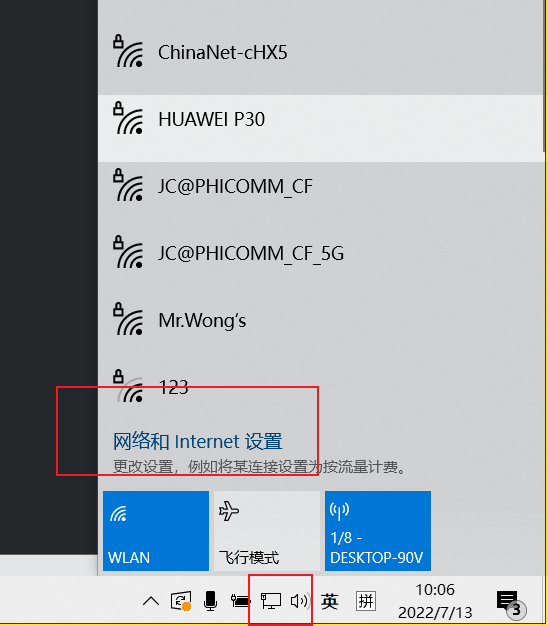

2. 选择更改适配器选项

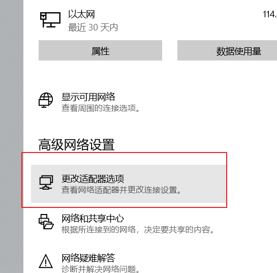

3. 首先确**定要修改的网络连接**，然后右击属性，

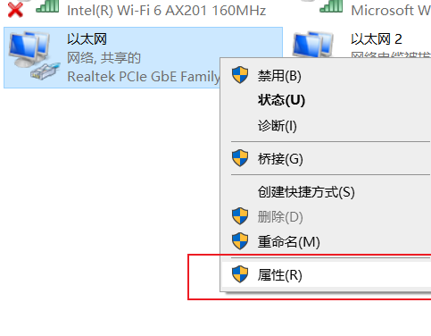

4. 点击打开Internet协议版本4

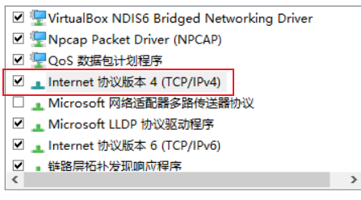

5. 进入ip地址的配置界面

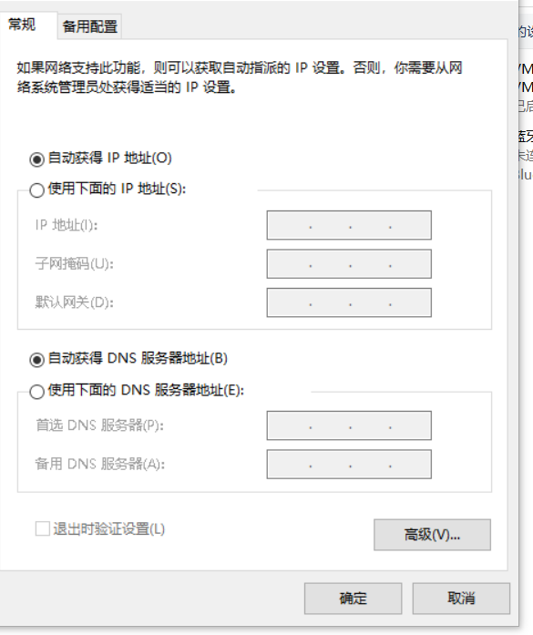

(1)自动获取ip地址

首先考虑ip地址的获取方式，如果是自动获取，那么只要保证物理上的网络连同就可以访问网络，ip地址的配置信息由dhcp服务器生成。

（2）静态ip地址获取

首先简答说明一下ip地址，子网掩码，默认网关，dns的概念

ip地址其实它是由32位二进制组成，为了便于人自己去查看ip地址的信息，于是将32位二进制首先分成4组，然后再转化成十进制（点分十进制）

ip地址：192.168.200.31   子网掩码：255.255.255.0

11000000     10101000    11001000    00011111

11111111  11111111     11111111  00000000

1. IP地址：是用来确实设备在网络上的位置，类似家庭地址

   - IP地址分为2个部分,第一部分：**网络地址**，同一网段下主机的网络地址是一样的，利用子网掩码可以确定网络地址，那么接下来只需要确定第二部分**主机地址**的范围即可（0~255）。

     0：用来网络地址不可以用

     255：用来表示广播地址，也不可以用

     剩余地址中，凡是已经被使用的ip地址也不能使用。

2. 子网掩码：如果转化成二进制，那么它是由连续1来表示的，二进制的子网地址和二进制的IP地址进行与运算，最终得到的结果就是网络地址，也就是子网地址，我们常说的在不在同一网段下，就是看的这一部分，如果一样就是在同一网段下。掩码可以根据它前面有多少个1 ，然后用长度表示法进行表示。

   例如：255.255.255.0用长度表示法就是24，代表前面是由24个1组成。

3. 默认网关： 这边填写就是你遇到第一台路由器的ip地址（路由器用来连接不同网段，比如： 192.168代表的私网，然后访问外网，就是访问公网上的设备（公网ip180.101.49.11），那这两2不同网段设备间的访问就需要用到路由器。）

4. DNS服务器地址: 域名解析服务器，将域名解析成对应的网络设备的IP地址（因为设备在网络上的位置是由ip地址决定的）当我们在浏览器中输入www.baidu.com时，首先会先去dns服务器上获取到www.baidu.com域名对应的ip地址，然后再拿着ip地址去访问百度的服务器。（常见的dns服务器:114.114.114.114,还有8.8.8.8等，也可以写自己网关地址。）

5. 确定网络地址

   **192.168.200.**0 

6. 然后确定主机地址

   （0~255）

   - 0做为网络地址已经被使用了

   - 255作为广播地址已经被使用了

   - 同一网段下ip地址不能冲突

   - 例如：192.168.200.31

     

7. 确定子网掩码

   - 255.255.255.0


 8. 确定网关地址

    - 192.168.200.254

9. 确定nds服务器的地址

   - 114.114.114.114

   其中在确定静态ip的流程中，只有主机地址是我们自己要确定的，其他的例如网络地址，网关地址，子网掩码。这些都是由网关人员预先确定下来的，不需要更改，DNS是由第三方提供，也不需要修改。

   

- 配置ip地址的思路

   - 考虑是否有对应网络连接可以修改
   - 考虑ip地址的获取方式，是动态ip还是静态ip
   - 如果是静态ip，首先要考虑网关多少，然后子网掩码，还有子网掩码，获得网络地址（子网地址），确定合适的ip地址，最后dns服务器的ip地址。
   


## 12.3 配置动态ip

**nmcli connection add con-name "0713" type ethernet ifname ens160  autoconnect yes**

注意：修改创建完网络连接之后，需要重新重新激活才能生效。

**nmcli connection up “网络连接名”**

**用tab键补全**

15点03继续

- add   添加网络连接
- con-name  “网络连接名”  网络连接名
- type   网络类型
- ifname 对应的网卡名
- autoconnect  yes   启用自动连接

```bash
[root@localhost ~]# nmcli connection add con-name "0713" type ethernet ifname ens160  autoconnect yes
Connection '0713' (3a79ad00-2722-412a-bef2-3f0138b1583f) successfully added.
[root@localhost ~]# nmcli connection show 
NAME    UUID                                  TYPE      DEVICE 
ens160  c9c4dba3-1603-4f99-969c-56bc9f60da7f  ethernet  ens160 
virbr0  e585fca2-278b-410d-bb48-948db0606128  bridge    virbr0 
0713    3a79ad00-2722-412a-bef2-3f0138b1583f  ethernet  --     
[root@localhost ~]# nmcli connection up 0713
Connection successfully activated (D-Bus active path: /org/freedesktop/NetworkManager/ActiveConnection/4)
[root@localhost ~]# nmcli connection show 
NAME    UUID                                  TYPE      DEVICE 
0713    3a79ad00-2722-412a-bef2-3f0138b1583f  ethernet  ens160 
virbr0  e585fca2-278b-410d-bb48-948db0606128  bridge    virbr0 
ens160  c9c4dba3-1603-4f99-969c-56bc9f60da7f  ethernet  --   
```


## 12.4 静态IP的配置

- 确定网络地址（也叫做子网地址）

  **注意：每个人网段，ip地址都是不一样的**

inet 192.168.182.135  netmask 255.255.255.0

网络地址是192.168.182.0 ，

- 确定主机地址（1~254中减去被使用的，比如网关地址），顺便也确定好了**掩码地址**为（255.255.255.0，长度表示法就是24）注意,VM中默认网关地址是以2结尾的，所以2不能用，然后192.168.182.1 已经被vmnet8这张虚拟网卡使用，所以也不能拿来使用。（IP地址的范围3~254）

- 确定网关地址

  1. 在联网状态下，可以使用**route -n**命令查看路由表信息，然后gateway中第一个ip地址就是你的默认网关信息(例如此处就是192.168.182.2)

     ```bash
     [root@localhost ~]# route -n
     Kernel IP routing table
     Destination     Gateway         Genmask         Flags Metric Ref    Use Iface
     0.0.0.0         192.168.182.2   0.0.0.0         UG    100    0        0 ens160
     192.168.122.0   0.0.0.0         255.255.255.0   U     0      0        0 virbr0
     192.168.182.0   0.0.0.0         255.255.255.0   U     100    0        0 ens160
     
     ```
  
- 从VMware上快速获取到网络信息

  点击软件上方的编辑----》虚拟网络编辑器---->选择nat模式，然后点击nat设置，即可获取到子网ip，子网掩码，网关的信息。

  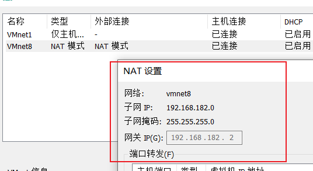


- 确定dns地址，此处就以114.114.114.114为例。


  ### 12.4.1 配置静态IP

nmcli connection add con-name "0713s" type  ethernet ifname ens160  autoconnect yes ipv4.method manual  ipv4.addresses 192.168.**182**.166/24  ipv4.gateway 192.168.**182**.2 ipv4.dns 114.114.114.114

- add   添加网络连接
- con-name  “网络连接名”  网络连接名
- type   网络类型
- ifname 对应的网卡名
- autoconnect  yes   启用自动连接
- ipv4.method manual   ip地址获取方式改为手动获取
-  ipv4.addresses 192.168.**182**.166/24  配置IP地址和子网掩码，注意加粗部分，改成自己的。
- ipv4.gateway 192.168.**182**.2   配置网关地址,注意改成自己的网关地址

- ipv4.dns 114.114.114.114   配置dns地址为114.114.114.114

注意：创建好网络连接后，想要启用必须激活

```bash
[root@localhost ~]# nmcli connection add con-name "0713s" type  ethernet ifname ens160  autoconnect yes ipv4.method manual  ipv4.addresses 192.168.182.166/24  ipv4.gateway 192.168.182.2 ipv4.dns 114.114.114.114
Connection '0713s' (969a0350-b4cd-41f8-b60e-98670e4bd868) successfully added.
[root@localhost ~]# nmcli connection show 
NAME    UUID                                  TYPE      DEVICE 
0713    3a79ad00-2722-412a-bef2-3f0138b1583f  ethernet  ens160 
virbr0  e585fca2-278b-410d-bb48-948db0606128  bridge    virbr0 
0713s   969a0350-b4cd-41f8-b60e-98670e4bd868  ethernet  --     
ens160  c9c4dba3-1603-4f99-969c-56bc9f60da7f  ethernet  --     
[root@localhost ~]# nmcli connection up 0713s
Connection successfully activated (D-Bus active path: /org/freedesktop/NetworkManager/ActiveConnection/5)
[root@localhost ~]# ifconfig 
ens160: flags=4163<UP,BROADCAST,RUNNING,MULTICAST>  mtu 1500
        inet 192.168.182.166  netmask 255.255.255.0  broadcast 192.168.182.255
        inet6 fe80::3af9:40a7:1da8:9aac  prefixlen 64  scopeid 0x20<link>
        ether 00:0c:29:28:b0:2e  txqueuelen 1000  (Ethernet)
        RX packets 18576  bytes 19068243 (18.1 MiB)
        RX errors 0  dropped 0  overruns 0  frame 0
        TX packets 9264  bytes 919580 (898.0 KiB)
        TX errors 0  dropped 0 overruns 0  carrier 0  collisions 0

lo: flags=73<UP,LOOPBACK,RUNNING>  mtu 65536
        inet 127.0.0.1  netmask 255.0.0.0
        inet6 ::1  prefixlen 128  scopeid 0x10<host>
        loop  txqueuelen 1000  (Local Loopback)
        RX packets 176  bytes 14888 (14.5 KiB)
        RX errors 0  dropped 0  overruns 0  frame 0
        TX packets 176  bytes 14888 (14.5 KiB)
        TX errors 0  dropped 0 overruns 0  carrier 0  collisions 0

virbr0: flags=4099<UP,BROADCAST,MULTICAST>  mtu 1500
        inet 192.168.122.1  netmask 255.255.255.0  broadcast 192.168.122.255
        ether 52:54:00:43:d9:bd  txqueuelen 1000  (Ethernet)
        RX packets 0  bytes 0 (0.0 B)
        RX errors 0  dropped 0  overruns 0  frame 0
        TX packets 0  bytes 0 (0.0 B)
        TX errors 0  dropped 0 overruns 0  carrier 0  collisions 0

[root@localhost ~]# ping www.baidu.com
PING www.baidu.com (127.0.0.1) 56(84) bytes of data.
64 bytes from localhost (127.0.0.1): icmp_seq=1 ttl=64 time=0.040 ms
64 bytes from localhost (127.0.0.1): icmp_seq=2 ttl=64 time=0.067 ms
^C
--- www.baidu.com ping statistics ---
2 packets transmitted, 2 received, 0% packet loss, time 1037ms
rtt min/avg/max/mdev = 0.040/0.053/0.067/0.015 ms

```

## 12.5 网络故障解决思路

- 判断硬件外部的网络有没有问题（网线，宽带欠费，vm软件本身导致）
- 是否有ip地址生成（思考配置有无问题，网卡设备有没有问题）
- 查看是否激活网络连接（是否开启自动连接）
- 有ip地址但是无法上网
  - （1）如果无法ping通dns服务器地址，那么尝试ping一下自己的网关地址，如果网关地址ping不通，就检查一下，网关地址ip地址有没有写错。
  - （2）可以ping通dns的服务器地址，但是无法ping www.baidu.com ，那么就是dns出了问题， 看一下dns有没有写错。（如果dns没有写错，可以试着把nds改成自己的网关地址。）


## 12.6 修改网络连接信息

注意：修改网络连接信息用到是modify

**nmcli connection modify  0713s ipv4.addresses 192.168.182.167/24**

注意：修改完毕后要激活一下

**nmcli connection up 0713s**


题目把刚刚166IP地址，改为167改完截图

```bash
[root@localhost ~]# nmcli connection modify  0713s ipv4.addresses 192.168.182.167/24

[root@localhost ~]# nmcli connection up 0713s
Connection successfully activated (D-Bus active path: /org/freedesktop/NetworkManager/ActiveConnection/6)
[root@localhost ~]# ifconfig 
ens160: flags=4163<UP,BROADCAST,RUNNING,MULTICAST>  mtu 1500
        inet 192.168.182.167  netmask 255.255.255.0  broadcast 192.168.182.255
        inet6 fe80::3af9:40a7:1da8:9aac  prefixlen 64  scopeid 0x20<link>

```


## 12.7 删除网络连接

**nmcli connection delete  连接名**

```bash
[root@localhost ~]# nmcli connection delete 0713
Connection '0713' (3a79ad00-2722-412a-bef2-3f0138b1583f) successfully deleted.
[root@localhost ~]# nmcli connection show 
NAME    UUID                                  TYPE      DEVICE 
0713s   969a0350-b4cd-41f8-b60e-98670e4bd868  ethernet  ens160 
virbr0  e585fca2-278b-410d-bb48-948db0606128  bridge    virbr0 
ens160  c9c4dba3-1603-4f99-969c-56bc9f60da7f  ethernet  --   
```


## 12.8 修改本地网络脚本文件

本地网络脚本文件存放路径：

- /etc/sysconfig/network-scripts/ifcfg-网络连接名

```bash
[root@localhost ~]# ls  /etc/sysconfig/network-scripts/
ifcfg-0713s  ifcfg-ens160
[root@localhost ~]# cat /etc/sysconfig/network-scripts/ifcfg-0713s 
TYPE=Ethernet
PROXY_METHOD=none
BROWSER_ONLY=no
BOOTPROTO=none
IPADDR=192.168.182.167
PREFIX=24
GATEWAY=192.168.182.2
DNS1=114.114.114.114
DEFROUTE=yes
IPV4_FAILURE_FATAL=no
IPV6INIT=yes
IPV6_AUTOCONF=yes
IPV6_DEFROUTE=yes
IPV6_FAILURE_FATAL=no
IPV6_ADDR_GEN_MODE=stable-privacy
NAME=0713s
UUID=969a0350-b4cd-41f8-b60e-98670e4bd868
DEVICE=ens160
ONBOOT=yes

```


1. 修改本地网络脚本中的网络连接信息
   - 注意：改完本地网络脚本文件中的内容后，直接激活，不会生效
   - 首先是nmcli connection reload 加载一下配置文件的内容
   - 然后才是nmcli connection up 连接名 进行激活

```bash
[root@localhost ~]# vim /etc/sysconfig/network-scripts/ifcfg-0713s 
[root@localhost ~]# cat /etc/sysconfig/network-scripts/ifcfg-0713s 
TYPE=Ethernet
PROXY_METHOD=none
BROWSER_ONLY=no
BOOTPROTO=none
IPADDR=192.168.182.168

# 注意reload的加载操作
[root@localhost ~]# nmcli connection reload 
[root@localhost ~]# nmcli connection up 0713s 
Connection successfully activated (D-Bus active path: /org/freedesktop/NetworkManager/ActiveConnection/8)
[root@localhost ~]# ip addr
1: lo: <LOOPBACK,UP,LOWER_UP> mtu 65536 qdisc noqueue state UNKNOWN group default qlen 1000
    link/loopback 00:00:00:00:00:00 brd 00:00:00:00:00:00
    inet 127.0.0.1/8 scope host lo
       valid_lft forever preferred_lft forever
    inet6 ::1/128 scope host 
       valid_lft forever preferred_lft forever
2: ens160: <BROADCAST,MULTICAST,UP,LOWER_UP> mtu 1500 qdisc mq state UP group default qlen 1000
    link/ether 00:0c:29:28:b0:2e brd ff:ff:ff:ff:ff:ff
    inet 192.168.182.168/24 brd 192.168.182.255 scope global n
```


## 12.9 使用nmtui来设置ip地址

使用图形界面来设置网络

在命令终端输入nmtui，回车

具体操作参考《考点1》后面的步骤


## 12.10 补充注意点

- 在配置多个网络连接时，如果都使用了自动连接，那么会导致在系统重启之后，会随机使用一个自动连接
- 随机就会导致，ip地址会发生变化，所以在时间工作中，请保证只有同一网络环境下，只有一套网络连接时自动连接的。


# 13. 系统进程管理

## 13.1 系统启动

- 主要就是介绍：如何设置图形界面和文本界面

  （1）如何查看系统的默认启动方式

```bash
[root@localhost ~]# systemctl get-default 
graphical.target

```

（2）修改默认启动方式

systemctl set-default   启动方式

```bash
[root@localhost ~]# systemctl set-default multi-user.target 
Removed /etc/systemd/system/default.target.
Created symlink /etc/systemd/system/default.target → /usr/lib/systemd/system/multi-user.target.
[root@localhost ~]# reboot
# 将当前纯文本界面改成图形界面 **graphical.target    图形界面**
```

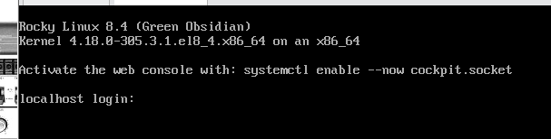

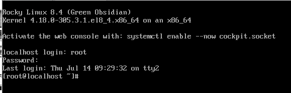

常见的启动方式

- **graphical.target    图形界面**
- **multi-user.target  多用户（纯文本的界面）**
- emergency.target   紧急模式
- rescue.target          救援模式


补充：

- 如果想要从文本界面切换到图形界面，那么首先系统中要安装好图形界面所需的组件（yum group install "Server with GUI" -y）
- 如果时正常进入文本界面的，那么首先会让你输入用户名，然后在输入密码（输入密码过程不可见）。但是如果进入文本界面后，直接让你输入root用户密码，那么就代表系统可能出了问题，进入的是救援模式或者紧急模式。


## 13.2  进程管理 

什么是进程？

​		进程是由软件运行时产生的实例，软件本身只会占用磁盘空间，而进程会占用cpu，运行内存等资源。

进程的几种状态

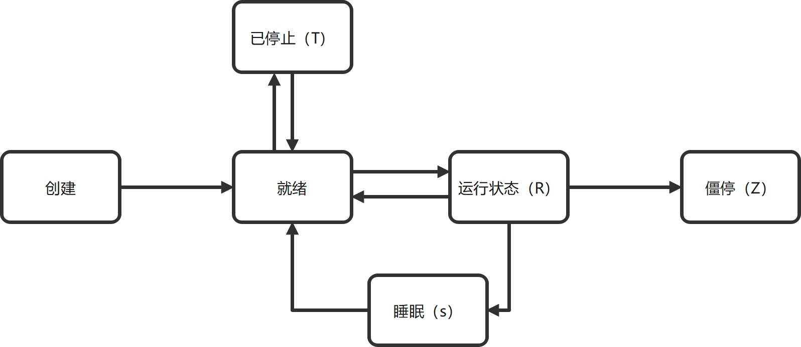

- 睡眠状态和停止状态的区别：睡眠状态时进程想要运行，但是cpu还没轮到该进程，那么它就处于睡眠状态，停止状态时人为或者软件发送停止信号，终止该进程的运行。


## 13.2.1 查看当前系统的进程状态

注意: ps命令只是将执行命令时系统的瞬时状态呈现出来，不会动态的变化。

-  ps aux

  - USER: 运行进程的用户名
  - PID：进程编号
  - %CPU： cpu的占用率
  - %MEM: 内存的占用率
  - VSZ: 系统通过算法计算出进程所需的虚拟内存大小。
  - RSS： 实际内存占用
  - TTY:  运行命令的终端编号，如果是？代表运行在后台
  - STAT: 运行的状态
  
    - S：睡眠
  
    - R: 运行
  
    - T: 停止
  
    - Z: 僵停状态
  
    - < : 高优先级的任务
  
    - N: 低优先级的任务
  
    - l: 进程的是多线程的
  - START： 启动时间
  - TIME: 占用cpu的时间
  
  - COMMAND： 启动的命令
  
- ps lax

  - PPID：父进程id（pstree  -p 可以用来查看进程树）
  - PRI  优先级
  - NI    可以调整NI的值，来控制PRI的值，NI的值越高，优先级反而是越低。（调整的方式：renice   NI的值   进程编号）
  
  
  
- top  查看进程的动态信息（类似windows中的任务管理器）
  
  h  命令可以查看top的帮助手册（例如z加上颜色，m查看内存，信息，按内存大小排序）
  
  
  
  

## 13.3 系统调优

- tuned-adm  list  查看所有的调优配置
- tuned-adm active  查看当前系统所使用的调优配置
- tuned-adm recommend  查看系统推荐的调优配置
- tuned-adm profile 调优配置  （使用相应的调优配置）
- tuned-adm off  关闭当前的调优配置


题目：将当前系统首先设置成节能模式，然后再查看系统推荐的调优模式，改为系统推荐的模式。（做完截图）


## 13.4 控制作业

​       作业是由一系列进程组成的，通过作业可以实现对进程的批量控制，而进程之间一般用管道符 ”|“ 连接。

（1） 如何将进程置入后台

​       **命令   &**

 (2) 查看作业

​		**jobs**

（3）杀死作业

​	**kill   %作业编号**

（4）将后台作业调至前台

​		**fg  %作业编号**

（5）将前台已经运行的作业置入后台，并停止运行

​		**ctrl  z**

 (6) 将后台已经停止的作业继续运行

​		**bg  %作业编号**

在终端输入firefox，然后运行浏览器，使用快捷键，置入后台，并保证其继续运行中，最后杀死（截图）   14点08继续

```bash
[root@localhost ~]# firefox 
^Z
[3]+  Stopped                 firefox
[root@localhost ~]# jobs 
[1]   Running                 sleep 1000 &
[2]-  Running                 sleep 2000 &
[3]+  Stopped                 firefox
[root@localhost ~]# bg %3
[3]+ firefox &
[root@localhost ~]# kill %3

```

## 13.5 如何给进程发送信号

- kill  -l  查看所有能发送的信号

- 常见的信号

  - -9    强制杀死进程（类型windows中任务管理器的结束进程）
  - -15  尽可能正常关闭进程（不加信号编号，默认使用的就是-15）
  - -18  继续运行
  - -19  停止运行

  kill  -信号编号     进程编号

  注意： 给进程发送信号时，不需要加上%,给作业发送信号时，需要在作业编号前加上百分号。用于区分。


## 13.6计划任务

计划将来要发生的事情，时间标准都是以当前任务运行的系统时间为主。**在联网状态下，可以使用systemctl restart chronyd.service 进行强制网络校时。**

### 13.6.1 一次性的计划任务

通过编写命令或者脚本，让任务在将来的某个时间点运行

（1）命令格式

- at    时:分   年-月-日

- 回车后进入，命令编辑界面，一行一条命令

- 编辑完毕后ctrl  d退出

注意：at 命令也可以实现在文本中写好命令，然后使用输入重定向符来给at命令传递要执行的命令

```bash
[root@localhost ~]# at  15:01 2022-7-14 < 2.txt 
warning: commands will be executed using /bin/sh
job 2 at Thu Jul 14 15:01:00 2022
[root@localhost ~]# cat 2.txt 
echo "world" > /root/1.txt
[root@localhost ~]# cat 1.txt 
world

```


（2）查看当前的计划任务列表

​	    **at   -l**

(3)   查看计划任务具体的内容

 		**at   -c    计划任务的编号**

(4)  删除计划任务

​	   **at  -r   计划任务的编号**


题目： 创建一个计划任务，在今天晚上8点，发送一个消息”have   dinner“ 保存到指定文件/root/1.txt中，然后查看人列表，查看任务内容，最后删除任务。

15点14继续


### 13.6.2 周期性计划任务

使用crontab命令

（1）编辑命令

crontab  -e  -u 用户名   （-e进入任务编辑界面，-u  指定执行任务的用户，如果没有-u的话，默认就是当前执行命令的终端用户）

（2）如何编辑计划任务

 at  /etc/crontab  可以用来查看例子（除了周以外，每天，每分钟，每小时这个每读在你遇到到第一个*上）

```bash
分    时    日    月    周      （日和周不建议混用）
*     *     *     *    *      每分钟运行一次
0     *     *     *    *      每小时运行一次（1：00，2：00 ） 
30    2     *     *    *      每天的2：30分运行一次
0     0     *     *    *      每天运行一次（每天的0：00，0:00）
0     0     1     *    *       每月的第一天的0：00
0     0     *     *    2       每周2的0：00运行一次

*/5   *     *     *    *     每5分钟运行一次
0     */3   *     *    *      每个三小时运行一次
20    */2   *     *    *      每2小时的第20分钟运行一次（2：20，4：20）
 
3,4   *    *      *     *     每小时的第三分钟，第四分钟运行一次

12,24  1-10  *    *     *     每天的1点到10点之间，每小时的第12分钟和第24分钟运行一次

6,15     */3    *     *   2-4   每周2到周四之间的时间段内，每隔三小时的第6和第15分钟运行一次。
```

```bash
[root@localhost ~]# crontab -e 
no crontab for root - using an empty one
crontab: installing new crontab
[root@localhost ~]# crontab -l
* * * * *   echo "hello world"  >> /root/1.txt

```

（2）查看周期计划任务

crontab  -l   (查看运行中的计划任务，其中使用-u可以查看指定用户的计划任务。)

（3）修改计划任务

crontab  -e 进入计划任务的编辑界面，对任务重新编辑即可

（4）删除计划任务

crontab	-r   （删除当前终端用户的计划任务，可以使用-u指定用户）


题目：创建一个计划任务，每天的晚上8点会发消息”have dinner“ 到/root/1.txt中，完成后查看任务，并删除。，完成后截图


# 14. yum仓库

1. 在安装软件时，首先第一步就是要考虑软件的版本的问题。
2. 软件安装：最可靠的办法就是去软件对应的官方上面查看安装手册。


## 14.1 软件安装

红帽系软件常见的安装三种方式（安装都需要参考官方网站，安装的方式必须确定可靠！）

（1）编译安装

一般使用编译安装的方法，第一个从官网下载一个源码的压缩包，解压之后。

./configure        检查当前系统的运行环境是否符合要求。

make                  编译

make   install     安装


（2）rpm包安装

rpm  -ivh    包的路径  （-i  安装，-v显示安装的过程，-h显示安装的进度）

rpm   -e  包名 （删除已安装的包）

rpm   -qa   |  grep   "包名“   (-q查询  -a所有，查找指定包是否已被安装)

注意: rpm只能管理通过rpm包安装的软件。


（3）yum安装

（注意：8版本以后，rpm包的管理工具变为dnf，但对于我们使用者而言yum命令一样通用，使用过程没有区别）

yum准确来讲它就是rpm包的管理工具，rpm包类似软件安装包，而yum就类似手机应用商店。对于这些软件安装包进行了统一的管理，方便用户下载安装软件。

yum  install   软件包  （安装软件）

yum  remove   软件包   （卸载软件）


补充：rpm包既可以使用rpm命令进行安装，也可以使用yum命令进行安装，rpm的安装方式，只会针对软件本身进行安装（如果环境中缺少组件， 需要用户自己解决，不会解决软件依赖的问题），yum安装会尽可能的解决软件依赖的问题。

```bash
[root@localhost Packages]# pwd
/run/media/root/Rocky-8-4-x86_64-dvd/BaseOS/Packages
[root@localhost Packages]# 
[root@localhost Packages]# rpm -ivh  ./vim-minimal-8.0.1763-15.el8.x86_64.rpm 
Verifying...                                                          ################################# [100%]
Preparing...                                                          ################################# [100%]
	package vim-minimal-2:8.0.1763-15.el8.x86_64 is already installed
[root@localhost Packages]# yum install ./vim-minimal-8.0.1763-15.el8.x86_64.rpm 
Last metadata expiration check: 0:29:50 ago on Fri 15 Jul 2022 09:46:51 AM CST.
Package vim-minimal-2:8.0.1763-15.el8.x86_64 is already installed.
Dependencies resolved.
Nothing to do.
Complete!
```


补充说明：红帽系的linux发行版，除了商业版（redhat）以外,其他系统yum仓库默认已经安装好，所以可以直接使用yum进行软件安装

刚刚使用yum安装的vim是本地路径下的rpm包，而下面使用yum安装的vim包，调用的是yum仓库中最新的rpm包，所以安装过程中，发生了更新。

```bash
[root@localhost ~]# yum install vim-minimal.x86_64
Last metadata expiration check: 0:34:39 ago on Fri 15 Jul 2022 09:46:51 AM CST.

........

Upgraded:
  vim-minimal-2:8.0.1763-19.el8_6.2.x86_64                            

Complete!

```


## 14.2 搭建yum仓库

​    本质上来讲，就是将软件包所在的路径提前写入到yum仓库的配置文件中，这样安装软件时，用户只需要输入软件包的名字，yum就可以直接通过配置文件中软件包所在的路径进行下载安装。

### 14.2.1 搭建仓库使用yum本地源

1. 将Rocky自带的网络源进行清理（备份）

```bash
[root@localhost ~]# cd /etc/yum.repos.d/
[root@localhost yum.repos.d]# ls
Rocky-AppStream.repo         Rocky-Plus.repo
Rocky-BaseOS.repo            Rocky-PowerTools.repo
Rocky-Devel.repo             Rocky-ResilientStorage.repo
Rocky-Extras.repo            Rocky-RT.repo
Rocky-HighAvailability.repo  Rocky-Sources.repo
Rocky-Media.repo
[root@localhost yum.repos.d]# mkdir RockyBak
[root@localhost yum.repos.d]# mv *.repo  RockyBak/
[root@localhost yum.repos.d]# ls
RockyBak

```

2. 创建本地源的配置文件

注意： 创建yum的配置文件时，1.一定要在/etc/yum.repos.d目录下  2. 文件名可以任意，但是后缀一定是.repo

```bash
[root@localhost yum.repos.d]# touch local.repo
[root@localhost yum.repos.d]# pwd
/etc/yum.repos.d
[root@localhost yum.repos.d]# vim local.repo 
[root@localhost yum.repos.d]# cat local.repo
[BaseOS]  # 仓库编号唯一，不能同名冲突
name=baseos  # 仓库的描述信息
baseurl=file:///run/media/root/Rocky-8-4-x86_64-dvd/BaseOS   # yum源所在的路径，如果是file://代表使用的是本地源，如果是https代表使用的是网络源
enabled=1  # 启用仓库
gpgcheck=0  # 关闭gpg校验（用来检查包的完整性和合法性）

[AppStream]
name=appstream
baseurl=file:///run/media/root/Rocky-8-4-x86_64-dvd/AppStream
enabled=1
gpgcheck=0

# 清空缓存
[root@localhost yum.repos.d]# yum clean all 
27 files removed
# 重新建立缓存
[root@localhost yum.repos.d]# yum makecache 
baseos                                288 MB/s | 2.5 MB     00:00    
appstream                             266 MB/s | 7.1 MB     00:00  
```


**补充:  查看本地源的方法**

```bash
[root@localhost AppStream]# lsblk 
NAME        MAJ:MIN RM  SIZE RO TYPE MOUNTPOINT
sr0          11:0    1  9.2G  0 rom  /run/media/root/Rocky-8-4-x86_64-dvd
nvme0n1     259:0    0   20G  0 disk 
├─nvme0n1p1 259:1    0    1G  0 part /boot
└─nvme0n1p2 259:2    0   19G  0 part 
  ├─rl-root 253:0    0   17G  0 lvm  /
  └─rl-swap 253:1    0    2G  0 lvm  [SWAP]
[root@localhost AppStream]# cd /run/media/root/Rocky-8-4-x86_64-dvd
[root@localhost Rocky-8-4-x86_64-dvd]# ls
AppStream  BaseOS  EFI  images  isolinux  LICENSE  media.repo  TRANS.TBL
[root@localhost Rocky-8-4-x86_64-dvd]# cd AppStream/
# 判断该路径是不是yum源，就要看该目录下有没有Packages和repodata目录
[root@localhost AppStream]# ls
Packages  repodata
[root@localhost AppStream]# pwd
/run/media/root/Rocky-8-4-x86_64-dvd/AppStream

```

**yum的其他命令**

- 列出所有的仓库

  yum   repolist  （如果此处报错，可以查看是不是[仓库编号]和name出问题）

- 列出所有的rpm包

  yum list    （如果此命令报错，就去检查配置文件中的baseurl路径对不对）

- 如果上面命令没有报错，最后如果在安装软件时报错了，那么就去检查一下gpgcheck有没有拼写错误。

- 示例: 安装yum install -y httpd

  yum搭建流程至少在走2遍

  

  安装mysql 5.7版本

  （1）从官网下载添加 MySQL Yum 存储库

  ```bash
  [root@localhost ~]# ls Downloads/
  mysql80-community-release-el8-4.noarch.rpm
  
  ```

  （2）搭建yum存储库

  ```bash
  [root@localhost ~]# yum localinstall Downloads/mysql80-community-release-el8-4.noarch.rpm -y
  Last metadata expiration check: 0:39:59 ago on Fri 15 Jul 2022 01:38:12 PM CST.
  Dependencies resolved.
  ======================================================================
   Package                     Arch     Version    Repository      Size
  ======================================================================
  Installing:
   mysql80-community-release   noarch   el8-4      @commandline    14 k
  
  Transaction Summary
  ======================================================================
  Install  1 Package
  
  Total size: 14 k
  Installed size: 8.6 k
  Downloading Packages:
  Running transaction check
  Transaction check succeeded.
  Running transaction test
  Transaction test succeeded.
  Running transaction
    Preparing        :                                              1/1 
    Installing       : mysql80-community-release-el8-4.noarch       1/1 
    Verifying        : mysql80-community-release-el8-4.noarch       1/1 
  Installed products updated.
  
  Installed:
    mysql80-community-release-el8-4.noarch                              
  
  Complete!
  
  
  [root@localhost ~]# ls  /etc/yum.repos.d/
  local.repo                      mysql-community.repo         RockyBak
  mysql-community-debuginfo.repo  mysql-community-source.repo
  
  ```

  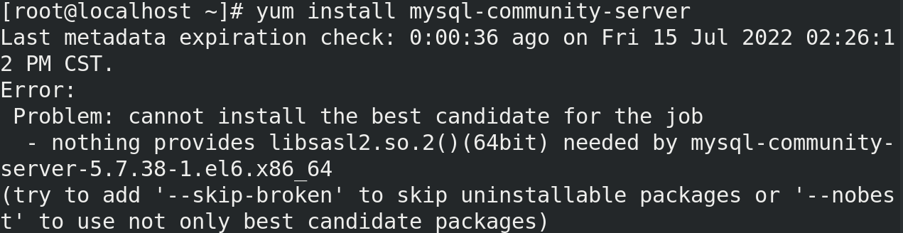

  编辑vim /etc/yum.repos.d/mysql-community.repo

  把http://repo.mysql.com/yum/mysql-5.7-community/el/7/$basearch里面的**6**改成**7**就可以了

  

  

  注意：官方默认的gpgkey已经失效.所以mysql5.7的仓库配置文件如下,即最终修改后的配置文件如下
  
  ```bash
  [mysql57-community]
  name=MySQL 5.7 Community Server
  baseurl=http://repo.mysql.com/yum/mysql-5.7-community/el/7/$basearch/
  enabled=1
  gpgcheck=1
  gpgkey=file:///etc/pki/rpm-gpg/RPM-GPG-KEY-mysql-2022
         file:///etc/pki/rpm-gpg/RPM-GPG-KEY-mysql
  
  ```


# 15. 服务控制

- systemctl   statuts  服务名    （查看服务状态）
- systemctl 　start　　服务名　（启动服务）
- systemctl   enable   服务名    （设置服务的开机自启）
- systemctl   restart   服务名   （重启服务）
- systemctl  stop    服务名      （停止服务）
- systemctl   disable  服务名   （取消服务的开机自启）


## 1. 安装httpd软件，并启动和设置该服务开机自启。

然后打开浏览器，输入localhost:80 截图

```bash
[root@localhost ~]#  yum install httpd
Last metadata expiration check: 0:35:38 ago on Fri 15 Jul 2022 02:44:04 PM CST.
Package httpd-2.4.37-39.module+el8.4.0+571+fd70afb1.x86_64 is already installed.
Dependencies resolved.
Nothing to do.
Complete!
[root@localhost ~]# systemctl enable httpd
Created symlink /etc/systemd/system/multi-user.target.wants/httpd.service → /usr/lib/systemd/system/httpd.service.
[root@localhost ~]# systemctl start httpd
[root@localhost ~]# systemctl status httpd

```

- 在火狐浏览器中，输入www.baidu.com

- 网页空白处，右击，点击view  page  source，然后ctrl  a选中所有，右击复制

- 返回终端  编辑vim   /var/www/html/index.html

  按i进入编辑界面后，将刚刚复制的源码进行粘贴

- 在编辑模式下按esc，返回命令模式。然后输入：进入底行命令模式

  :%s/替换的对象/替换后的内容/g

  完成后，保存退出

- 替换完成后，然后再网页上输入当前运行http服务器主机ip即可（或者输入127.0.0.1或localhost）


# 16 . 防火墙

补充：

nat模式下，虚拟机和windows系统如果无法互相拼通，怎么解决。

- linux能不能访问外网

- linux可以访问外网，但是Linux无法和windows拼通

  - 检查windows网络适配器中VMnet8这张网卡的ip地址和Linux系统地址是不是同一网段下，如果不是，禁用，然后再启动一下
  - 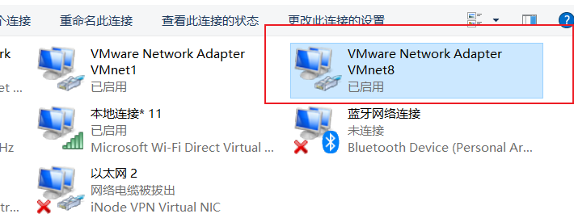

  

  


## 16.1 防火墙的作用

对主机外部的流量进行拦截（限制是否开放从主机外想要访问主机内部**指定端口**，从而限制流量的访问）

- ip可以找到对应主机，但问题是主机中同一网线内的流量不是同一应用上，不同应用的流量就通过端口来进行划分。

比如：http ------> 80

​		   ssh------->22

- 关闭防火墙
  systemctl stop firewalld.service 

- 启动防火墙（操作并截图）

   systemctl start  firewalld.service 


## 16.2 查看防火墙中的信息

```bash
[root@localhost ~]# firewall-cmd --list-all
public (active)
  target: default
  icmp-block-inversion: no
  interfaces: ens160
  sources: 
  services: cockpit dhcpv6-client ssh
  ports: 
  protocols: 
  masquerade: no
  forward-ports: 
  source-ports: 
  icmp-blocks: 
  rich rules: 

```


## 16.3 防火墙端口设置

### 16.3.1开放防护墙端口

- **firewall-cmd --permanent --add-port=端口号/协议类型**  
- firewall-cmd --reload 

```bash
[root@localhost ~]# firewall-cmd --permanent --add-port=80/tcp  
success
[root@localhost ~]# firewall-cmd --reload 
success
[root@localhost ~]# firewall-cmd --list-all
public (active)
  target: default
  icmp-block-inversion: no
  interfaces: ens160
  sources: 
  services: cockpit dhcpv6-client ssh
  ports: 80/tcp
  protocols: 
  masquerade: no
  forward-ports: 
  source-ports: 
  icmp-blocks: 
  rich rules: 
```


### 16.3.2 删除指定端口

- **firewall-cmd --permanent  --remove-port=端口号/协议类型** 
- firewall-cmd --reload 

```bash
[root@localhost ~]# firewall-cmd --permanent  --remove-port=80/tcp 
success
[root@localhost ~]# firewall-cmd --reload 
success
[root@localhost ~]# firewall-cmd --list-all
public (active)
  target: default
  icmp-block-inversion: no
  interfaces: ens160
  sources: 
  services: cockpit dhcpv6-client ssh
  ports: 
  protocols: 
  masquerade: no
  forward-ports: 
  source-ports: 
  icmp-blocks: 
  rich rules: 

```


## 16.4 防火墙对于服务的管理

### 16.4.1 开放指定服务

-  **firewall-cmd --permanent --add-service=服务名**
- firewall-cmd --reload 

```bash
[root@localhost ~]# firewall-cmd --permanent --add-service=http 
success
[root@localhost ~]# firewall-cmd --reload 
success
[root@localhost ~]# firewall-cmd --list-all
public (active)
  target: default
  icmp-block-inversion: no
  interfaces: ens160
  sources: 
  services: cockpit dhcpv6-client http ssh
  ports: 
  protocols: 
  masquerade: no
  forward-ports: 
  source-ports: 
  icmp-blocks: 
  rich rules: 

```


## 16.4.2 防火墙删除指定服务

- **firewall-cmd  --permanent --remove-service=服务名**
- firewall-cmd --reload

```bash
[root@localhost ~]# firewall-cmd  --permanent --remove-service=http
Warning: NOT_ENABLED: http
success
[root@localhost ~]# firewall-cmd --reload 
success
[root@localhost ~]# firewall-cmd --list-all
public (active)
  target: default
  icmp-block-inversion: no
  interfaces: ens160
  sources: 
  services: cockpit dhcpv6-client ssh
  ports: 
  protocols: 
  masquerade: no
  forward-ports: 
  source-ports: 
  icmp-blocks: 
  rich rules: 
```


# 17. selinux

​      作用： 通过对软件进程限制某些权限，从而保证系统的安全。例如：通过上下文类型和设定好的上下文类型是否一致，如果一致，那么软件就可以进行后续的操作，比如：访问文件中的数据，或者让软件可以使用该端口。

​	注意：selinux的功能有点类似360安全管家，但是它不能完全代替防火墙，杀毒软件，它的本质是在这些软件的基础上，进一步加强系统对软件的限制，从而保证系统安全。

- selinux对于软件访问文件内容的限制
- selinux设置软件对于端口的访问限制
- 通selinux的策略开放限制某些软件的功能

## 17.1 selinux的三种模式

### 17.1.1 查看selinux模式

查看selinux的当前模式：**getenforce** 

（1）enforcing:  强制模式，selinux处于运行模式：凡是软件违法selinux规则的操作，都会被被禁，而且会被记录下来

（2）Permissive：许可模式，selinux处于运行状态：凡是软件违法selinux规则的操作，不会被禁止，但是会被记录下来

（3）disabled: 禁用模式,selinux处于关闭状态，凡是违反selinux规则的操作，不会被禁止，也不会被记录。


### 17.1.2 修改selinux模式

（1）临时修改（临时生效，系统一旦重启失效）

setenforce   模式 （1代表Enforcing,0代表Permissvie）

(2) 永久修改

（凡是看到永久生效，大概率都是要修改某一个配置文件，然后让系统再启动过程中加载该文件中的配置信息并生效。）

```bash
[root@localhost ~]# vim  /etc/selinux/config

#     permissive - SELinux prints warnings instead of enforcing.
#     disabled - No SELinux policy is loaded.
#在SELINUX=后加上指定的模式
SELINUX=permissive
# SELINUXTYPE= can take one of these three values:
#     tar
```

注意： 一般情况下，如果修改永久生效，那么临时生效也要做。


## 17.2 selinux的权限设置

### 17.2.1 文件限制

- selinux对于软件访问文件内容的限制

作用: 通过比较文件上的selinux的上下文类型是否和设定好的正确的默认上下文是否一致，如果一致可以访问文件内容，如果不一致，那么就不能访问。

（1）文件本身上下文类型查看  

- **ls  -Z** (如果查看目录本身的话，需要加上-d)

  ```bash
  [root@localhost html]# ls -Z  
  unconfined_u:object_r:httpd_sys_content_t:s0 1.html
  
  ```

  - httpd_sys_content_t 重点比较这一字段的信息（上下文类型）是否和默认上下文一致

（2）查看文件默认上下文：

注意: 默认上下文首先要检查是否正确，然后就是比较文件本身的上下文是否和默认上下文一致（这也是修改上下文的目的）。

- **semanage fcontext -l**  （查看已设定的默认上下文）

```bash
[root@localhost html]# semanage fcontext -l | grep "/var/www"
/var/www(/.*)?                                     all files          system_u:object_r:httpd_sys_content_t:s0 

```

（3）修改文件的上下文（将文件的上下文重置为默认上下文）

- restorecon -Rv   文件路径  


（4）默认上下文本身就有问题

​	假如默认上下文本身的就是错误，那么就需要手动去修改默认上下文。

1. 修改默认上下文

注意：要学会查看man手册中的案例 

man semanage-fcontext，进入手册后/EXAMPLE

- **semanage fcontext -a -t httpd_sys_content_t "/var/www/html(/.*)?"**
  - -a  添加 ，-m 修改，-t指明修改的是上下文类型，-d 删除
  - 注意：如果修改的对象路径是一个目录的话，那么要加上(/.*)？代表设定该目录下所有文件默认上下文

```bash
# 将/var/www/html目录下文件默认上下文故意改成错误的
[root@localhost html]# semanage fcontext -a -t admin_home_t  "/var/www/html(/.*)?"
[root@localhost html]# semanage fcontext -l | grep "/var/www/html"
/var/www/html(/.*)?                                all files          system_u:object_r:admin_home_t:s0

# 将错误上下文改为正确的
[root@localhost html]# man semanage-fcontext 
[root@localhost html]# semanage fcontext -a -t httpd_sys_content_t "/var/www/html(/.*)?"
ValueError: File context for /var/www/html(/.*)? already defined
[root@localhost html]# semanage fcontext -m -t httpd_sys_content_t "/var/www/html(/.*)?"
[root@localhost html]# restorecon -Rv *
Relabeled /var/www/html/1.html from unconfined_u:object_r:admin_home_t:s0 to unconfined_u:object_r:httpd_sys_content_t:s0
Relabeled /var/www/html/2.html from unconfined_u:object_r:admin_home_t:s0 to unconfined_u:object_r:httpd_sys_content_t:s0
Relabeled /var/www/html/index.html from unconfined_u:object_r:admin_home_t:s0 to unconfined_u:object_r:httpd_sys_content_t:s0
[root@localhost html]# ls -Z 
unconfined_u:object_r:httpd_sys_content_t:s0 1.html
unconfined_u:object_r:httpd_sys_content_t:s0 2.html
unconfined_u:object_r:httpd_sys_content_t:s0 index.html

```

修改/var/www/html的默认上下文为admin_home_t，然后再enforcing模式下，查看是否可以访问对应的网页，如果不行，请重新将/var/www/html默认上下文设定成正确默认上下文，保证可以正常访问网页。（做一遍，然后截图）


- selinux设置软件对于端口的访问限制

  如何修改httpd的默认端口

  vim /etc/httpd/conf/httpd.conf

```bash
#Listen 12.34.56.78:80
#Listen 80
Listen 8888

root@localhost ~]# systemctl restart httpd
Job for httpd.service failed because the control process exited with error code.
See "systemctl status httpd.service" and "journalctl -xe" for details.

# 此处由于selinux没有给httpd开放8888端口的许可，导致无法正常启动
```


（1）查看selinux默认开放端口

通过给指定端口加上上下文类型，从而限制软件能够使用端口，防止软件偷偷使用非指定的端口。

- **semanage port  -l**   (列出selinux所有的端口信息)

```bash
[root@localhost ~]# semanage port  -l  | grep http
http_cache_port_t              tcp      8080, 8118, 8123, 10001-10010
http_cache_port_t              udp      3130
http_port_t                    tcp      80, 81, 443, 488, 8008, 8009, 8443, 9000
pegasus_http_port_t            tcp      5988
pegasus_https_port_t           tcp      5989
```

(2) 给指定端口加上上下文类型

 man semanage-port 

/EXAMPLE 找到相关的例子

- semanage port -a -t http_port_t -p tcp 81
  - -a 添加
  - -t 端口上下文类型
  - -p 协议 （后面加协议和端口名）


```bash
EXAMPLE
       List all port definitions
       # semanage port -l
       Allow Apache to listen on tcp port 81
       # semanage port -a -t http_port_t -p tcp 81
       Allow sshd to listen on tcp port 8991
       # semanage port -a -t ssh_port_t -p tcp 8991

```

题目： 参考man手册中的例子，将8888端口加上http_port_t类型，从而保证http服务正常启动，且可以通过浏览器访问网页。（截图）

#**请让windows中的浏览器也可以访问该页面**

3分钟，完成后提供window页面的截图

```bash

[root@localhost ~]# firewall-cmd --permanent --add-port=8888/tcp
success
[root@localhost ~]# firewall-cmd --reload 
success

```


(3) 通过selinux的策略限制软件的某些功能

查看selinux由哪些策略

- semanage boolean  -l

修改selinux策略的布尔值

- semanage boolean -m --on 策略名
  - -m  修改
  - --on   开启 --off关闭

```bash
[root@localhost ~]# man semanage-boolean

# /EXAMPLE
EXAMPLE
       Turn on the apache can send mail boolan
       # semanage boolean -m --on httpd_can_sendmail


[root@localhost ~]# semanage boolean  -l  | grep httpd_can_connect_ftp
httpd_can_connect_ftp          (off  ,  off)  Allow httpd to can connect ftp
[root@localhost ~]# semanage boolean -m --on httpd_can_connect_ftp
[root@localhost ~]# semanage boolean  -l  | grep httpd_can_connect_ftp
httpd_can_connect_ftp          (on   ,   on)  Allow httpd to can connect ftp
[root@localhost ~]# semanage boolean -m --off httpd_can_connect_ftp

```


# 18. 时间同步

作用：在集群中下发命令时，如果每一台主机的时间不一致，那么命令就不能同一执行，从而导致问题，那么就需要时间同步来进行校准。

（1）查看时间同步服务是否开放

```bash
[root@localhost ~]# systemctl status chronyd.service 
● chronyd.service - NTP client/server
   Loaded: loaded (/usr/lib/systemd/system/chronyd.service; enabled; vendor preset>
   Active: active (running) since Sat 2022-07-16 09:23:35 CST; 5h 52min ago
     Docs: man:chronyd(8)
```

- 如果服务没有启动的，使用systemctl start chronyd.service
- 并设置服务的开机自启，systemctl enable chronyd.service


（2）修改配置文件，指明校时的服务器地址

```bash
[root@localhost ~]# vim /etc/chrony.conf 

# Please consider joining the pool (http://www.pool.ntp.org/join.html).
# pool 2.pool.ntp.org iburst
server ntp.aliyun.com iburst
# 指明服务器的地址，并立即生效

# 修改完配置后，重启服务。
[root@localhost ~]# systemctl restart chronyd.service 
[root@localhost ~]# 

# 检查ntp服务器是否生效 ^代表正在使用的，* 连通正常
[root@localhost ~]# chronyc  sources
210 Number of sources = 1
MS Name/IP address         Stratum Poll Reach LastRx Last sample               
===============================================================================
^* 203.107.6.88                  2   6    17    25   -312us[-3888us] +/-   22ms
[root@localhost ~]# ping ntp.aliyun.com
PING ntp.aliyun.com (203.107.6.88) 56(84) bytes of data.
64 bytes from 203.107.6.88 (203.107.6.88): icmp_seq=1 ttl=128 time=27.5 ms
^C
--- ntp.aliyun.com ping statistics ---
1 packets transmitted, 1 received, 0% packet loss, time 0ms
rtt min/avg/max/mdev = 27.485/27.485/27.485/0.000 ms

```

- date 命令可以查看时间
- date -s 可以修改时间

```bash
[root@localhost ~]# date
Sat Jul 16 15:22:35 CST 2022
[root@localhost ~]# date -s 16:22
Sat Jul 16 16:22:00 CST 2022
[root@localhost ~]# systemctl restart chronyd.service 
[root@localhost ~]# date
Sat Jul 16 15:24:38 CST 2022
[root@localhost ~]# 
```


将ntp服务器修改为ntp.aliyun.com，完成后截图


## 题目

将系统直接快照重置，然后搭建本地yum仓库，部署安装httpd软件，要求如下：

-  httpd服务使用的监听端口为8899

- 保证外部的windows浏览器可以访问httpd服务器页面

- selinux和防火墙都是开启状态。

- 从当前用户的家目录创建文件index.html,写入hello word，然后移动至/var/www/html目录下，最终可以保证可以正常访问该页面。

  

1. 搭建本地yum仓库，并安装httpd

```bash
[root@localhost ~]# cd /etc/yum.repos.d/
[root@localhost yum.repos.d]# ls
Rocky-AppStream.repo
Rocky-BaseOS.repo
Rocky-Devel.repo
Rocky-Extras.repo
Rocky-HighAvailability.repo
Rocky-Media.repo
Rocky-Plus.repo
Rocky-PowerTools.repo
Rocky-ResilientStorage.repo
Rocky-RT.repo
Rocky-Sources.repo

[root@localhost yum.repos.d]# ls
Rocky-AppStream.repo
Rocky-BaseOS.repo
Rocky-Devel.repo
Rocky-Extras.repo
Rocky-HighAvailability.repo
Rocky-Media.repo
Rocky-Plus.repo
Rocky-PowerTools.repo
Rocky-ResilientStorage.repo
Rocky-RT.repo
Rocky-Sources.repo
[root@localhost yum.repos.d]# mkdir Rocky_bak
[root@localhost yum.repos.d]# mv *.repo   Rocky_bak/

[root@localhost yum.repos.d]# ls
Rocky_bak
[root@localhost yum.repos.d]# lsblk 
NAME        MAJ:MIN RM  SIZE RO TYPE MOUNTPOINT
sr0          11:0    1  9.2G  0 rom  /run/media/root/Rocky-8-4-x86_64-dvd
nvme0n1     259:0    0   20G  0 disk 
├─nvme0n1p1 259:1    0    1G  0 part /boot
└─nvme0n1p2 259:2    0   19G  0 part 
  ├─rl-root 253:0    0   17G  0 lvm  /
  └─rl-swap 253:1    0    2G  0 lvm  [SWAP]
[root@localhost yum.repos.d]# cd /run/media/root/Rocky-8-4-x86_64-dvd
[root@localhost Rocky-8-4-x86_64-dvd]# ls
AppStream  BaseOS  EFI  images  isolinux  LICENSE  media.repo  TRANS.TBL
[root@localhost Rocky-8-4-x86_64-dvd]# cd /etc/yum.repos.d/
[root@localhost yum.repos.d]# vim local.repo
[root@localhost ~]# cat /etc/yum.repos.d/local.repo 
[BaseOS]
name=baseos
baseurl=file:///run/media/root/Rocky-8-4-x86_64-dvd/BaseOS
enabled=1
gpgcheck=0


[AppStream]
name=appstream
baseurl=file:///run/media/root/Rocky-8-4-x86_64-dvd/AppStream
enabled=1
gpgcheck=0


[root@localhost yum.repos.d]# yum clean  all
0 files removed
[root@localhost yum.repos.d]# yum makecache 
baseos                                                                   304 MB/s | 2.5 MB     00:00    
appstream                                                                295 MB/s | 7.1 MB     00:00    
Last metadata expiration check: 0:00:01 ago on Mon 18 Jul 2022 09:56:08 AM CST.
Metadata cache created.
[root@localhost yum.repos.d]# yum install -y httpd
Last metadata expiration check: 0:00:17 ago on Mon 18 Jul 2022 09:56:08 AM CST.
Dependencies resolved.
=========================================================================================================
 Package                 Architecture Version                                      Repository       Size
=========================================================================================================
Installing:
 httpd                   x86_64       2.4.37-39.module+el8.4.0+571+fd70afb1        AppStream       1.4 M
Installing dependencies:
 apr                     x86_64       1.6.3-11.el8.1                               AppStream       124 k
 apr-util                x86_64       1.6.1-6.el8.1                                AppStream       104 k
 httpd-filesystem        noarch       2.4.37-39.module+el8.4.0+571+fd70afb1        AppStream        37 k
 httpd-tools             x86_64       2.4.37-39.module+el8.4.0+571+fd70afb1        AppStream       105 k
 mod_http2               x86_64       1.15.7-3.module+el8.4.0+553+7a69454b         AppStream       153 k
 rocky-logos-httpd       noarch       84.5-7.el8                                   BaseOS           22 k
Installing weak dependencies:
 apr-util-bdb            x86_64       1.6.1-6.el8.1                                AppStream        23 k
 apr-util-openssl        x86_64       1.6.1-6.el8.1                                AppStream        26 k
Enabling module streams:
 httpd                                2.4                                                               

Transaction Summary
=========================================================================================================
Install  9 Packages

Total size: 2.0 M
Installed size: 5.4 M
Downloading Packages:
Running transaction check
Transaction check succeeded.
Running transaction test
Transaction test succeeded.
Running transaction
  Preparing        :                                                                                 1/1 
  Installing       : apr-1.6.3-11.el8.1.x86_64                                                       1/9 
  Running scriptlet: apr-1.6.3-11.el8.1.x86_64                                                       1/9 
  Installing       : apr-util-bdb-1.6.1-6.el8.1.x86_64                                               2/9 
  Installing       : apr-util-openssl-1.6.1-6.el8.1.x86_64                                           3/9 
  Installing       : apr-util-1.6.1-6.el8.1.x86_64                                                   4/9 
  Running scriptlet: apr-util-1.6.1-6.el8.1.x86_64                                                   4/9 
  Installing       : httpd-tools-2.4.37-39.module+el8.4.0+571+fd70afb1.x86_64                        5/9 
  Running scriptlet: httpd-filesystem-2.4.37-39.module+el8.4.0+571+fd70afb1.noarch                   6/9 
  Installing       : httpd-filesystem-2.4.37-39.module+el8.4.0+571+fd70afb1.noarch                   6/9 
  Installing       : rocky-logos-httpd-84.5-7.el8.noarch                                             7/9 
  Installing       : mod_http2-1.15.7-3.module+el8.4.0+553+7a69454b.x86_64                           8/9 
  Installing       : httpd-2.4.37-39.module+el8.4.0+571+fd70afb1.x86_64                              9/9 
  Running scriptlet: httpd-2.4.37-39.module+el8.4.0+571+fd70afb1.x86_64                              9/9 
  Verifying        : rocky-logos-httpd-84.5-7.el8.noarch                                             1/9 
  Verifying        : apr-1.6.3-11.el8.1.x86_64                                                       2/9 
  Verifying        : apr-util-1.6.1-6.el8.1.x86_64                                                   3/9 
  Verifying        : apr-util-bdb-1.6.1-6.el8.1.x86_64                                               4/9 
  Verifying        : apr-util-openssl-1.6.1-6.el8.1.x86_64                                           5/9 
  Verifying        : httpd-2.4.37-39.module+el8.4.0+571+fd70afb1.x86_64                              6/9 
  Verifying        : httpd-filesystem-2.4.37-39.module+el8.4.0+571+fd70afb1.noarch                   7/9 
  Verifying        : httpd-tools-2.4.37-39.module+el8.4.0+571+fd70afb1.x86_64                        8/9 
  Verifying        : mod_http2-1.15.7-3.module+el8.4.0+553+7a69454b.x86_64                           9/9 
Installed products updated.

Installed:
  apr-1.6.3-11.el8.1.x86_64                                                                              
  apr-util-1.6.1-6.el8.1.x86_64                                                                          
  apr-util-bdb-1.6.1-6.el8.1.x86_64                                                                      
  apr-util-openssl-1.6.1-6.el8.1.x86_64                                                                  
  httpd-2.4.37-39.module+el8.4.0+571+fd70afb1.x86_64                                                     
  httpd-filesystem-2.4.37-39.module+el8.4.0+571+fd70afb1.noarch                                          
  httpd-tools-2.4.37-39.module+el8.4.0+571+fd70afb1.x86_64                                               
  mod_http2-1.15.7-3.module+el8.4.0+553+7a69454b.x86_64                                                  
  rocky-logos-httpd-84.5-7.el8.noarch                                                                   

Complete!


```


2. 检查防火墙和selinux的环境

   ```bash
   [root@localhost yum.repos.d]# cd 
   [root@localhost ~]# systemctl status firewalld.service 
   ● firewalld.service - firewalld - dynamic firewall d>
      Loaded: loaded (/usr/lib/systemd/system/firewalld>
      Active: active (running) since Mon 2022-07-18 09:>
        Docs: man:firewalld(1)
    Main PID: 1072 (firewalld)
       Tasks: 2 (limit: 11079)
      Memory: 10.9M
      CGroup: /system.slice/firewalld.service
              └─1072 /usr/libexec/platform-python -s /u>
   
   Jul 18 09:50:46 localhost.localdomain systemd[1]: St>
   Jul 18 09:50:47 localhost.localdomain systemd[1]: St>
   Jul 18 09:50:47 localhost.localdomain firewalld[1072>
   [root@localhost ~]# getenforce 
   Enforcing
   
   ```

   

4. 编辑httpd配置文件，selinux开放8899端口

  ```bash
  [root@localhost ~]# vim /etc/httpd/conf/httpd.conf 
  [root@localhost ~]# cat  /etc/httpd/conf/httpd.conf  | grep 8899
  Listen 8899
  [root@localhost ~]# systemctl restart httpd
  Job for httpd.service failed because the control process exited with error code.
  See "systemctl status httpd.service" and "journalctl -xe" for details.
  [root@localhost ~]# man semanage-port 
  [root@localhost ~]# semanage port -a -t http_port_t -p tcp 8899
  [root@localhost ~]# semanage port -l | grep http
  http_cache_port_t              tcp      8080, 8118, 8123, 10001-10010
  http_cache_port_t              udp      3130
  http_port_t                    tcp      8899, 80, 81, 443, 488, 8008, 8009, 8443, 9000
  pegasus_http_port_t            tcp      5988
  pegasus_https_port_t           tcp      5989
  
  ```

5. 启动httpd

```bash
[root@localhost ~]# systemctl start httpd
[root@localhost ~]# systemctl status  httpd
● httpd.service - The Apache HTTP Server
   Loaded: loaded (/usr/lib/systemd/system/httpd.ser>
   Active: active (running) since Mon 2022-07-18 10:>
     Docs: man:httpd.service(8)
 Main PID: 33269 (httpd)
   Status: "Started, listening on: port 8899"

```


6. 编辑移动index.hml(并重置上下文类型)

  ```bash
  [root@localhost ~]# vim index.html
  [root@localhost ~]# vim index.html
  [root@localhost ~]# cat index.html 
  hello world
  [root@localhost ~]# mv index.html /var/www/html/
  [root@localhost ~]# cd /var/www/html/
  [root@localhost html]# ls -Z
  unconfined_u:object_r:admin_home_t:s0 index.html
  [root@localhost html]# restorecon -Rv *
  Relabeled /var/www/html/index.html from unconfined_u:object_r:admin_home_t:s0 to unconfined_u:object_r:httpd_sys_content_t:s0
  [root@localhost html]# 
  ```


7. 配置防火墙

```bash
[root@localhost ~]# firewall-cmd --permanent --add-port=8899/tcp
success
[root@localhost ~]# firewall-cmd --reload 
success
[root@localhost ~]# firewall-cmd --list-all
public (active)
  target: default
  icmp-block-inversion: no
  interfaces: ens160
  sources: 
  services: cockpit dhcpv6-client ssh
  ports: 8899/tcp
  protocols: 
  masquerade: no
  forward-ports: 
  source-ports: 
  icmp-blocks: 
  rich rules: 
[root@localhost ~]# ip addr
1: lo: <LOOPBACK,UP,LOWER_UP> mtu 65536 qdisc noqueue state UNKNOWN group default qlen 1000
    link/loopback 00:00:00:00:00:00 brd 00:00:00:00:00:00
    inet 127.0.0.1/8 scope host lo
       valid_lft forever preferred_lft forever
    inet6 ::1/128 scope host 
       valid_lft forever preferred_lft forever
2: ens160: <BROADCAST,MULTICAST,UP,LOWER_UP> mtu 1500 qdisc mq state UP group default qlen 1000
    link/ether 00:0c:29:28:b0:2e brd ff:ff:ff:ff:ff:ff
    inet 192.168.182.135/24 brd 192.168.182.255 scope global dynamic noprefixroute ens160
       valid_lft 1383sec preferred_lft 1383sec
    inet6 fe80::20c:29ff:fe28:b02e/64 scope link noprefixroute 
       valid_lft forever preferred_lft forever
```


# 19. 硬盘管理

- 磁盘的作用：用来存储和读取数据。
- 磁盘中的最小存储单位叫做扇区（大小为512字节）。
- 磁盘管理中主要由4个步骤组成（1.添加磁盘---->2.分区---->3.格式化------>4.挂载）

## 19.1 添加硬盘

（1）关机

（2）编辑虚拟机设置

（3）添加

（4）添加硬盘--->下一步（操作默认下一步，然后再选择磁盘大小时，最大磁盘大小进行修改为30G）---->下一步----->完成

（5）确定

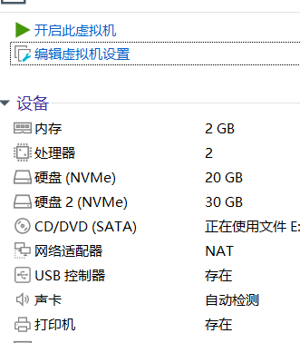


打开终端后，执行lsblk查看硬盘情况（并截图）

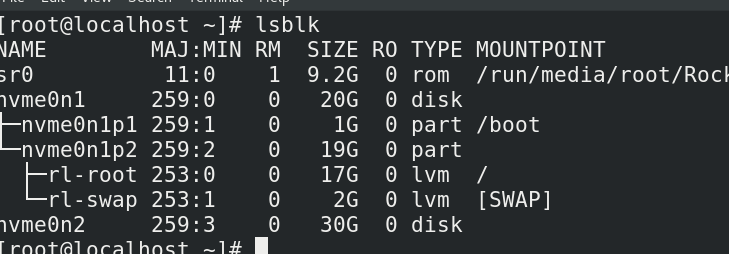


## 19.2 分区

分区：1.便于数据的管理   2. 提高数据的安全性。

在linux中如何给磁盘进行分区？

fdisk  -------->   默认对应的分区类型为MBR类型分区

MBR类型分区的特点：

- 它是由主分区，扩展分区和逻辑分区构成
- 如果将它全部划分成主分区的话，那么最多只能划分出4个分区。所以一般情况下，都是三个主分区加一个扩展分区，在扩展分区的基础上，划分出逻辑分区，通过这种方式，避免了只能划分4个分区的情况。

命令格式：

​		fdisk   磁盘路径  （/dev/存储设备名）

然后就会进入分区页面

m 寻求帮助

n 添加分区

d 删除分区

p 打印分区表信息

w保存并退出

q直接退出不保存


- 如果都是主分区的的话，那么只能划分4个分区。
- 扩展分区的作用就是用来给逻辑分区划分使用的，所以在指定扩展分区大小时，需要把磁盘剩余空间都给扩展分区。（指定last sectors时，直接回车，把磁盘剩余空间都给它）
- 扩展分区是不能用来存储和读取数据的，所以在对分区进行后续操作（格式化，挂载），不可以对扩展分区进行操作。

fdisk的缺点单个分区的大小不能超过2T


gdisk------->GPT类型的分区，单个分区大小可以达到2PE（2048TB）

注意：GPT类型的分区只有主分区。最多只能划分128个主分区。

gdisk   磁盘路径  (/dev/存储设备名)

? 查看帮助

n 添加分区

d 删除分区

p 打印分区表信息

w保存并退出

q直接退出不保存


注意：如果对分区进行了修改或者设置，但是lsblk无法看到你做的修改，那么可以使用partprobe 让内核重新读取分区表信息。

补充：如何查看已被分区的磁盘分区表类型。

​			gdisk   磁盘分区路径  （然后就可以在Partition table scan可以查看）


## 19.3 格式化

格式化：就是给分区创建一个文件系统，例如电脑需要操作时，需要安装操作系统，想要更好的管理磁盘分区，那么就需要给他安装文件系统，这个流程也就是我们说的格式化的过程（对文件复制，删除等操作，都是要依赖文件系统才能完成。）

1. mkfs  -t   文件系统类型   分区路径

```bash
[root@localhost ~]#mkfs -t ext4 /dev/nvme0n2p1
```

2. mkfs.文件系统类型    分区路径

```bash
[root@localhost ~]# blkid /dev/nvme0n2p1
```

- 补充：格式化完成后，可以使用**blkid  分区路径**查看格式化是否成功。

```bash
[root@localhost ~]# blkid /dev/nvme0n2p2
/dev/nvme0n2p2: UUID="d3d14d53-d20e-47fd-ac5b-f719b5b7649c" BLOCK_SIZE="512" TYPE="xfs" PARTUUID="dedd3985-02"
```

题目： 将n3（15G）硬盘的第一个分区格式化成ext4类型的分区，完成后blkid截图   

```bash
[root@localhost ~]# mkfs -t ext4 /dev/nvme0n3p1
mke2fs 1.45.6 (20-Mar-2020)
Creating filesystem with 524288 4k blocks and 131072 inodes
Filesystem UUID: 0d88f4fb-67e3-471a-84b1-16dca98fd6fc
Superblock backups stored on blocks: 
	32768, 98304, 163840, 229376, 294912

Allocating group tables: done                            
Writing inode tables: done                            
Creating journal (16384 blocks): done
Writing superblocks and filesystem accounting information: done 

[root@localhost ~]# blkid /dev/nvme0n3p1
/dev/nvme0n3p1: UUID="0d88f4fb-67e3-471a-84b1-16dca98fd6fc" BLOCK_SIZE="4096" TYPE="ext4" PARTLABEL="Linux filesystem" PARTUUID="ac6e4662-1d59-47c9-bb42-fa56e76450fc"
```


## 19.4 挂载

挂载的作用：给分区提供一个入口（也就是目录），可以通过这个入口来对分区中的数据进行读取和存储管理。

1. 创建挂载点，也就创建一个目录

mkdir   目录路径  （一般创建在/mnt目录下）


2. 临时挂载（系统一旦重启，挂载失效）：

mount     格式化后的分区路径         挂载点

```bash
[root@localhost ~]# mkdir /mnt/n2p1
[root@localhost ~]# mount /dev/nvme0n2p1    /mnt/n2p1
[root@localhost ~]# lsblk 
NAME        MAJ:MIN RM  SIZE RO TYPE MOUNTPOINT
sr0          11:0    1  9.2G  0 rom  /run/media/root/Rocky-8-4-x86_64-
nvme0n1     259:0    0   20G  0 disk 
├─nvme0n1p1 259:1    0    1G  0 part /boot
└─nvme0n1p2 259:2    0   19G  0 part 
  ├─rl-root 253:0    0   17G  0 lvm  /
  └─rl-swap 253:1    0    2G  0 lvm  [SWAP]
nvme0n2     259:3    0   30G  0 disk 
├─nvme0n2p1 259:13   0    2G  0 part /mnt/n2p1
├─nvme0n2p2 259:14   0    3G  0 part 

```


- umount   格式化后的的分区路径 （取消挂载）

  补充： 取消挂载后，数据还是在磁盘中，需要重新挂载才能查看到里面的内容。


3. 永久挂载

    **vim  /etc/fstab** 

```bash
# 一行就是一套挂载信息
/dev/mapper/rl-root   /   xfs   defaults   0 0
```

- /dev/mapper/rl-root： 格式化后的分区路径（也可以使用uuid）
- /  :挂载点路径
- xfs:  文件系统类型，blkid可以查看
- defaults：挂载的类型，例如ro，以只读的形式进行挂载，rw读写的形式。
- 0: 是否启用dump备份
- 0: 是否开启磁盘校验

一般情况下，只需要动前面三个参数吗，后面三个defaults 0  0 直接复制就行。

- 补充： 编辑完毕后，使用mount -a来加载/etc/fstab文件，来测试是否永久挂载，注意报错信息，如果出现报错，那么说明fstab中出现了问题，需要进行修改。


题目：在n3磁盘上创建一个4g的分区，然后将其格式化成ext4类型的分区，并将它临时挂载到/mnt/n3p4目录下

```bash
[root@localhost ~]# gdisk /dev/nvme0n3
GPT fdisk (gdisk) version 1.0.3

Partition table scan:
  MBR: protective
  BSD: not present
  APM: not present
  GPT: present

Found valid GPT with protective MBR; using GPT.

Command (? for help): n
Partition number (4-128, default 4): 
First sector (34-31457246, default = 16779264) or {+-}size{KMGTP}: 
Last sector (16779264-31457246, default = 31457246) or {+-}size{KMGTP}: +4G
Current type is 'Linux filesystem'
Hex code or GUID (L to show codes, Enter = 8300): 
Changed type of partition to 'Linux filesystem'

Command (? for help): p
Disk /dev/nvme0n3: 31457280 sectors, 15.0 GiB
Model: VMware Virtual NVMe Disk
Sector size (logical/physical): 512/512 bytes
Disk identifier (GUID): B696CE55-1F3C-4CF3-9930-308DE09B5718
Partition table holds up to 128 entries
Main partition table begins at sector 2 and ends at sector 33
First usable sector is 34, last usable sector is 31457246
Partitions will be aligned on 2048-sector boundaries
Total free space is 6291389 sectors (3.0 GiB)

Number  Start (sector)    End (sector)  Size       Code  Name
   1            2048         4196351   2.0 GiB     8300  Linux filesystem
   2         4196352        10487807   3.0 GiB     8300  Linux filesystem
   3        10487808        16779263   3.0 GiB     8300  Linux filesystem
   4        16779264        25167871   4.0 GiB     8300  Linux filesystem

Command (? for help): w

Final checks complete. About to write GPT data. THIS WILL OVERWRITE EXISTING
PARTITIONS!!

Do you want to proceed? (Y/N): y
OK; writing new GUID partition table (GPT) to /dev/nvme0n3.
The operation has completed successfully.
[root@localhost ~]# lsblk 
NAME        MAJ:MIN RM  SIZE RO TYPE MOUNTPOINT
sr0          11:0    1  9.2G  0 rom  /run/media/root/Rocky-8-4-x86_64-
nvme0n1     259:0    0   20G  0 disk 
├─nvme0n1p1 259:1    0    1G  0 part /boot
└─nvme0n1p2 259:2    0   19G  0 part 
  ├─rl-root 253:0    0   17G  0 lvm  /
  └─rl-swap 253:1    0    2G  0 lvm  [SWAP]
nvme0n2     259:3    0   30G  0 disk 
├─nvme0n2p1 259:13   0    2G  0 part /mnt/n2p1
├─nvme0n2p2 259:14   0    3G  0 part 
├─nvme0n2p3 259:15   0    2G  0 part 
├─nvme0n2p4 259:16   0    1K  0 part 
└─nvme0n2p5 259:17   0    2G  0 part 
nvme0n3     259:9    0   15G  0 disk 
├─nvme0n3p1 259:4    0    2G  0 part 
├─nvme0n3p2 259:5    0    3G  0 part 
├─nvme0n3p3 259:7    0    3G  0 part 
└─nvme0n3p4 259:8    0    4G  0 part 


[root@localhost ~]# mkfs -t ext4 /dev/nvme0n3p4
mke2fs 1.45.6 (20-Mar-2020)
Creating filesystem with 1048576 4k blocks and 262144 inodes
Filesystem UUID: 57f652ae-3841-478c-aa44-0ada9f829ad9
Superblock backups stored on blocks: 
	32768, 98304, 163840, 229376, 294912, 819200, 884736

Allocating group tables: done                            
Writing inode tables: done                            
Creating journal (16384 blocks): done
Writing superblocks and filesystem accounting information: done 

[root@localhost ~]# blkid /dev/nvme0n3p4
/dev/nvme0n3p4: UUID="57f652ae-3841-478c-aa44-0ada9f829ad9" BLOCK_SIZE="4096" TYPE="ext4" PARTLABEL="Linux filesystem" PARTUUID="66948cbd-693d-4a31-ab95-2185b08feab0"
[root@localhost ~]# mkdir /mnt/n3p4
[root@localhost ~]# ls /mnt/
hgfs  n2p1  n3p4
[root@localhost ~]# mount /dev/nvme0n
nvme0n1    nvme0n2    nvme0n2p3  nvme0n3    nvme0n3p3  
nvme0n1p1  nvme0n2p1  nvme0n2p4  nvme0n3p1  nvme0n3p4  
nvme0n1p2  nvme0n2p2  nvme0n2p5  nvme0n3p2  
[root@localhost ~]# mount /dev/nvme0n3
[root@localhost ~]# mount /dev/nvme0n3p4  /mnt/n3p4
[root@localhost ~]# lsblk 
NAME        MAJ:MIN RM  SIZE RO TYPE MOUNTPOINT
sr0          11:0    1  9.2G  0 rom  /run/media/root/Rocky-8-4-x86_64-
nvme0n1     259:0    0   20G  0 disk 
├─nvme0n1p1 259:1    0    1G  0 part /boot
└─nvme0n1p2 259:2    0   19G  0 part 
  ├─rl-root 253:0    0   17G  0 lvm  /
  └─rl-swap 253:1    0    2G  0 lvm  [SWAP]
nvme0n2     259:3    0   30G  0 disk 
├─nvme0n2p1 259:13   0    2G  0 part /mnt/n2p1
├─nvme0n2p2 259:14   0    3G  0 part 
├─nvme0n2p3 259:15   0    2G  0 part 
├─nvme0n2p4 259:16   0    1K  0 part 
└─nvme0n2p5 259:17   0    2G  0 part 
nvme0n3     259:9    0   15G  0 disk 
├─nvme0n3p1 259:4    0    2G  0 part 
├─nvme0n3p2 259:5    0    3G  0 part 
├─nvme0n3p3 259:7    0    3G  0 part 
└─nvme0n3p4 259:8    0    4G  0 part /mnt/n3p4

```


# 20. 重置root密码

参考文档《重置密码.pdf》

剩余时间重置密码多走几遍，然后进行答疑复习。


# 21. 交换分区

交换分区的作用：通过在磁盘中划分出一个专门的分区用于和内存交换数据用。（内存会将不常用和旧的数据存放到交换分区中，从而防止由于内存不够杀死某些进程，或者无法启动软件进程。）


## 21.1 创建交换分区

- 准备一个未被使用的分区（虽然该分区已被格式化，但是该分区没有数据，所以直接可以拿来用）

  ```bash
  [root@localhost ~]# blkid /dev/nvme0n2p1
  /dev/nvme0n2p1: UUID="7d5da11c-5553-4a19-bb08-5815c2b05660" BLOCK_SIZE="4096" TYPE="ext4" PARTUUID="dedd3985-01"
  ```

- 格式化成swap类型

  **mkswap   分区路径**

```bash
[root@localhost ~]# mkswap /dev/nvme0n2p1
mkswap: /dev/nvme0n2p1: warning: wiping old ext4 signature.
Setting up swapspace version 1, size = 2 GiB (2147479552 bytes)
no label, UUID=370a1a4f-c7e6-4610-abfe-6f633d0dac37
[root@localhost ~]# blkid /dev/nvme0n2p1
/dev/nvme0n2p1: UUID="370a1a4f-c7e6-4610-abfe-6f633d0dac37" TYPE="swap" PARTUUID="dedd3985-01"


```

注意： 由于交换分区不是给用户使用，是给内存交换数据用，所以它不需要挂载点。


- 在/etc/fstab文件中编辑

```bash
[root@localhost ~]# vim /etc/fstab 
[root@localhost ~]# cat /etc/fstab 

#
# /etc/fstab
# Created by anaconda on Wed Jul  6 06:21:03 2022
#
# Accessible filesystems, by reference, are maintained under '/dev/disk/'.
# See man pages fstab(5), findfs(8), mount(8) and/or blkid(8) for more info.
#
# After editing this file, run 'systemctl daemon-reload' to update systemd
# units generated from this file.
#
/dev/mapper/rl-root     /                       xfs     defaults        0 0
UUID=c619147e-cd59-426a-97bd-a825ef8f9b3e /boot                   xfs     defaults        0 0
/dev/mapper/rl-swap     none                    swap    defaults        0 0
/dev/nvme0n3p4    /mnt/n3p4       ext4    defaults        0 0
/dev/nvme0n2p1     none                    swap    defaults        0 0

```

- 激活交换分区

swapon   分区路径

```bash
[root@localhost ~]# swapon  /dev/nvme0n2p1 
[root@localhost ~]# lsblk 
NAME        MAJ:MIN RM  SIZE RO TYPE MOUNTPOINT
sr0          11:0    1  9.2G  0 rom  /run/media/root/Roc
nvme0n1     259:0    0   20G  0 disk 
├─nvme0n1p1 259:1    0    1G  0 part /boot
└─nvme0n1p2 259:2    0   19G  0 part 
  ├─rl-root 253:0    0   17G  0 lvm  /
  └─rl-swap 253:1    0    2G  0 lvm  [SWAP]
nvme0n2     259:3    0   30G  0 disk 
├─nvme0n2p1 259:4    0    2G  0 part [SWAP]
├─nvme0n2p2 259:5    0    3G  0 part 
```

- swapon  -s  (查看正在使用中的交换分区)
- swapoff  交换分区路径  （关闭交换分区的使用。）


题目： 修改/dev/sr0的挂载点，要求将它永久挂载到/mnt/packages中（完成后截图）

10点15继续

1.  创建挂载点
2. 取消/dev/sr0的挂载
3. vim  /etc/fstab     (blkid /dev/sr0)

```bash
[root@localhost ~]# mkdir /mnt/packages
[root@localhost ~]# ls /mnt/
hgfs  n2p1  n3p4  packages
[root@localhost ~]# lsblk 
NAME        MAJ:MIN RM  SIZE RO TYPE MOUNTPOINT
sr0          11:0    1  9.2G  0 rom  /run/media/root/Roc
nvme0n1     259:0    0   20G  0 disk 
├─nvme0n1p1 259:1    0    1G  0 part /boot
└─nvme0n1p2 259:2    0   19G  0 part 
  ├─rl-root 253:0    0   17G  0 lvm  /
  └─rl-swap 253:1    0    2G  0 lvm  [SWAP]
nvme0n2     259:3    0   30G  0 disk 
├─nvme0n2p1 259:4    0    2G  0 part [SWAP]
├─nvme0n2p2 259:5    0    3G  0 part 
├─nvme0n2p3 259:6    0    2G  0 part 
├─nvme0n2p4 259:7    0    1K  0 part 
└─nvme0n2p5 259:8    0    2G  0 part 
nvme0n3     259:9    0   15G  0 disk 
├─nvme0n3p1 259:10   0    2G  0 part 
├─nvme0n3p2 259:11   0    3G  0 part 
├─nvme0n3p3 259:12   0    3G  0 part 
└─nvme0n3p4 259:13   0    4G  0 part /mnt/n3p4
[root@localhost ~]# umount /dev/sr0 
[root@localhost ~]# lsblk 
NAME        MAJ:MIN RM  SIZE RO TYPE MOUNTPOINT
sr0          11:0    1  9.2G  0 rom  
nvme0n1     259:0    0   20G  0 disk 
├─nvme0n1p1 259:1    0    1G  0 part /boot
└─nvme0n1p2 259:2    0   19G  0 part 
  ├─rl-root 253:0    0   17G  0 lvm  /
  └─rl-swap 253:1    0    2G  0 lvm  [SWAP]
nvme0n2     259:3    0   30G  0 disk 
├─nvme0n2p1 259:4    0    2G  0 part [SWAP]
├─nvme0n2p2 259:5    0    3G  0 part 
├─nvme0n2p3 259:6    0    2G  0 part 
├─nvme0n2p4 259:7    0    1K  0 part 
└─nvme0n2p5 259:8    0    2G  0 part 
nvme0n3     259:9    0   15G  0 disk 
├─nvme0n3p1 259:10   0    2G  0 part 
├─nvme0n3p2 259:11   0    3G  0 part 
├─nvme0n3p3 259:12   0    3G  0 part 
└─nvme0n3p4 259:13   0    4G  0 part /mnt/n3p4
[root@localhost ~]# vim /etc/fstab 
[root@localhost ~]# cat /etc/fstab 
#
# /etc/fstab
# Created by anaconda on Wed Jul  6 06:21:03 2022
#
# Accessible filesystems, by reference, are maintained under '/dev/disk/'.
# See man pages fstab(5), findfs(8), mount(8) and/or blkid(8) for more info.
#
# After editing this file, run 'systemctl daemon-reload' to update systemd
# units generated from this file.
#
/dev/mapper/rl-root     /                       xfs     defaults        0 0
UUID=c619147e-cd59-426a-97bd-a825ef8f9b3e /boot                   xfs     defaults        0 0
/dev/mapper/rl-swap     none                    swap    defaults        0 0
/dev/nvme0n3p4    /mnt/n3p4       ext4    defaults        0 0
/dev/nvme0n2p1     none                    swap    defaults        0 0
/dev/sr0      /mnt/packages      iso9660     defaults  0 0 


[root@localhost ~]# mount -a
mount: /mnt/packages: WARNING: device write-protected, mounted read-only.
[root@localhost ~]# lsblk 
NAME        MAJ:MIN RM  SIZE RO TYPE MOUNTPOINT
sr0          11:0    1  9.2G  0 rom  /mnt/packages

```


题目： 将yum仓库源中的配置修改正确（然后提供下方2条命令的截图）

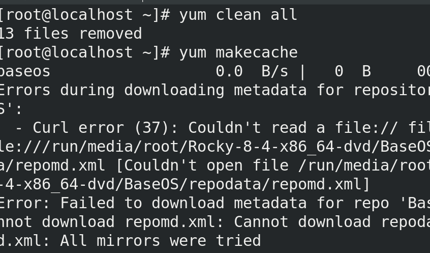


# 22. 逻辑卷(LVM)

为什么要有逻辑卷技术？

- 逻辑卷可以将多个磁盘或者分区从逻辑上整合成一块更大的磁盘，也就是卷组
- 使用普通分区时，如果分区的空间被使用完了，是没有办法实现在线的扩容，而逻辑卷技术就可以实现在线的扩容。

## 22.1 逻辑卷组件介绍

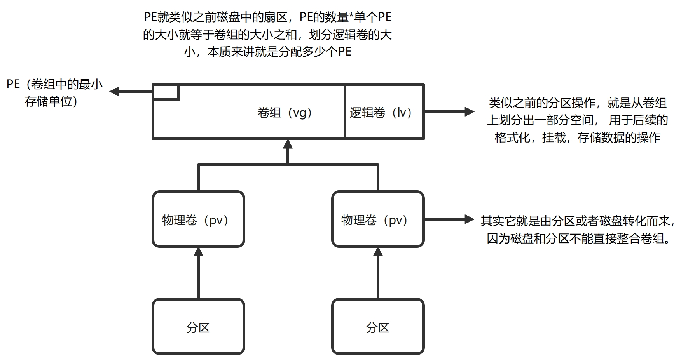


| 简称 | 全称   | 作用                                                         |
| ---- | ------ | ------------------------------------------------------------ |
| PV   | 物理卷 | 指的就是一个物理磁盘或者分区：在整合成卷组之前，必须先转化成物理卷 |
| VG   | 卷组   | 由多个PV组成的逻辑磁盘，卷组大小就是所有PV大小之和（误差在一个PE内） |
| PE   | 物理块 | 卷组中的最小存储单位，对于卷组而言，PE的数量*单个PE大小就等于卷组大小之和，在卷组上划分逻辑卷，本质上就是分配多少个PE给逻辑卷 |
| lv   | 逻辑卷 | 格式化，挂载的操作都是在lv的基础上进行的，类似之前分区操作。 |


## 22.2 创建逻辑卷的步骤

1. 准备磁盘或者分区（fdisk或者gdisk，具体步骤参考之前的磁盘管理）

   ```bash
   [root@localhost ~]# blkid /dev/nvme0n2p3
   /dev/nvme0n2p3: PARTUUID="dedd3985-03"
   [root@localhost ~]# blkid /dev/nvme0n2p5
   /dev/nvme0n2p5: PARTUUID="dedd3985-05"
   [root@localhost ~]# 
   
   ```

2. 把分区转化成物理卷pv

- pvcreate  分区路径1   分区路径2（多个分区可以使用空格隔开）

 ```bash
 [root@localhost ~]# pvcreate /dev/nvme0n2p3   /dev/nvme0n2p5
   Physical volume "/dev/nvme0n2p3" successfully created.
   Physical volume "/dev/nvme0n2p5" successfully created.
 ```

- 查看pv信息的命令
  - **pvdisplay**

3. 将物理卷整合成卷组vg

- vgcreate   卷组名   物理卷路径1  物理卷路径2 （-s  指定PE的大小，默认单位是MB,而且PE一定是2的倍数）

   ```bash
   [root@localhost ~]# vgcreate  rh /dev/nvme0n2p3 /dev/nvme0n2p5
     Volume group "rh" successfully created
   [root@localhost ~]# 
   
   ```

   修改vg中PE的大小为8MiB，完成后提供vgdisplay中pE的截图

   ```bash
   # 移除卷组rh
   [root@localhost ~]# vgremove rh 
     Volume group "rh" successfully removed
   [root@localhost ~]# vgs
     VG #PV #LV #SN Attr   VSize   VFree
     rl   1   2   0 wz--n- <19.00g    0 
   # 重新卷组卷组rh，并指定PE大小
   [root@localhost ~]# vgcreate rh -s 8 /dev/nvme0n2p
   /dev/nvme0n2p3  /dev/nvme0n2p5  
   [root@localhost ~]# vgcreate rh -s 8 /dev/nvme0n2p3 /dev/nvme0n2p5
     Volume group "rh" successfully created
   [root@localhost ~]# vgdisplay 
     --- Volume group ---
     VG Name               rh
     System ID             
     Format                lvm2
     Metadata Areas        2
     Metadata Sequence No  1
     VG Access             read/write
     VG Status             resizable
     MAX LV                0
     Cur LV                0
     Open LV               0
     Max PV                0
     Cur PV                2
     Act PV                2
     VG Size               3.98 GiB
     PE Size               8.00 MiB
     Total PE              510
     Alloc PE / Size       0 / 0   
     Free  PE / Size       510 / 3.98 GiB
     VG UUID               ZLpdVM-CLAW-uIB6-2crC-qXGy-ZLya-4rFvNy
   
   ```

- 查看卷组信息
  - **vgdisplay**

4. 创建逻辑卷有2种方式
   - lvcreate   -L 指定lv的大小  -n   逻辑卷的名字   卷组名
   - lvcreate  -l   指定PE的数量   -n 逻辑卷的名字  卷组名

- 查看lv的信息
  - lvdisplay

5. 格式化

   mkfs  -t  文件系统类型   逻辑卷路径

```bash
[root@localhost ~]# mkfs -t ext4 /dev/rh/lvm1
mke2fs 1.45.6 (20-Mar-2020)
Creating filesystem with 204800 1k blocks and 51200 inodes
Filesystem UUID: 7925bb48-1271-400b-a158-940b788c2f5c
Superblock backups stored on blocks: 
	8193, 24577, 40961, 57345, 73729

Allocating group tables: done         
```


- 逻辑卷路径的2种写法

  - /dev/卷组名/逻辑卷名
  - /dev/mapper/卷组名-逻辑卷			

  ```bash
  [root@localhost ~]# ls -l /dev/rh/lvm1
  lrwxrwxrwx. 1 root root 7 Jul 19 13:42 /dev/rh/lvm1 -> ../dm-2
  [root@localhost ~]# ls -l /dev/mapper/rh-lvm1 
  lrwxrwxrwx. 1 root root 7 Jul 19 13:42 /dev/mapper/rh-lvm1 -> ../dm-2
  
  ```

  

6. 挂载

   - 创建挂载点

   ```bash
   [root@localhost ~]# mkdir /mnt/lvm1
   ```

   - 临时挂载

   ```bash
   [root@localhost ~]# mount /dev/mapper/rh-lvm1 /mnt/lvm1/
   
   ```

   - 永久挂载

      vim /etc/fstab 

   ```bash
   /dev/rh/lvm1  /mnt/lvm1        ext4 defaults        0 0 
   
   ```


## 22.3 逻辑卷的在线扩容

1.  确定要扩容lv属于哪个VG （lvs,lvdisplay）

2. 确认vg的容量是否足够支持你进行扩容（vgs，vgdisplay）

3. 假设vg容量不够，那么就要首先给卷组扩容（给卷组添加新的物理卷）。

   （1）创建pv  (注意：首先要准备好转化的分区或磁盘)

   - pvcreate  分区路径

   ```bash
   [root@localhost ~]# pvcreate /dev/nvme0n2p6
     Physical volume "/dev/nvme0n2p6" successfully created.
   
   ```

   ​	（2）给卷组扩容	

​		     vgextend 卷组名  物理卷路径

```bash
[root@localhost ~]# vgextend rh  /dev/nvme0n2p6
  Volume group "rh" successfully extended
[root@localhost ~]# vgs
  VG #PV #LV #SN Attr   VSize   VFree 
  rh   3   2   0 wz--n-  <6.98g <6.59g
  rl   1   2   0 wz--n- <19.00g     0 
```

（3）逻辑卷扩容

注意 ： 在给逻辑卷扩容时，一定不要忘记加上-ｒ选项（作用：给文件系统扩容）

**lvextend -r -L  逻辑卷扩容后的大小  逻辑卷的路径**

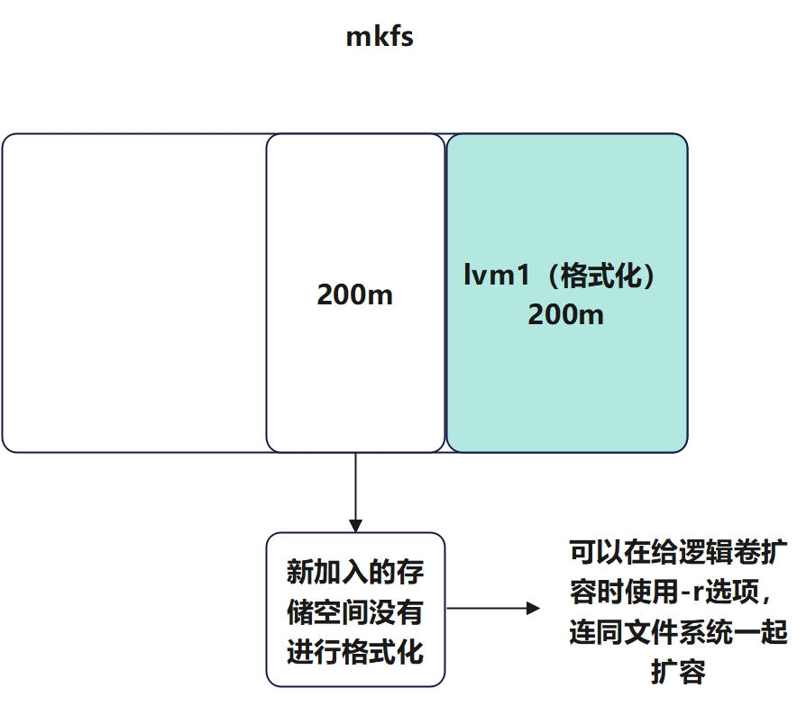

```bash
[root@localhost ~]# lvextend -r -L 400m  /dev/rh/lvm1 
  Size of logical volume rh/lvm1 unchanged from 400.00 MiB (50 extents).
  Logical volume rh/lvm1 successfully resized.
resize2fs 1.45.6 (20-Mar-2020)
Filesystem at /dev/mapper/rh-lvm1 is mounted on /mnt/lvm1; on-line resizing required
old_desc_blocks = 2, new_desc_blocks = 4
The filesystem on /dev/mapper/rh-lvm1 is now 409600 (1k) blocks long.

[root@localhost ~]# lvs
  LV   VG Attr       LSize   Pool Origin Data%  Meta%  Move Log Cpy%Sync Convert
  lvm1 rh -wi-ao---- 400.00m                                                    
  lvm2 rh -wi-a----- 200.00m                                                    
  root rl -wi-ao---- <17.00g                                                    
  swap rl -wi-ao----   2.00g                      
 # df -TH可以查看到挂载点的文件系统大小
[root@localhost ~]# df -TH
Filesystem          Type      Size  Used Avail Use% Mounted on
tmpfs               tmpfs     188M  4.8M  183M   3% /run/user/0
/dev/sr0            iso9660    10G   10G     0 100% /mnt/packages
/dev/mapper/rh-lvm1 ext4      402M  2.4M  377M   1% /mnt/lvm1

```


1.将逻辑卷lvm2格式化成xfs类型，挂载到/mnt/lvm2下，然后对lvm2进行扩容，要求扩容至300M（允许误差为1PE）

提供df -TH的截图

```bash
[root@localhost ~]# mkfs -t xfs /dev/rh/lvm2
.......
realtime =none                   extsz=4096   blocks=0, rtextents=0
[root@localhost ~]# 
[root@localhost ~]# blkid /dev/rh/lvm2
/dev/rh/lvm2: UUID="27eb3a00-3266-4e4f-82fd-095991eb1231" BLOCK_SIZE="512" TYPE="xfs"

[root@localhost ~]# mkdir /mnt/lvm2
[root@localhost ~]# vim /etc/fstab 
[root@localhost ~]# cat /etc/fstab | grep lvm2
/dev/rh/lvm2  /mnt/lvm2     xfs   defaults        0 0 
[root@localhost ~]# mount -a
[root@localhost ~]# lsblk 
NAME        MAJ:MIN RM  SIZE RO TYPE MOUNTPOINT
sr0          11:0    1  9.2G  0 rom  /mnt/packages
nvme0n1     259:0    0   20G  0 disk 
├─nvme0n1p1 259:1    0    1G  0 part /boot
└─nvme0n1p2 259:2    0   19G  0 part 
  ├─rl-root 253:0    0   17G  0 lvm  /
  └─rl-swap 253:1    0    2G  0 lvm  [SWAP]
nvme0n2     259:3    0   30G  0 disk 
├─nvme0n2p1 259:4    0    2G  0 part [SWAP]
├─nvme0n2p2 259:5    0    3G  0 part 
├─nvme0n2p3 259:6    0    2G  0 part 
│ ├─rh-lvm1 253:2    0  400M  0 lvm  /mnt/lvm1
│ └─rh-lvm2 253:3    0  200M  0 lvm  /mnt/lvm2

# 扩容至300M
[root@localhost ~]# lvextend -r -L 300M /dev/rh/lvm2
  Rounding size to boundary between physical extents: 304.00 MiB.
  Size of logical volume rh/lvm2 changed from 20
  ........
         =                       sectsz=512   sunit=0 blks, lazy-count=1
realtime =none                   extsz=4096   blocks=0, rtextents=0
data blocks changed from 51200 to 77824
[root@localhost ~]# 
[root@localhost ~]# lvs
  LV   VG Attr       LSize   Pool Origin Data%  Meta%  Move Log Cpy%Sync Convert
  lvm1 rh -wi-ao---- 400.00m                                                    
  lvm2 rh -wi-ao---- 304.00m                                                    
  root rl -wi-ao---- <17.00g                                                    
  swap rl -wi-ao----   2.00g                                                    
[root@localhost ~]# df -TH'
> ^C
[root@localhost ~]# df -TH
Filesystem          Type      Size  Used Avail Use% Mounted on
devtmpfs            devtmpfs  908M     0  908M 100% /mnt/packages
/dev/mapper/rh-lvm1 ext4      402M  2.4M  377M   1% /mnt/lvm1
/dev/mapper/rh-lvm2 xfs       314M   14M  301M   5% /mnt/lvm2

```


2. **要求将根目录/ 扩容到20G**（思考题）


- 确定要扩容的逻辑卷路径（/dev/rl/root）

```bash
[root@localhost ~]# lvscan 
  ACTIVE            '/dev/rh/lvm1' [400.00 MiB] inherit
  ACTIVE            '/dev/rh/lvm2' [304.00 MiB] inherit
  ACTIVE            '/dev/rl/swap' [2.00 GiB] inherit
  ACTIVE            '/dev/rl/root' [<17.00 GiB] inherit

```

- 确定卷组rl的剩余容量，够不够扩容

  - 剩余容量不够，先给卷组扩容

  ```bash
  [root@localhost ~]# vgs
    VG #PV #LV #SN Attr   VSize   VFree 
    rh   3   2   0 wz--n-  <6.98g <6.29g
    rl   1   2   0 wz--n- <19.00g     0 
  
  ```

  - 创建一个4g的分区

```bash
[root@localhost ~]# lsblk 
NAME        MAJ:MIN RM  SIZE RO TYPE MOUNTPOINT
sr0          11:0    1  9.2G  0 rom  /mnt/packages
nvme0n1     259:0    0   20G  0 disk 
├─nvme0n1p1 259:1    0    1G  0 part /boot
└─nvme0n1p2 259:2    0   19G  0 part 
  ├─rl-root 253:0    0   17G  0 lvm  /
  └─rl-swap 253:1    0    2G  0 lvm  [SWAP]
nvme0n2     259:3    0   30G  0 disk 
├─nvme0n2p1 259:4    0    2G  0 part [SWAP]
├─nvme0n2p2 259:5    0    3G  0 part 
├─nvme0n2p3 259:6    0    2G  0 part 
│ ├─rh-lvm1 253:2    0  400M  0 lvm  /mnt/lvm1
│ └─rh-lvm2 253:3    0  304M  0 lvm  /mnt/lvm2
├─nvme0n2p4 259:7    0    1K  0 part 
├─nvme0n2p5 259:8    0    2G  0 part 
├─nvme0n2p6 259:14   0    3G  0 part 
└─nvme0n2p7 259:15   0    4G  0 part 
```

- 将分区转换成物理卷

  ```bash
  [root@localhost ~]# pvcreate /dev/nvme0n2p7
    Physical volume "/dev/nvme0n2p7" successfully created.
  
  ```

  - 将物理卷加入rl卷组扩容

  ```bash
  [root@localhost ~]# vgextend rl /dev/nvme0n2p7 
    Volume group "rl" successfully extended
  [root@localhost ~]# vgs
    VG #PV #LV #SN Attr   VSize  VFree 
    rh   3   2   0 wz--n- <6.98g <6.29g
    rl   2   2   0 wz--n- 22.99g <4.00g
  
  ```

  - 逻辑卷扩容

```bash
[root@localhost ~]# lvextend -r -L 20G /dev/rl/root 


[root@localhost ~]# df -Th
Filesystem          Type      Size  Used Avail Use% Mounted on

/dev/mapper/rl-root xfs        20G  5.4G   15G  27% /


```

补充：如果误删了物理卷，导致卷组中出现物理卷丢失的情况，可以使用**vgreduce --removemissing 卷组名**删除丢失的物理卷


如果想要删除磁盘或者物理卷等存储设备，注意：一定要把该设备的信息从/etc/fstab中删除。（一旦fstab报错了，千万别直接重启系统，先解决问题，确定无误了再进行重启。）

注意：如图fstab中出现了不存在设备路径，就会导致重启后进入紧急模式

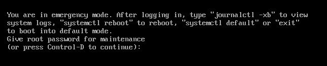

然后输入root用户密码，进入终端，执行mount -a,将凡是报错的行，从/etc/fstab中删除，然后再次执行mount -a,无报错后重启即可。


剩余时间，可以快照重置一下，然后自己添加一块硬盘，然后完完整整的走一步磁盘管理和逻辑卷的流程

码云
