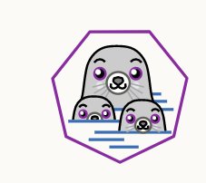

# 1. 容器（podman）



## 1.1 容器介绍

podman的官网地址：https://podman.io/

### 1.1.1 为什么要有容器？

在软件部署运行过程中，软件的环境时优先应该考虑，但也是最麻烦的一个问题。

- 就像王者荣耀，它本身是手游，只能运行在安卓或者ios系统上。
- 但如果想要在windows系统上运行王者荣耀，其实也有办法------》安装模拟器（本质上来讲就是在windows上模拟了安卓的运行环境。）
- 所以借鉴这个思想，容器就诞生了，既然在部署运行环境时，不同的环境可能会对软件进程造成影响，那么可以直接连同环境成为软件的一部分，然后打包运行。
- 所以其实容器本质上来讲：就是一个自带环境的软件（甚至你可以任务每一个容器都是一个微型的虚拟机，这个虚拟机上运行软件所需的操作系统，然后再操作系统上运行容器提供的软件服务。）


### 1.1.2 容器的三个概念

- 镜像：可以理解为容器的安装包，通过镜像来安装产生不同的容器（类似yum仓库中的rpm包，我们可以通过rpm包来安装不同软件）

- 镜像仓库：镜像存放的路径，其实告诉podman去哪里下载镜像（类似之前的yum仓库，里面存放的就是各种各样的rpm包）

- 容器：是由镜像创建运行的实例，它提供了容器对应的软件服务（类似之前yum安装的软件，再运行时占用cpu，内存等资源，不运行时只占用磁盘资源）

注意：所有说白了，我们所学的容器，本质上来讲就是下载软件，安装软件，运行软件，不要把它复杂化。


# 2. 镜像仓库的搭建和使用

## 2.1 查看系统中的podman版本

由于podman是红帽官方自己推出的技术，所以基本上红帽系统都是默认已经安装好podman，使用命令podman --version 可以查看系统中podman的版本信息。

```bash
[root@localhost ~]# podman --version
podman version 3.0.2-dev
```


## 2.2 安装podman

快照重置一下，然后更新一下podman

1. 安装podman

   ```bash
   [root@localhost ~]# yum install -y podman
   ```

2. 查看版本信息

```bash
[root@localhost ~]# podman -v
podman version 4.0.2
```


## 2.3 容器的镜像仓库

容器的镜像仓库配置地址有2种方式，注意配置文件的路径

1. 全局生效（所有用户都可以使用该仓库）

```bash
[root@localhost ~]# vim  /etc/containers/registries.conf
```

2. 单用户生效（只有指定用户可以使用该仓库,例如student为例）需要再student的家目录下手动创建该配置文件

```bash
 vim  /home/student/.config/containers/registries.conf
```

无论是全局生效还是单用户生效，配置文件的内容是一样。

- /etc/containers/registries.conf配置说明

  | unqualified-search-registries | 从网络上拉取镜像时，指定的镜像仓库的地址列表（镜像的注册表） |
  | ----------------------------- | ------------------------------------------------------------ |
  | [[registry]]                  | 镜像注册表，用于反向代理到国内的镜像                         |
  | insecure = false              | 如果是true的话，可以使用http协议，默认是false,代表只能使用https协议。 |

  

## 2.4  镜像管理

### 2.4.1 登录镜像仓库

补充：由于此处使用的docker镜像仓库是开源的，不需要注册登录，所以没有该步骤。

- podman  login 镜像仓库的地址

```bash
[root@localhost ~]# podman login docker.io
Username: student
Password: 

```


### 2.4.2 测试镜像仓库是否可用

podman  search  镜像仓库地址/镜像名 （该命令可用查看指定镜像仓库中的镜像）


```bash
[root@localhost ~]# podman search docker.io/centos
NAME                                                  DESCRIPTION
docker.io/library/centos                              The official build of CentOS.
docker.io/kasmweb/centos-7-desktop                    CentOS 7 desktop for Kasm Workspaces
docker.io/bitnami/centos-base-buildpack               Centos base compilation image
docker.io/bitnami/centos-extras-base                  
docker.io/couchbase/centos7-systemd                   centos7-systemd images with additional debugging libraries
docker.io/continuumio/centos5_gcc5_base               
docker.io/dokken/centos-7                             CentOS 7 image for kitchen-dokken
docker.io/dokken/centos-8                             CentOS 8 image for kitchen-dokken
docker.io/spack/centos7                               CentOS 7 with Spack preinstalled
docker.io/dokken/centos-6                             CentOS 6 image for kitchen-dokken
docker.io/spack/centos6                               CentOS 6 with Spack preinstalled
docker.io/dokken/centos-stream-8                      
docker.io/datadog/centos-i386                         
docker.io/corpusops/centos                            centos corpusops baseimage
docker.io/couchbase/centos-72-java-sdk                
docker.io/couchbase/centos-72-jenkins-core            
docker.io/fnndsc/centos-python3                       Source for a slim Centos-based Python3 image .

```

### 2.4.3 下载镜像

（1） podman pull  仓库地址/镜像名（默认下载是最新版本，可用通过  **镜像名:版本**  来指定下载的版本）

```bash
[root@localhost ~]# podman pull  docker.io/library/centos
Trying to pull docker.io/library/centos:latest...
Getting image source signatures
Copying blob a1d0c7532777 done  
Copying config 5d0da3dc97 done  
Writing manifest to image destination
Storing signatures
5d0da3dc976460b72c77d94c8a1ad043720b0416bfc16c52c45d4847e53fadb6

```

**补充：** 建议先使用search来确定想要拉取的镜像路径和版本，确定下来后，再使用pull拉取镜像。


### 2.4.4 查看本地镜像

- **podman images**

```bash
[root@localhost ~]# podman images 
REPOSITORY                TAG         IMAGE ID      CREATED        SIZE
docker.io/library/ubuntu  latest      27941809078c  6 weeks ago    80.3 MB
docker.io/library/centos  latest      5d0da3dc9764  10 months ago  239 MB

```


### 2.4.5 删除本地镜像

注意：删除镜像时，该镜像不能被容器所使用

```bash
[root@localhost ~]# podman image rm docker.io/library/ubuntu
Untagged: docker.io/library/ubuntu:latest
Deleted: 27941809078cc9b2802deb2b0bb6feed6c236cde01e487f200e24653533701ee
[root@localhost ~]# podman images 
REPOSITORY                TAG         IMAGE ID      CREATED        SIZE
docker.io/library/centos  latest      5d0da3dc9764  10 months ago  239 MB
```

补充：另外一个删除镜像的命令

```bash
[root@localhost ~]# podman rmi  quay.io/centos/centos
Untagged: quay.io/centos/centos:latest
Deleted: 300e315adb2f96afe5f0b2780b87f28ae95231fe3bdd1e16b9ba606307728f55
```

下载一个httpd的镜像，然后查看该镜像，并删除

```bash
[root@localhost ~]# podman search docker.io/httpd
NAME                                             DESCRIPTION
docker.io/library/httpd                          The Apache HTTP Server Project
docker.io/clearlinux/httpd                       httpd HyperText Transfer Protocol (HTTP) server program with the benefits of Clear Linux OS
docker.io/centos/httpd-24-centos7                Platform for running Apache httpd 2.4 or building httpd-based application 
docker.io/manageiq/httpd                         Container with httpd, built on CentOS for ManageIQ.
docker.io/centos/httpd-24-centos8                
docker.io/dockerpinata/httpd                     
docker.io/19022021/httpd-connection_test         This httpd image will test the connectivity of the endpoint.
docker.io/publici/httpd                          httpd:latest
docker.io/paketobuildpacks/httpd                 
docker.io/manasip/httpd                          
docker.io/centos/httpd                           
docker.io/e2eteam/httpd                          
docker.io/httpdocker/kubia                       
docker.io/patrickha/httpd-err                    
docker.io/solsson/httpd-openidc                  mod_auth_openidc on official httpd image, verified with Keycloak using docker-compose
docker.io/hypoport/httpd-cgi                     httpd-cgi
docker.io/dariko/httpd-rproxy-ldap               Apache httpd reverse proxy with LDAP authentication
docker.io/amd64/httpd                            The Apache HTTP Server Project
docker.io/manageiq/httpd_configmap_generator     Httpd Configmap Generator
docker.io/inanimate/httpd-ssl                    A play container with httpd, ssl enabled, and PLAY certs incorporated!
docker.io/ppc64le/httpd                          The Apache HTTP Server Project
docker.io/httpdss/archerysec                     ArcherySec repository
docker.io/jonathanheilmann/httpd-alpine-rewrite  httpd:alpine with enabled mod_rewrite
docker.io/nnasaki/httpd-ssi                      SSI enabled Apache 2.4 on Alpine Linux
docker.io/sandeep1988/httpd-new                  httpd-new
[root@localhost ~]# podman pull  docker.io/library/httpd
Trying to pull docker.io/library/httpd:latest...
Getting image source signatures
Copying blob 97f4b88189d8 done  
Copying blob c332ae8365a7 done  
Copying blob 72dcd3e40e39 done  
Copying blob d6bc17b4451a done  
Copying blob 461246efe0a7 done  
Copying config 444f7df01c done  
Writing manifest to image destination
Storing signatures
444f7df01ce93f20c2e30cbac9ffc332b024cdd27118224ed55bcb3d287d163b

```


## 2.5 容器的管理

### 2.5.1 启动并创建容器

确定容器所使用的镜像（podman search ,podman images）

```bash
[root@localhost ~]# podman search docker.io/httpd
NAME                                             DESCRIPTION
docker.io/library/httpd                          The Apache HTTP Server Project
docker.io/clearlinux/httpd                       httpd HyperText Transfer Protocol (HTTP) server program with the benefits of Clear Linux OS
docker.io/centos/httpd-24-centos7                Platform for running Apache httpd 2.4 or building httpd-based application
```

（1）启动创建容器

注意：课上由于版本的问题，需要升级一下runc软件

```bash
yum install  runc -y
```

(如果之前没有下载镜像，那么在运行启动容器时，会自动下载)

```bash
[root@localhost ~]# podman run --name web -d docker.io/library/httpd
```

- 启动时常用的参数

| --name | 给容器起一个别名                                             |
| ------ | ------------------------------------------------------------ |
| -d     | 容器在后台运行（不是所有容器都支持在后台运行， 必须要有后台服务才可以在后台运行） |
| -it    | -i 代表以交互的形式启动，-t 代表启动一个伪终端               |

### 2.5.2 查看容器状态

- podman ps  （ps只会查看运行中的容器，而想要查看所有的容器状态，需要加上-a）

```bash
[root@localhost ~]# podman ps -a
CONTAINER ID  IMAGE                           COMMAND           CREATED        STATUS            PORTS       NAMES
b72938a94916  docker.io/library/httpd:latest  httpd-foreground  4 minutes ago  Up 4 minutes ago              web

```

- 常见的容器7种状态
  - created（已创建）
  - restarting (重启中)
  - **running或者up （运行中）**
  - removing   (迁移中)
  - paused(暂停)
  - **exited(停止)**
  - dead(死亡)

- -it的使用，退出容器exit命令

```bash
[root@localhost ~]# podman run -it --name centos_test docker.io/library/centos
Trying to pull docker.io/library/centos:latest...
Getting image source signatures
Copying blob a1d0c7532777 done  
Copying config 5d0da3dc97 done  
Writing manifest to image destination
Storing signatures
[root@5624ca497086 /]# ls
bin  etc   lib	  lost+found  mnt  proc  run   srv  tmp  var
dev  home  lib64  media       opt  root  sbin  sys  usr
[root@5624ca497086 /]# cat /etc/os-release 
NAME="CentOS Linux"
VERSION="8"
ID="centos"
ID_LIKE="rhel fedora"
VERSION_ID="8"
PLATFORM_ID="platform:el8"
PRETTY_NAME="CentOS Linux 8"
ANSI_COLOR="0;31"
CPE_NAME="cpe:/o:centos:centos:8"
HOME_URL="https://centos.org/"
BUG_REPORT_URL="https://bugs.centos.org/"
CENTOS_MANTISBT_PROJECT="CentOS-8"
CENTOS_MANTISBT_PROJECT_VERSION="8"


```

题目： 进入容器内部后，查看ip地址，尝试一下，从外部ping一下容器ip地址（截图）

```bash
[root@5624ca497086 /]# ip addr
1: lo: <LOOPBACK,UP,LOWER_UP> mtu 65536 qdisc noqueue state UNKNOWN group default qlen 1000
    link/loopback 00:00:00:00:00:00 brd 00:00:00:00:00:00
    inet 127.0.0.1/8 scope host lo
       valid_lft forever preferred_lft forever
    inet6 ::1/128 scope host 
       valid_lft forever preferred_lft forever
3: eth0@if7: <BROADCAST,MULTICAST,UP,LOWER_UP> mtu 1500 qdisc noqueue state UP group default 
    link/ether f6:71:6a:1d:4f:a7 brd ff:ff:ff:ff:ff:ff link-netnsid 0
    inet 10.88.0.3/16 brd 10.88.255.255 scope global eth0
       valid_lft forever preferred_lft forever
    inet6 fe80::f471:6aff:fe1d:4fa7/64 scope link 
       valid_lft forever preferred_lft forever

```


### 2.5.3 进入容器内部运行命令

注意：容器必须时运行状态

- **podman exec -it 容器名  /bin/bash**

```bash
[root@localhost ~]# podman exec -it web  /bin/bash
root@b72938a94916:/usr/local/apache2# ls
bin  build  cgi-bin  conf  error  htdocs  icons  include  logs	modules
root@b72938a94916:/usr/local/apache2# ip addr
bash: ip: command not found
root@b72938a94916:/usr/local/apache2# ip     
bash: ip: command not found
root@b72938a94916:/usr/local/apache2# cat /etc/os-release 
PRETTY_NAME="Debian GNU/Linux 11 (bullseye)"
NAME="Debian GNU/Linux"
VERSION_ID="11"
VERSION="11 (bullseye)"
VERSION_CODENAME=bullseye
ID=debian
HOME_URL="https://www.debian.org/"
SUPPORT_URL="https://www.debian.org/support"
BUG_REPORT_URL="https://bugs.debian.org/"
root@b72938a94916:/usr/local/apache2# 


root@b72938a94916:/usr/local/apache2# ls
bin  build  cgi-bin  conf  error  htdocs  icons  include  logs	modules
root@b72938a94916:/usr/local/apache2# cd htdocs/
root@b72938a94916:/usr/local/apache2/htdocs# ls
index.html
root@b72938a94916:/usr/local/apache2/htdocs# cat index.html 
<html><body><h1>It works!</h1></body></html>
root@b72938a94916:/usr/local/apache2/htdocs# pwd          
/usr/local/apache2/htdocs
root@b72938a94916:/usr/local/apache2/htdocs# echo "hello"  > index.html 
root@b72938a94916:/usr/local/apache2/htdocs# cat index.html 
hello

```


### 2.5.4 查看容器的信息

- podman inspect  容器名  
- podman inspect  容器名  | grep  -i  "关键字"

```bash
[root@localhost ~]# podman inspect  web  | grep -i add
               "IPAddress": "10.88.0.2",
               "GlobalIPv6Address": "",
               "MacAddress": "82:5a:50:0d:9f:a3",
               "LinkLocalIPv6Address": "",
                         "IPAddress": "10.88.0.2",
                         "GlobalIPv6Address": "",
                         "MacAddress": "82:5a:50:0d:9f:a3",
               "CapAdd": [],
               "GroupAdd": [],

```

题目：根据httpd镜像创建一个web容器，容器名为web01，然后编辑/usr/local/apache2/htdocs该路径下的index.html写入hello  world，然后可以在外部操作系统的浏览器中，打开网页，并访问到hello  world

```bash

[root@localhost ~]# podman images
REPOSITORY                TAG         IMAGE ID      CREATED        SIZE
docker.io/library/httpd   latest      444f7df01ce9  8 days ago     149 MB
docker.io/library/centos  latest      5d0da3dc9764  10 months ago  239 MB
[root@localhost ~]# podman run --name web01  -d docker.io/library/httpd
811d3c98e93ed283fc309b08916e8d8e7aa10add5b0f5851ba4f571220cc894b
[root@localhost ~]# podman ps 
CONTAINER ID  IMAGE                           COMMAND           CREATED         STATUS             PORTS       NAMES
b72938a94916  docker.io/library/httpd:latest  httpd-foreground  40 minutes ago  Up 40 minutes ago              web
811d3c98e93e  docker.io/library/httpd:latest  httpd-foreground  6 seconds ago   Up 6 seconds ago               web01
[root@localhost ~]# podman stop web01
web01
[root@localhost ~]# podman ps 
CONTAINER ID  IMAGE                           COMMAND           CREATED         STATUS             PORTS       NAMES
b72938a94916  docker.io/library/httpd:latest  httpd-foreground  41 minutes ago  Up 41 minutes ago              web
[root@localhost ~]# podman ps -a
CONTAINER ID  IMAGE                            COMMAND           CREATED             STATUS                     PORTS       NAMES
b72938a94916  docker.io/library/httpd:latest   httpd-foreground  41 minutes ago      Up 41 minutes ago                      web
5624ca497086  docker.io/library/centos:latest  /bin/bash         31 minutes ago      Exited (0) 24 minutes ago              centos_test
811d3c98e93e  docker.io/library/httpd:latest   httpd-foreground  About a minute ago  
[root@localhost ~]# podman ps
CONTAINER ID  IMAGE                           COMMAND           CREATED         STATUS             PORTS       NAMES
b72938a94916  docker.io/library/httpd:latest  httpd-foreground  42 minutes ago  Up 42 minutes ago              web
[root@localhost ~]# podman ps -a
CONTAINER ID  IMAGE                            COMMAND           CREATED         STATUS                         PORTS       NAMES
b72938a94916  docker.io/library/httpd:latest   httpd-foreground  43 minutes ago  Up 43 minutes ago                          web
5624ca497086  docker.io/library/centos:latest  /bin/bash         32 minutes ago  Exited (0) 26 minutes ago                  centos_test
811d3c98e93e  docker.io/library/httpd:latest   httpd-foreground  2 minutes ago   Exited (0) About a minute ago              web01
[root@localhost ~]# podman start  web01 
web01
[root@localhost ~]# podman ps 
CONTAINER ID  IMAGE                           COMMAND           CREATED         STATUS             PORTS       NAMES
b72938a94916  docker.io/library/httpd:latest  httpd-foreground  43 minutes ago  Up 43 minutes ago              web
811d3c98e93e  docker.io/library/httpd:latest  httpd-foreground  3 minutes ago   Up 3 seconds ago               web01


[root@localhost ~]# podman exec -it  web01 /bin/bash
root@811d3c98e93e:/usr/local/apache2# ls
bin  build  cgi-bin  conf  error  htdocs  icons  include  logs	modules
root@811d3c98e93e:/usr/local/apache2# cd htdocs/
root@811d3c98e93e:/usr/local/apache2/htdocs# pwd
/usr/local/apache2/htdocs
root@811d3c98e93e:/usr/local/apache2/htdocs# echo "hello world" > index.html 
root@811d3c98e93e:/usr/local/apache2/htdocs# cat index.html 
hello world
root@811d3c98e93e:/usr/local/apache2/htdocs# exit
exit
[root@localhost ~]# podman inspect  web01 | grep -i "ip"
               "IPAddress": "10.88.0.5",
               "IPPrefixLen": 16,
               "IPv6Gateway": "",
               "GlobalIPv6Address": "",
               "GlobalIPv6PrefixLen": 0,
               "LinkLocalIPv6Address": "",
               "LinkLocalIPv6PrefixLen": 0,
                         "IPAddress": "10.88.0.5",
                         "IPPrefixLen": 16,
                         "IPv6Gateway": "",
                         "GlobalIPv6Address": "",
                         "GlobalIPv6PrefixLen": 0,
                         "IPAMConfig": null,
               "IpcMode": "private",

```


 ### 2.5.5 停止和启动容器

- podman  stop 容器名
- podman start 容器名

### 2.5.6 删除容器

- 注意：删除前要先用**podman ps -a** 查看确定要删除的容器名或容器id
- 如果是在运行中的容器，请先使用**podman stop 容器名**，将容器先停止。

- **podman  rm 容器名**


### 2.5.7 端口映射（-p）

​    所谓端口映射，当用户访问主机ip的对应端口时，服务器会自动将请求映射到容器对应的端口上。 本地主机ip：8888---->容器ip：80端口，**那么我在访问本地主机的8888端口时，其实就是访问容器80端口的数据。**

- podman run --name web -p **主机端口:容器端口** -d   镜像路径  （-d: 后台运行）

  ```bash
  [root@localhost ~]#podman run --name web -p 8888:80 -d   docker.io/library/httpd:latest
  
  [root@localhost ~]# podman inspect web  | grep -i ipadd
                 "IPAddress": "10.88.0.2",
                           "IPAddress": "10.88.0.2",
  
  ```

  补充： 使用podman ps  -a也可以查看到端口映射的状态。

```bash
[root@localhost ~]# podman ps -a
CONTAINER ID  IMAGE                            COMMAND           CREATED         STATUS                   PORTS                 NAMES
5624ca497086  docker.io/library/centos:latest  /bin/bash         18 hours ago    Exited (0) 18 hours ago                        centos_test
c170b5c720aa  docker.io/library/httpd:latest   httpd-foreground  16 minutes ago  Up 16 minutes ago        0.0.0.0:8888->80/tcp  web

```


### 2.5.8 外部存储(-v)

注意：由于容器的存储空间有限，而且容器用来存储也不安全，所以一般情况下，容器只提供软件运行的服务，而数据的存储一般使用本地主机的存储路径，方便对数据保存和管理。

```bash
[root@localhost ~]# mkdir /opt/http/
# 此处忘记使用--name给容器重命名了
[root@localhost ~]# podman  run -d -v /opt/http:/usr/local/apache2/htdocs:z  -p 8899:80  docker.io/library/httpd

# 注意此处可以使用podman ps -a查看容器名
[root@localhost ~]# podman inspect dreamy_mendel | grep -i "ipadd"
               "IPAddress": "10.88.0.3",
                         "IPAddress": "10.88.0.3",
[root@localhost ~]# touch /opt/http/index.html
[root@localhost ~]# vim  /opt/http/index.html
[root@localhost ~]# cat /opt/http/index.html 
<h1>hello</h1>
[root@localhost ~]# 

# 修改容器的名字
[root@localhost ~]# podman  rename  dreamy_mendel  web01
```

这样设置之后，容器里对应的目录真正的数据其实是存放在主机的存储路径里面，z保证上下文一致。


题目： 使用httpd镜像创建一个容器名为web02，要求如下：

- 本地主机输入8877端口可以访问到容器提供的web界面（-p）
- 容器的网页数据保存到本地主机的/opt/httpdata目录下。(-v)
- 打开浏览器之后，出现的内容为successful（编辑内容）
- 完成后截图

```bash
[root@localhost ~]# mkdir /opt/httpdata
[root@localhost ~]# ls /opt/
http  httpdata
[root@localhost ~]# podman run -d --name web02 -p 8877:80 -v /opt/httpdata:/usr/local/apache2/htdocs:z docker.io/library/httpd:latest 
c8a03587cff7679950020b9e7e1e8dd66db67fb9328403a9d5b983c37e472a51
[root@localhost ~]# podman ps 
CONTAINER ID  IMAGE                           COMMAND           CREATED            STATUS                PORTS                 NAMES
c170b5c720aa  docker.io/library/httpd:latest  httpd-foreground  About an hour ago  Up About an hour ago  0.0.0.0:8888->80/tcp  web
6a5e89c053b4  docker.io/library/httpd:latest  httpd-foreground  35 minutes ago     Up 35 minutes ago     0.0.0.0:8899->80/tcp  web01
c8a03587cff7  docker.io/library/httpd:latest  httpd-foreground  8 seconds ago      Up 9 seconds ago      0.0.0.0:8877->80/tcp  web02
[root@localhost ~]# vim /opt/httpdata/index.html
[root@localhost ~]# cat /opt/httpdata/index.html 
successful
# 在火狐浏览器上输入127.0.0.1:8877即可访问网页。
```


###  2.5.9 设置环境变量（-e）

注意：该方法可以给容器传入外部参数（-e）

-e   环境变量名: 值

```bash
# 环境变量名一般大写
[root@localhost ~]# podman run -it --name centos01  -e NAME=student centos
[root@6a5181219550 /]# echo $NAME
student
[root@6a5181219550 /]# env
LANG=en_US.UTF-8
HOSTNAME=6a5181219550
container=podman
PWD=/
HOME=/root
NAME=student
TERM=xterm
SHLVL=1
PATH=/usr/local/sbin:/usr/local/bin:/usr/sbin:/usr/bin:/sbin:/bin
LESSOPEN=||/usr/bin/lesspipe.sh %s
_=/usr/bin/env

```

例题： 利用-e 设置环境变量，从而设置mysql的root用户密码为123456

```bash
[root@localhost ~]# podman run -d  --name mysql_test -e MYSQL_ROOT_PASSWORD=123456   docker.io/library/mysql:latest
✔ docker.io/library/mysql:latest
Trying to pull docker.io/library/mysql:latest...
Getting image source signatures
Copying blob 642077275f5f done  
Copying blob 327840d38cb2 done  
Copying blob cbf214d981a6 done  
Copying blob 7d1cc1ea1b3d done  
Copying blob e54b73e95ef3 done  
Copying blob e077469d560d done  
Copying blob 94c3d7b2c9ae done  
Copying blob d48f3c15cb80 done  
Copying blob f6cfbf240ed7 done  
Copying blob e12b159b2a12 done  
Copying blob 4e93c6fd777f done  
Copying config 33037edcac done  
Writing manifest to image destination
Storing signatures
42e8cc651526738b3edca6556901a64c1f6909f24d54bc731e7a6025d9460f74
[root@localhost ~]# podman ps 
CONTAINER ID  IMAGE                           COMMAND           CREATED            STATUS                PORTS                 NAMES
c170b5c720aa  docker.io/library/httpd:latest  httpd-foreground  About an hour ago  Up About an hour ago  0.0.0.0:8888->80/tcp  web
6a5e89c053b4  docker.io/library/httpd:latest  httpd-foreground  52 minutes ago     Up 52 minutes ago     0.0.0.0:8899->80/tcp  web01
c8a03587cff7  docker.io/library/httpd:latest  httpd-foreground  16 minutes ago     Up 16 minutes ago     0.0.0.0:8877->80/tcp  web02
42e8cc651526  docker.io/library/mysql:latest  mysqld            9 seconds ago      Up 9 seconds ago                            mysql_test
[root@localhost ~]# 
[root@localhost ~]# podman exec  -it mysql_test  /bin/bash
bash-4.4# env 
MYSQL_ROOT_PASSWORD=123456
container=podman
PWD=/
HOME=/root
MYSQL_MAJOR=8.0
GOSU_VERSION=1.14
MYSQL_VERSION=8.0.29-1.el8
TERM=xterm
SHLVL=1
PATH=/usr/local/sbin:/usr/local/bin:/usr/sbin:/usr/bin:/sbin:/bin
MYSQL_SHELL_VERSION=8.0.29-1.el8
_=/usr/bin/env
bash-4.4# mysql -u root -p123456
mysql: [Warning] Using a password on the command line interface can be insecure.
Welcome to the MySQL monitor.  Commands end with ; or \g.
Your MySQL connection id is 8
Server version: 8.0.29 MySQL Community Server - GPL

Copyright (c) 2000, 2022, Oracle and/or its affiliates.

Oracle is a registered trademark of Oracle Corporation and/or its
affiliates. Other names may be trademarks of their respective
owners.

Type 'help;' or '\h' for help. Type '\c' to clear the current input statement.

mysql> exit
Bye
bash-4.4# mysql -u root -p12345 
mysql: [Warning] Using a password on the command line interface can be insecure.
ERROR 1045 (28000): Access denied for user 'root'@'localhost' (using password: YES)
bash-4.4# mysql -u root -p123456
mysql: [Warning] Using a password on the command line interface can be insecure.
Welcome to the MySQL monitor.  Commands end with ; or \g.
Your MySQL connection id is 10
Server version: 8.0.29 MySQL Community Server - GPL

Copyright (c) 2000, 2022, Oracle and/or its affiliates.

Oracle is a registered trademark of Oracle Corporation and/or its
affiliates. Other names may be trademarks of their respective
owners.

Type 'help;' or '\h' for help. Type '\c' to clear the current input statement.

mysql> show databases;
+--------------------+
| Database           |
+--------------------+
| information_schema |
| mysql              |
| performance_schema |
| sys                |
+--------------------+
4 rows in set (0.00 sec)

mysql> exit
Bye

```


# 3. dockerfile

## 3.1 dockerfile介绍

- dockerfile是一个用来构建镜像的文本文本，文本内容中包含了一条条构建镜像时所需的指令或者说明
- 我们可以通过dockerfile来定制镜像，其实本质上来讲，就是通过容器引擎（podman）根据dockerfile中的指令来生成所需的镜像。


## 3.2 常见指令

- **FROM**:  定制的镜像都是基于FROM的镜像，后续的操作都是集运FROM后面的镜像

- **MAINTAINER**:  镜像编写者的信息: 例如 姓名<邮箱地址>

- **RUN**：后面加上在创建镜像时需要执行的命令，由于每写一个RUN指令，镜像就会格外加上一层，为了避免镜像过于庞大，可以多个命令之间可以使用&& 进行连接

- **ADD**: 将上下文目录下的指定的文件或者目录复制到容器指定目录中，如果时url或者压缩包，会自动解压到容器指定目录

- **ENV:** 设置环境变量，定义了环境变量变量之后，那么在后续的指令中，就苦于使用该变量。

- **WORKDIR**: 指定工作目录，注意指定的工作目录必须是已经提前提前创建好的。

- **VOLUME**： 定义匿名存储卷（如果用户在运行创建容器时，没有使用-v参数，那么容器默认就会将Volume中定义路径的数据存储到本地主机的路径**/var/lib/containers/storage/volumes/** 中）

- **EXPOSE**： 声明容器开放的端口，注意：声明的端口，不会主动和宿主机上的端口映射，但是如果创建容器时使用**-P(自动使用端口映射)**那么就会使用声明的端口进行映射。

- **CMD**：类似于RUN指令，都可以运行命令，但是两者运行的时间点不一样

  - CMD在podman run 时运行
  - RUN实在podman  bulid时运行
  - 如果Dockerfile中存在多个CMD指令，仅最后一个生效
- **ONBUILD**： 用于延迟构建命令的运行，就是如果Dockerfile中，有用到登录ONBUILD指定的指令，那么在本次镜像构建中不会去执行（例如镜像为test）,当有新的Dockerfile使用了test作为自己的镜像模板（FROM test），那么此时执行构建新的镜像时，就会执行test中ONBUILD的指令。
- **COPY**: 复制指令，从上下文目录中复制文件或者目录到容器的指定路径

## 3.3 dockerfile案例

1. 根据centos镜像，创建一个新的镜像， 要求在根目录下，创建文件1.txt.

```bash
[root@localhost ~]# mkdir DockerFile

[root@localhost ~]# cd DockerFile/
[root@localhost DockerFile]# mkdir dockerfile1
[root@localhost DockerFile]# cd dockerfile1/
[root@localhost dockerfile1]# touch Dockerfile
[root@localhost dockerfile1]# cat Dockerfile 
FROM centos
MAINTAINER xxr<1627389570@qq.com>
RUN touch /1.txt


[root@localhost Dockerfile]# podman build -t centostest:lastest .
STEP 1/3: FROM centos
STEP 2/3: MAINTAINER xxr<1627389570@qq.com>
--> f8029884589
STEP 3/3: RUN touch /1.txt
COMMIT centostest:lastest
--> 93b7166cdbc
Successfully tagged localhost/centostest:lastest
93b7166cdbcfe06347c6550b34249cd662139adb4c1d8fbfc03496130977a016
[root@localhost Dockerfile]# vim Dockerfile 
[root@localhost Dockerfile]# podman images
REPOSITORY                TAG         IMAGE ID      CREATED             SIZE
localhost/centostest      lastest     93b7166cdbcf  About a minute ago  239 MB


[root@localhost Dockerfile]# podman run -it --name centos02 localhost/centostest:lastest
[root@14a133cc2f1a /]# ls
1.txt  dev  home  lib64       media  opt   root  sbin  sys  usr
bin    etc  lib   lost+found  mnt    proc  run	 srv   tmp  var
[root@14a133cc2f1a /]# 


```

补充： 编写镜像指令的文件名一定是Dockerfile

- 构建镜像的指令 podman   build   -t   新镜像名:版本   .  
  - 镜像名必须小写
  - .代表从当前路径下读取构建指令相关的文件信息


2.（RUN指令里多个命令可以使用**&&** 连接）

- 命令1  &&  命令2  （当命令1正确运行时，就会运行命令2）

根据centos镜像，创建一个新的镜像centostest01， 要求在根目录下，创建目录dirA，并在dirA创建文件2.txt。写入hello world

```bash
[root@localhost DockerFile]# ls
dockerfile1
[root@localhost DockerFile]# mkdir dockerfile2
[root@localhost DockerFile]# cd dockerfile2


[root@localhost dockerfile2]# ls
[root@localhost dockerfile2]# touch Dokcerfile
[root@localhost dockerfile2]# ls
Dokcerfile
[root@localhost dockerfile2]# vim Dokcerfile 
[root@localhost dockerfile2]# mv Dokcerfile Dockerfile
[root@localhost dockerfile2]# ls
Dockerfile
[root@localhost dockerfile2]# vim Dockerfile 
[root@localhost dockerfile2]# podman build -t centostest01:v1  .
STEP 1/3: FROM centos
STEP 2/3: MAINTAINER xxr<1627389670@qq.com>
--> 3a4a8e44629
STEP 3/3: RUN mkdir /dirA  && echo "hello world" > /dirA/2.txt
COMMIT centostest01:v1
--> 0b33434d589
Successfully tagged localhost/centostest01:v1
0b33434d5894de15a8f30e474accfe573739d9ce4d96752c9379d155df701420
[root@localhost dockerfile2]# cat Dockerfile 
FROM centos
MAINTAINER xxr<1627389670@qq.com>
RUN mkdir /dirA  && echo "hello world" > /dirA/2.txt

[root@localhost dockerfile2]# podman run -it --name centos03 localhost/centostest01:v1 
[root@56dd709a4111 /]# ls
bin  dirA  home  lib64	     media  opt   root	sbin  sys  usr
dev  etc   lib	 lost+found  mnt    proc  run	srv   tmp  var
[root@56dd709a4111 /]# cat dirA/2.txt 
hello world
[root@56dd709a4111 /]# exit
exit

```


3. ADD,ENV

   将当前路径下的jdk压缩包复制并解压到镜像/usr/local/目录中

```bash
[root@localhost DockerFile]# ls
dockerfile1  dockerfile2
[root@localhost DockerFile]# mkdir dockerfile3
[root@localhost DockerFile]# cd dockerfile
bash: cd: dockerfile: No such file or directory
[root@localhost DockerFile]# cd dockerfile3
[root@localhost dockerfile3]# 

[root@localhost dockerfile3]# wget https://download.oracle.com/java/18/latest/jdk-18_linux-x64_bin.tar.gz
--2022-07-21 13:48:44--  https://download.oracle.com/java/18/latest/jdk-18_linux-x64_bin.tar.gz
Resolving download.oracle.com (download.oracle.com)... 23.34.249.242
Connecting to download.oracle.com (download.oracle.com)|23.34.249.242|:443... connected.
HTTP request sent, awaiting response... 200 OK
Length: 182282747 (174M) [application/x-gzip]
Saving to: ‘jdk-18_linux-x64_bin.tar.gz’

jdk-18_linux- 100% 173.84M  2.41MB/s    in 62s       

2022-07-21 13:49:47 (2.81 MB/s) - ‘jdk-18_linux-x64_bin.tar.gz’ saved [182282747/182282747]


[root@localhost dockerfile3]# ls
jdk-18_linux-x64_bin.tar.gz
[root@localhost dockerfile3]# 
[root@localhost dockerfile3]# vim Dockerfile
[root@localhost dockerfile3]# cat Dockerfile 
FROM centos
MAINTAINER  xxr<1627389570@qq.com>
ADD jdk-18_linux-x64_bin.tar.gz  /usr/local/
[root@localhost dockerfile3]# vim Dockerfile 
[root@localhost dockerfile3]# 
[root@localhost dockerfile3]# cat Dockerfile 
FROM centos
MAINTAINER  xxr<1627389570@qq.com>
ADD jdk-18_linux-x64_bin.tar.gz  /usr/local/
ENV JAVA_HOME  /usr/local/jdk-18.0.2
ENV PATH  $PATH:$JAVA_HOME/bin
[root@localhost dockerfile3]# ls
Dockerfile  jdk-18_linux-x64_bin.tar.gz
[root@localhost dockerfile3]# 


[root@localhost dockerfile3]# podman build -t centos_java:v1  .
STEP 1/5: FROM centos
STEP 2/5: MAINTAINER  xxr<1627389570@qq.com>
--> c80945374b7
STEP 3/5: ADD jdk-18_linux-x64_bin.tar.gz  /usr/local/
--> 290bcfab2f4
STEP 4/5: ENV JAVA_HOME  /usr/local/jdk-18.0.2
--> db3b0d54349
STEP 5/5: ENV PATH  $PATH:$JAVA_HOME/bin
COMMIT centos_java:v1
--> 74a7ea0181d
Successfully tagged localhost/centos_java:v1
74a7ea0181ddc9567970c3d1d32279761fdd78fb40a8d88c99deb4f63b5a719b


[root@localhost dockerfile3]# ls
Dockerfile  jdk-18_linux-x64_bin.tar.gz
[root@localhost dockerfile3]# podman images
REPOSITORY                TAG         IMAGE ID      CREATED         SIZE
localhost/centos_java     v1          74a7ea0181dd  43 seconds ago  557 MB
localhost/centostest01    v1          0b33434d5894  25 minutes ago  239 MB
localhost/centostest01    lastest     93b7166cdbcf  3 hours ago     239 MB
localhost/centostest      lastest     93b7166cdbcf  3 hours ago     239 MB
docker.io/library/mysql   latest      33037edcac9b  7 days ago      455 MB
docker.io/library/httpd   latest      444f7df01ce9  9 days ago      149 MB
docker.io/library/centos  latest      5d0da3dc9764  10 months ago   239 MB

     
[root@localhost dockerfile3]# podman run -it --name centosjava localhost/centos_java:v1

[root@7537d1b72630 /]# java --version
java 18.0.2 2022-07-19
Java(TM) SE Runtime Environment (build 18.0.2+9-61)
Java HotSpot(TM) 64-Bit Server VM (build 18.0.2+9-61, mixed mode, sharing)
[root@7537d1b72630 /]# exit
exit
[root@localhost dockerfile3]# 

```


4.  **WORKDIR,VOLUME,EXPOSE**

```bash
[root@localhost DockerFile]# ls
dockerfile1  dockerfile2  dockerfile3
[root@localhost DockerFile]# mkdir dockerfile4
[root@localhost DockerFile]# ls
dockerfile1  dockerfile2  dockerfile3  dockerfile4
[root@localhost DockerFile]# cd dockerfile4/
[root@localhost dockerfile4]# vim Dockerfile
[root@localhost dockerfile4]# cat Dockerfile 
FROM centos
RUN  mkdir /workdir && mkdir /data
WORKDIR /workdir
VOLUME  /data
[root@localhost dockerfile4]# podman build -t centosworkdir  .
STEP 1/5: FROM centos
STEP 2/5: RUN  mkdir /workdir && mkdir /data
--> 407654dd441
STEP 3/5: WORKDIR /workdir
--> 1759b0eb59f
STEP 4/5: VOLUME  /data
--> a6ac240fb9e
STEP 5/5: EXPOSE 80
COMMIT centosworkdir
--> 3b1a2899372
Successfully tagged localhost/centosworkdir:latest
3b1a2899372df45315efec1f36481369afd168b571dcbca9f8d3a825064fa9e8
[root@localhost dockerfile4]# podman images
REPOSITORY                TAG         IMAGE ID      CREATED         SIZE
localhost/centosworkdir   latest      3b1a2899372d  22 seconds ago  239 MB
localhost/centos_java     v1          74a7ea0181dd  22 minutes ago  557 MB
localhost/centostest01    v1          0b33434d5894  46 minutes ago  239 MB
localhost/centostest01    lastest     93b7166cdbcf  3 hours ago     239 MB
localhost/centostest      lastest     93b7166cdbcf  3 hours ago     239 MB
docker.io/library/mysql   latest      33037edcac9b  8 days ago      455 MB
docker.io/library/httpd   latest      444f7df01ce9  9 days ago      149 MB
docker.io/library/centos  latest      5d0da3dc9764  10 months ago   239 MB


[root@localhost dockerfile4]# podman run -it -P --name  centoswork localhost/centosworkdir:latest
[root@1866e5140a30 workdir]# cd /data/
# hello.txt 参考下方另一个终端的步骤
[root@1866e5140a30 data]# ls
hello.txt
[root@1866e5140a30 data]# touch 1.txt
[root@1866e5140a30 data]# exit
exit

# 新建终端
[root@localhost volumes]# pwd
/var/lib/containers/storage/volumes

[root@localhost volumes]# ls -l
total 0
drwx------. 3 root root     19 Jul 21 13:13 3a78cce8516e1bbc4fc843aecd924091c6cdd493d9a26187ef85f2272eb161c8
drwx------. 3 root root     32 Jul 21 13:11 48a382978f1b5e9756f8e47d1d962d57177b621b7333a35c93769d607fb3327f
drwx------. 3 root root     19 Jul 21 14:27 8ce066412df3459e9a06e3d3ba49e881a73e97a24adeb067e0350bec131b3e43
drwx------. 3 root root     19 Jul 21 10:54 a1943c217592fe10bfe999cb172e643cdd541eddf4ca295f4068c91b8b116b56
brw-------. 1 root root 253, 0 Jul 21 14:27 backingFsBlockDev
[root@localhost volumes]# cd 8ce066412df3459e9a06e3d3ba49e881a73e97a24adeb067e0350bec131b3e43/
[root@localhost 8ce066412df3459e9a06e3d3ba49e881a73e97a24adeb067e0350bec131b3e43]# ls
_data
[root@localhost 8ce066412df3459e9a06e3d3ba49e881a73e97a24adeb067e0350bec131b3e43]# cd _data/
[root@localhost _data]# 
[root@localhost _data]# ls
[root@localhost _data]# touch hello.txt


```


5. 在容器内搭建yum仓库，并安装vim

(参考链接https://www.cnblogs.com/alexlv/p/15252346.html)

```bash
[root@localhost ~]# podman run -it --name centos_yum  docker.io/library/centos:latest 
[root@1a88b8c98cb1 ~]# cd /etc/yum.repos.d/;mkdir bak/; mv *.repo bak/
[root@1a88b8c98cb1 yum.repos.d]# ls
bak
# 注意wget命令无法使用
[root@1a88b8c98cb1 yum.repos.d]# wget -O /etc/yum.repos.d/CentOS-Base.repo https://mirrors.aliyun.com/repo/Centos-8.repo
bash: wget: command not found
# 注意使用curl话选项是小写的o
[root@1a88b8c98cb1 yum.repos.d]# curl -o /etc/yum.repos.d/CentOS-Base.repo https://mirrors.aliyun.com/repo/Centos-8.repo
  % Total    % Received % Xferd  Average Speed   Time    Time     Time  Current
                                 Dload  Upload   Total   Spent    Left  Speed
100  2600  100  2600    0     0  18840      0 --:--:-- --:--:-- --:--:-- 18978
[root@1a88b8c98cb1 yum.repos.d]# ls
CentOS-Base.repo  bak
# 注意使用curl话选项是小写的o
[root@1a88b8c98cb1 yum.repos.d]# curl -o /etc/yum.repos.d/epel.repo http://mirrors.aliyun.com/repo/epel-7.repo
  % Total    % Received % Xferd  Average Speed   Time    Time     Time  Current
                                 Dload  Upload   Total   Spent    Left  Speed
100   664  100   664    0     0  16600      0 --:--:-- --:--:-- --:--:-- 16600
[root@1a88b8c98cb1 yum.repos.d]# ls
CentOS-Base.repo  bak  epel.repo

[root@1a88b8c98cb1 yum.repos.d]# yum clean all && yum makecache
Failed to set locale, defaulting to C.UTF-8
0 files removed
Failed to set locale, defaulting to C.UTF-8
CentOS-8 - Base - mirrors.aliyun.com                  655 kB/s | 4.6 MB     00:07    
CentOS-8 - Extras - mirrors.aliyun.com                 22 kB/s |  10 kB     00:00    
CentOS-8 - AppStream - mirrors.aliyun.com             459 kB/s | 8.4 MB     00:18    
Extra Packages for En 398 kB/s |  17 MB     00:43     Metadata cache created.0:13 ETA

[root@1a88b8c98cb1 yum.repos.d]# yum install -y vim
Failed to set locale, defaulting to C.UTF-8
Last metadata expiration check: 0:00:57 ago on Thu Jul 21 07:13:03 2022.
Dependencies resolved.
======================================================================================
 Package               Architecture  Version                   Repository        Size
======================================================================================
Installing:
 vim-enhanced          x86_64        2:8.0.1763-16.el8         AppStream        1.4 M
Installing dependencies:
 gpm-libs              x86_64        1.20.7-17.el8             AppStream         39 k
 vim-common            x86_64        2:8.0.1763-16.el8         AppStream        6.3 M
 vim-filesystem        noarch        2:8.0.1763-16.el8         AppStream         49 k
 which                 x86_64        2.21-16.el8               base              49 k

Transaction Summary
======================================================================================
Install  5 Packages

Total download size: 7.8 M
Installed size: 30 M
Downloading Packages:
(1/5): gpm-libs-1.20.7-17.el8.x86_64.rpm              214 kB/s |  39 kB     00:00    
(2/5): which-2.21-16.el8.x86_64.rpm                   229 kB/s |  49 kB     00:00    
(3/5): vim-filesystem-8.0.1763-16.el8.noarch.rpm      270 kB/s |  49 kB     00:00    
(4/5): vim-enhanced-8.0.1763-16.el8.x86_64.rpm        335 kB/s | 1.4 MB     00:04    
(5/5): vim-common-8.0.1763-16.el8.x86_64.rpm          334 kB/s | 6.3 MB     00:19    
--------------------------------------------------------------------------------------
Total                                                 412 kB/s | 7.8 MB     00:19     
warning: /var/cache/dnf/base-43708d1174dbbac2/packages/which-2.21-16.el8.x86_64.rpm: Header V3 RSA/SHA256 Signature, key ID 8483c65d: NOKEY
CentOS-8 - Base - mirrors.aliyun.com                   15 kB/s | 1.6 kB     00:00    
Importing GPG key 0x8483C65D:
 Userid     : "CentOS (CentOS Official Signing Key) <security@centos.org>"
 Fingerprint: 99DB 70FA E1D7 CE22 7FB6 4882 05B5 55B3 8483 C65D
 From       : https://mirrors.aliyun.com/centos/RPM-GPG-KEY-CentOS-Official
Key imported successfully
Running transaction check
Transaction check succeeded.
Running transaction test
Transaction test succeeded.
Running transaction
  Preparing        :                                                              1/1 
  Installing       : vim-filesystem-2:8.0.1763-16.el8.noarch                      1/5 
  Installing       : vim-common-2:8.0.1763-16.el8.x86_64                          2/5 
  Installing       : gpm-libs-1.20.7-17.el8.x86_64                                3/5 
  Running scriptlet: gpm-libs-1.20.7-17.el8.x86_64                                3/5 
  Installing       : which-2.21-16.el8.x86_64                                     4/5 
  Installing       : vim-enhanced-2:8.0.1763-16.el8.x86_64                        5/5 
  Running scriptlet: vim-enhanced-2:8.0.1763-16.el8.x86_64                        5/5 
  Running scriptlet: vim-common-2:8.0.1763-16.el8.x86_64                          5/5 
  Verifying        : which-2.21-16.el8.x86_64                                     1/5 
  Verifying        : gpm-libs-1.20.7-17.el8.x86_64                                2/5 
  Verifying        : vim-common-2:8.0.1763-16.el8.x86_64                          3/5 
  Verifying        : vim-enhanced-2:8.0.1763-16.el8.x86_64                        4/5 
  Verifying        : vim-filesystem-2:8.0.1763-16.el8.noarch                      5/5 

Installed:
  gpm-libs-1.20.7-17.el8.x86_64            vim-common-2:8.0.1763-16.el8.x86_64       
  vim-enhanced-2:8.0.1763-16.el8.x86_64    vim-filesystem-2:8.0.1763-16.el8.noarch   
  which-2.21-16.el8.x86_64                

Complete!
[root@1a88b8c98cb1 yum.repos.d]# vim 
CentOS-Base.repo  bak/              epel.repo         
[root@1a88b8c98cb1 yum.repos.d]# vim epel.repo  
[root@1a88b8c98cb1 yum.repos.d]# 

```


题目： 构建一个centos镜像，镜像名为centos_aliyum，要求yum仓库可使用阿里源，然后安装好vim工具。完成后截图，有疑问的话可以询问。

```bash
[root@localhost DockerFile]# podman images
REPOSITORY                TAG         IMAGE ID      CREATED        SIZE
localhost/sleeptest       latest      de521a9c43f1  17 hours ago   239 MB
localhost/testcmd         latest      13ccbde77b9a  17 hours ago   239 MB
localhost/centos_aliyum   latest      55cdf919f613  17 hours ago   347 MB
localhost/centosworkdir   latest      3b1a2899372d  19 hours ago   239 MB
localhost/centos_java     v1          74a7ea0181dd  20 hours ago   557 MB
localhost/centostest01    v1          0b33434d5894  20 hours ago   239 MB
localhost/centostest01    lastest     93b7166cdbcf  22 hours ago   239 MB
localhost/centostest      lastest     93b7166cdbcf  22 hours ago   239 MB
docker.io/library/mysql   latest      33037edcac9b  8 days ago     455 MB
docker.io/library/httpd   latest      444f7df01ce9  9 days ago     149 MB
docker.io/library/centos  latest      5d0da3dc9764  10 months ago  239 MB
[root@localhost DockerFile]# podman image rm 55cdf919f613 
Error: Image used by c7bbfd2e27eb8053debb0af7349183e93c4f8e76610ece1e054ab1f52871506f: image is in use by a container
[root@localhost DockerFile]# podman ps -a
CONTAINER ID  IMAGE                            COMMAND               CREATED       STATUS                   PORTS                  NAMES
5624ca497086  docker.io/library/centos:latest  /bin/bash             42 hours ago  Exited (0) 42 hours ago                         centos_test
c170b5c720aa  docker.io/library/httpd:latest   httpd-foreground      24 hours ago  Created                  0.0.0.0:8888->80/tcp   web
6a5e89c053b4  docker.io/library/httpd:latest   httpd-foreground      24 hours ago  Created                  0.0.0.0:8899->80/tcp   web01
b4a1f62e63c9  docker.io/library/centos:latest  /bin/bash             23 hours ago  Exited (0) 23 hours ago                         test
c8a03587cff7  docker.io/library/httpd:latest   httpd-foreground      23 hours ago  Created                  0.0.0.0:8877->80/tcp   web02
6a5181219550  docker.io/library/centos:latest  /bin/bash             23 hours ago  Exited (0) 23 hours ago                         centos01
42e8cc651526  docker.io/library/mysql:latest   mysqld                23 hours ago  Created                                         mysql_test
14a133cc2f1a  localhost/centostest:lastest     /bin/bash             22 hours ago  Exited (0) 22 hours ago                         centos02
56dd709a4111  localhost/centostest01:v1        /bin/bash             20 hours ago  Exited (0) 20 hours ago                         centos03
7537d1b72630  localhost/centos_java:v1         /bin/bash             19 hours ago  Exited (0) 19 hours ago                         centosjava
1866e5140a30  localhost/centosworkdir:latest   /bin/bash             19 hours ago  Exited (0) 19 hours ago  0.0.0.0:42285->80/tcp  centoswork
1a88b8c98cb1  docker.io/library/centos:latest  /bin/bash             19 hours ago  Exited (0) 18 hours ago                         centos_yum
c7bbfd2e27eb  localhost/centos_aliyum:latest   /bin/bash             17 hours ago  Exited (0) 17 hours ago                         yumtest
ae5b1c7bf2b4  localhost/testcmd:latest         /bin/sh -c ping w...  17 hours ago  Created                                         cmdTest
bbbca7e88125  localhost/sleeptest:latest       /bin/sh -c sleep ...  17 hours ago  Exited (0) 17 hours ago                         sleep
[root@localhost DockerFile]# podman rm yumtest
c7bbfd2e27eb8053debb0af7349183e93c4f8e76610ece1e054ab1f52871506f
[root@localhost DockerFile]# podman image rm 55cdf919f613 
Untagged: localhost/centos_aliyum:latest
Deleted: 55cdf919f6131209a7ead5885d5bdd8b1651dd9c0c1780e99bf38c50668ab53e
Deleted: 12d225353fc0c1eeb2edde75cab1f9b9f126dd8ef99dc3d3ae2cdc218695da47
[root@localhost DockerFile]# 
[root@localhost DockerFile]# podman ps
CONTAINER ID  IMAGE       COMMAND     CREATED     STATUS      PORTS       NAMES
[root@localhost DockerFile]# podman images
REPOSITORY                TAG         IMAGE ID      CREATED        SIZE
localhost/sleeptest       latest      de521a9c43f1  17 hours ago   239 MB
localhost/testcmd         latest      13ccbde77b9a  17 hours ago   239 MB
localhost/centosworkdir   latest      3b1a2899372d  19 hours ago   239 MB
localhost/centos_java     v1          74a7ea0181dd  20 hours ago   557 MB
localhost/centostest01    v1          0b33434d5894  20 hours ago   239 MB
localhost/centostest      lastest     93b7166cdbcf  22 hours ago   239 MB
localhost/centostest01    lastest     93b7166cdbcf  22 hours ago   239 MB
docker.io/library/mysql   latest      33037edcac9b  8 days ago     455 MB
docker.io/library/httpd   latest      444f7df01ce9  9 days ago     149 MB
docker.io/library/centos  latest      5d0da3dc9764  10 months ago  239 MB
[root@localhost DockerFile]# 


[root@localhost DockerFile]# ls
dockerfile1  dockerfile3  dockerfile5
dockerfile2  dockerfile4  dockerfile6
[root@localhost DockerFile]# mkdir dockerfile7
[root@localhost DockerFile]# cd dockerfile7/
[root@localhost dockerfile7]# touch Dockerfile
[root@localhost dockerfile7]# vim Dockerfile 
[root@localhost dockerfile7]# cat Dockerfile 
FROM centos
MAINTAINER xxr<1627389570@qq.com>
RUN  cd /etc/yum.repos.d/;mkdir bak/; mv *.repo bak/ && curl -o /etc/yum.repos.d/CentOS-Base.repo https://mirrors.aliyun.com/repo/Centos-8.repo   &&  curl -o /etc/yum.repos.d/epel.repo http://mirrors.aliyun.com/repo/epel-7.repo  &&  yum clean all && yum makecache
RUN  yum install -y vim 
[root@localhost dockerfile7]# 


[root@localhost dockerfile7]# podman build  -t centos_aliyum .
STEP 1/4: FROM centos
STEP 2/4: MAINTAINER xxr<1627389570@qq.com>
--> Using cache f8029884589198094e6ac49157a42f26d3b678552adbe482d12808c257b7a5d4
--> f8029884589
STEP 3/4: RUN  cd /etc/yum.repos.d/;mkdir bak/; mv *.repo bak/ && curl -o /etc/yum.repos.d/CentOS-Base.repo https://mirrors.aliyun.com/repo/Centos-8.repo   &&  curl -o /etc/yum.repos.d/epel.repo http://mirrors.aliyun.com/repo/epel-7.repo  &&  yum clean all && yum makecache
  % Total    % Received % Xferd  Average Speed   Time    Time     Time  Current
                                 Dload  Upload   Total   Spent    Left  Speed
  0     0    0     0    0     0      0      0 --:--:-- --:--:100  2600  100  2600    0     0  16993      0 --:--:-- --:--:-- --:--:-- 16993
  % Total    % Received % Xferd  Average Speed   Time    Time     Time  Current
                                 Dload  Upload   Total   Spent    Left  Speed
  0     0    0     0    0     0      0      0 --:--:-- --:--:100   664  100   664    0     0  23714      0 --:--:-- --:--:-- --:--:-- 23714
0 files removed
CentOS-8 - Base - mirrors.aliyun.com            329 kB/s | 4.6 MB     00:14    
CentOS-8 - Extras - mirrors.aliyun.com           33 kB/s |  10 kB     00:00    
CentOS-8 - AppStream - mirrors.aliyun.com       235 kB/s | 8.4 MB     00:36    


Extra Packages for Enterprise Linux 7 - x86_64  255 kB/s |  17 MB     01:07    
Metadata cache created.
--> 751c3801edb
STEP 4/4: RUN  yum install -y vim 
Last metadata expiration check: 0:00:52 ago on Fri Jul 22 01:44:35 2022.
Dependencies resolved.
================================================================================
 Package             Arch        Version                   Repository      Size
================================================================================
Installing:
 vim-enhanced        x86_64      2:8.0.1763-16.el8         AppStream      1.4 M
Installing dependencies:
 gpm-libs            x86_64      1.20.7-17.el8             AppStream       39 k
 vim-common          x86_64      2:8.0.1763-16.el8         AppStream      6.3 M
 vim-filesystem      noarch      2:8.0.1763-16.el8         AppStream       49 k
 which               x86_64      2.21-16.el8               base            49 k

Transaction Summary
================================================================================
Install  5 Packages

Total download size: 7.8 M
Installed size: 30 M
Downloading Packages:
(1/5): gpm-libs-1.20.7-17.el8.x86_64.rpm        105 kB/s |  39 kB     00:00    
(2/5): which-2.21-16.el8.x86_64.rpm             119 kB/s |  49 kB     00:00    
(3/5): vim-filesystem-8.0.1763-16.el8.noarch.rp 141 kB/s |  49 kB     00:00    
(4/5): vim-enhanced-8.0.1763-16.el8.x86_64.rpm  170 kB/s | 1.4 MB     00:08    
(5/5): vim-common-8.0.1763-16.el8.x86_64.rpm    176 kB/s | 6.3 MB     00:36    
--------------------------------------------------------------------------------
Total                                           218 kB/s | 7.8 MB     00:36     
warning: /var/cache/dnf/base-43708d1174dbbac2/packages/which-2.21-16.el8.x86_64.rpm: Header V3 RSA/SHA256 Signature, key ID 8483c65d: NOKEY
CentOS-8 - Base - mirrors.aliyun.com             12 kB/s | 1.6 kB     00:00    
Importing GPG key 0x8483C65D:
 Userid     : "CentOS (CentOS Official Signing Key) <security@centos.org>"
 Fingerprint: 99DB 70FA E1D7 CE22 7FB6 4882 05B5 55B3 8483 C65D
 From       : https://mirrors.aliyun.com/centos/RPM-GPG-KEY-CentOS-Official
Key imported successfully
Running transaction check
Transaction check succeeded.
Running transaction test
Transaction test succeeded.
Running transaction
  Preparing        :                                                        1/1 
  Installing       : vim-filesystem-2:8.0.1763-16.el8.noarch                1/5 
  Installing       : vim-common-2:8.0.1763-16.el8.x86_64                    2/5 
  Installing       : gpm-libs-1.20.7-17.el8.x86_64                          3/5 
  Running scriptlet: gpm-libs-1.20.7-17.el8.x86_64                          3/5 
  Installing       : which-2.21-16.el8.x86_64                               4/5 
  Installing       : vim-enhanced-2:8.0.1763-16.el8.x86_64                  5/5 
  Running scriptlet: vim-enhanced-2:8.0.1763-16.el8.x86_64                  5/5 
  Running scriptlet: vim-common-2:8.0.1763-16.el8.x86_64                    5/5 
  Verifying        : which-2.21-16.el8.x86_64                               1/5 
  Verifying        : gpm-libs-1.20.7-17.el8.x86_64                          2/5 
  Verifying        : vim-common-2:8.0.1763-16.el8.x86_64                    3/5 
  Verifying        : vim-enhanced-2:8.0.1763-16.el8.x86_64                  4/5 
  Verifying        : vim-filesystem-2:8.0.1763-16.el8.noarch                5/5 

Installed:
  gpm-libs-1.20.7-17.el8.x86_64         vim-common-2:8.0.1763-16.el8.x86_64    
  vim-enhanced-2:8.0.1763-16.el8.x86_64 vim-filesystem-2:8.0.1763-16.el8.noarch
  which-2.21-16.el8.x86_64             

Complete!
COMMIT centos_aliyum
--> 6264e43f0a3
Successfully tagged localhost/centos_aliyum:latest
6264e43f0a3d3f00a3991327ab640acd8086b73e3e77640bc1a4a92593f23577
[root@localhost dockerfile7]# 
[root@localhost dockerfile7]# 
[root@localhost dockerfile7]# 
[root@localhost dockerfile7]# podman images
REPOSITORY                TAG         IMAGE ID      CREATED         SIZE
localhost/centos_aliyum   latest      6264e43f0a3d  41 seconds ago  347 MB
localhost/sleeptest       latest      de521a9c43f1  17 hours ago    239 MB
localhost/testcmd         latest      13ccbde77b9a  17 hours ago    239 MB
localhost/centosworkdir   latest      3b1a2899372d  19 hours ago    239 MB
localhost/centos_java     v1          74a7ea0181dd  20 hours ago    557 MB
localhost/centostest01    v1          0b33434d5894  20 hours ago    239 MB
localhost/centostest01    lastest     93b7166cdbcf  22 hours ago    239 MB
localhost/centostest      lastest     93b7166cdbcf  22 hours ago    239 MB
docker.io/library/mysql   latest      33037edcac9b  8 days ago      455 MB
docker.io/library/httpd   latest      444f7df01ce9  9 days ago      149 MB
docker.io/library/centos  latest      5d0da3dc9764  10 months ago   239 MB
[root@localhost dockerfile7]# podman run -it --name centos07 6264e43f0a3d
[root@57f718c7aba0 /]# vim 1.txt
[root@57f718c7aba0 /]# exit
exit
```


# 4. 容器的自启动

  所谓的容器开机自启，就是把容器当成服务，然后像管理服务一样来设置容器的开机自启。

## 4.1 普通用户的开机自启（containers）

### 4.1.1 检查podman是否安装，版本是否可用

```bash
[root@localhost ~]# podman -v
podman version 4.0.2
```


### 4.1.2 创建用户containers，并设置密码为1

```bash
[root@localhost ~]# useradd containers
[root@localhost ~]# passwd containers 
Changing password for user containers.
New password: 
BAD PASSWORD: The password is a palindrome
Retype new password: 
passwd: all authentication tokens updated successfully.
[root@localhost ~]# 
```


### 4.1.3 使用ssh登录到普通用户，注意：不要使用su -（使用su - 在后续服务配置中会报错！）

```bash
[root@localhost ~]# ssh containers@localhost
The authenticity of host 'localhost (::1)' can't be established.
ECDSA key fingerprint is SHA256:wQMAibPlH6N7wLaKcbqAM5AUq5UJpFEIeuQyTx+dPso.
Are you sure you want to continue connecting (yes/no/[fingerprint])? yes
Warning: Permanently added 'localhost' (ECDSA) to the list of known hosts.
containers@localhost's password: 
Activate the web console with: systemctl enable --now cockpit.socket

```

- 补充，如果使用su - 登录到普通用户，在服务管理中报错如下

```bash
[containers@localhost ~]$ systemctl  --user daemon-reload 
Failed to connect to bus: No such file or directory

```


### 4.1.4 搭建属于containers用户的容器仓库（阿里镜像加速地址）

```bash
[containers@localhost ~]$ mkdir -p ~/.config/containers/
[containers@localhost ~]$ cp /etc/containers/registries.conf  ~/.config/containers/
# 清空配置文件内容
[containers@localhost ~]$ > ~/.config/containers/registries.conf 
[containers@localhost ~]$ cat ~/.config/containers/registries.conf 

```

#### 4.1.4.1获取阿里容器的加速地址

流程：百度输入阿里云------>注册登录----->点击控制台----》在上方输入框写入容器镜像服务--->选择容器镜像服务------>然后点击左侧镜像工具------>镜像加速器------>获取到**加速器地址**

参考链接: https://blog.csdn.net/qq_38066812/article/details/122727351

https://t7caaaaaa2i.mirror.aliyuncs.com（该地址仅做测试案例用，已修改不可用）

#### 4.1.4.2 编写配置文件

- **注意配置文件中location后面的地址需要去掉https://**

```bash
[containers@localhost ~]$ vim .config/containers/registries.conf 
[containers@localhost ~]$ cat .config/containers/registries.conf 
unqualified-search-registries=['docker.io']
[[registry]]
prefix = "docker.io"
location = "t7caaaaaa2i.mirror.aliyuncs.com"
insecure = true
blocked = false
[containers@localhost ~]$ podman search httpd
NAME                                          DESCRIPTION
docker.io/library/httpd                       The Apache HTTP Server Project
docker.io/clearlinux/httpd                    httpd HyperText Transfer Protocol (HTTP) server program with the benefits of Clear Linux OS
docker.io/centos/httpd-24-centos7             Platform for running Apache httpd 2.4 or building httpd-based application 
docker.io/manageiq/httpd                      Container with httpd, built on CentOS for ManageIQ.
docker.io/centos/httpd-24-centos8             
docker.io/dockerpinata/httpd                  
docker.io/19022021/httpd-connection_test      This httpd image will test the connectivity of the endpoint.
docker.io/centos/httpd                        
docker.io/e2eteam/httpd                       
docker.io/publici/httpd                       httpd:latest
docker.io/paketobuildpacks/httpd              
docker.io/manasip/httpd                       
docker.io/httpdocker/kubia                    
docker.io/solsson/httpd-openi
```

- 配置说明

| unqualified-search-registries | 从网络上拉取镜像时，指定的镜像仓库的地址列表（镜像的注册表） |
| ----------------------------- | ------------------------------------------------------------ |
| [[registry]]                  | 镜像注册表，用于反向代理到国内的镜像                         |
| prefix                        | 镜像名称前缀，可以是具体的镜像注册表，如果docker.io          |
| location                      | 接受于prefix字段相同格式，配合prefix使用时，表示将所有以prefix为根命名空间的镜像都反向代理到指定的location镜像。 |
| insecure = false              | 如果是true的话，可以使用http协议，默认是false,代表只能使用https协议。 |
| blocked  ture或者false        | 默认false，如果时true的话，表示阻止本地系统pull，search自[[registry]]块中定义的prefix，location镜像地址，（是否启动p'refix和loaction，true代表不启用） |


###  4.1.5  根据镜像创建容器

利用httpd镜像创建web容器，并将本地的6688端口映射到容器的80端口，并创建目录/home/containers/webData，要求web容器内部的/usr/local/apache2/htdocs目录中的数据存放到/home/containers/webData目录中，且需要数据存储和读取不会产生问题（上下文一致，rwx），然后在webData目录下，创建文件index.html。写入数据successful，在浏览器中输入localhost:6688可以访问该内容。

```bash
# 注意，避免使用root用户，如果使用了root用户，那么注意文件权限的变化，因为此处是由containers用户管理容器，可能会带来权限问题。
[containers@localhost ~]$ mkdir /home/containers/webData
[containers@localhost ~]$ ls
webData
[containers@localhost ~]$ ls -l 
total 0
drwxrwxr-x. 2 containers containers 6 Jul 22 11:07 webData

[containers@localhost ~]$ podman run -d --name web  -p 6688:80 -v /home/containers/webData/:/usr/local/apache2/htdocs:z httpd

10e5c4946afb4afa5cd806f5ecdfff0730c232fe69b013d4b098aab8076242f8
[containers@localhost ~]$ echo "successful"  > /home/containers/webData/index.html

```


### 4.1.6 创建容器服务文件所需的目录

```bash
[containers@localhost ~]$ mkdir -p ~/.config/systemd/user
[containers@localhost ~]$ cd ~/.config/systemd/user/
[containers@localhost user]$ pwd
/home/containers/.config/systemd/user
# 注意--files 加上后就会在当前路径下，生成容器的服务文件
[containers@localhost user]$ podman generate systemd --name web --files
# 该文件时自动生成，不需要在命令后面添加
/home/containers/.config/systemd/user/container-web.service
[containers@localhost user]$ ls
container-web.service

```


### 4.1.7 根据服务管理容器

```bash
# 防止已运行的容器和服务发生冲突，建议先把容器停止。
[containers@localhost user]$ podman stop web
web
# 让systemctl加载新创建容器服务，注意：普通用户想要使用systemctl命令。必须加上--user选项
[containers@localhost user]$ systemctl  --user  daemon-reload 
[containers@localhost user]$ systemctl --user start container-web.service 
# 设置服务的开机自启
[containers@localhost user]$ systemctl --user enable container-web.service 
Created symlink /home/containers/.config/systemd/user/default.target.wants/container-web.service → /home/containers/.config/systemd/user/container-web.service.
# 查看服务的状态
[containers@localhost user]$ systemctl --user status container-web.service 
● container-web.service - Podman container-web.service
   Loaded: loaded (/home/containers/.config/systemd/user/container-web.service; enabled; vendor preset: >
   Active: active (running) since Fri 2022-07-22 11:20:57 CST; 11s ago
     Docs: man:podman-generate-systemd(1)
 Main PID: 16495 (conmon)
   CGroup: /user.slice/user-1001.slice/user@1001.service/container-web.service
           ├─16476 /usr/bin/slirp4netns --disable-host-loopback --mtu=65520 --enable-sandbox --enable-se>
           ├─16480 /usr/bin/fuse-overlayfs -o ,lowerdir=/home/containers/.local/share/containers/storage>
           ├─16482 rootlessport
           ├─16487 rootlessport-child
           ├─16495 /usr/bin/conmon --api-version 1 -c 10e5c4946afb4afa5cd806f5ecdfff0730c232fe69b013d4b0>
           └─10e5c4946afb4afa5cd806f5ecdfff0730c232fe69b013d4b098aab8076242f8
             ├─16507 httpd -DFOREGROUND
             ├─16518 httpd -DFOREGROUND
             ├─16519 httpd -DFOREGROUND
             └─16520 httpd -DFOREGROUND
...skipping...
● container-web.service - Podman container-web.service
   Loaded: loaded (/home/containers/.config/systemd/user/container-web.service; enabled; vendor preset: >
   Active: active (running) since Fri 2022-07-22 11:20:57 CST; 11s ago
     Docs: man:podman-generate-systemd(1)
 Main PID: 16495 (conmon)
   CGroup: /user.slice/user-1001.slice/user@1001.service/container-web.service
           ├─16476 /usr/bin/slirp4netns --disable-host-loopback --mtu=65520 --enable-sandbox --enable-se>
           ├─16480 /usr/bin/fuse-overlayfs -o ,lowerdir=/home/containers/.local/share/containers/storage>
           ├─16482 rootlessport
           ├─16487 rootlessport-child
           ├─16495 /usr/bin/conmon --api-version 1 -c 10e5c4946afb4afa5cd806f5ecdfff0730c232fe69b013d4b0>
           └─10e5c4946afb4afa5cd806f5ecdfff0730c232fe69b013d4b098aab8076242f8
             ├─16507 httpd -DFOREGROUND
             ├─16518 httpd -DFOREGROUND
             ├─16519 httpd -DFOREGROUND
             └─16520 httpd -DFOREGROUND
~
~


```


### 4.1.8 设置容器服务随系统的启动而启动

- 注意：如果不设置loginctl enable-linger的话，那么容器只会随着containers用户的登录而启动

```bash
[containers@localhost user]$ loginctl enable-linger 
[containers@localhost user]$ loginctl show-user containers 
UID=1001
GID=1001
Name=containers
Timestamp=Fri 2022-07-22 09:59:33 CST
TimestampMonotonic=2457740689
RuntimePath=/run/user/1001
Service=user@1001.service
Slice=user-1001.slice
Display=4
State=active
Sessions=4
IdleHint=no
IdleSinceHint=0
IdleSinceHintMonotonic=0
#查看此处的值是否为yes
Linger=yes

```


### 4.1.9 验证操作

```bash
# 重启系统后，登录到root中执行ps aux | grep 容器名
# 如果没有在后台运行，那么结果如下
[root@localhost ~]# ps aux | grep web
root        5105  0.0  0.0  12136  1124 pts/0    S+   13:55   0:00 grep --color=auto web
# 如果是成功在后台运行的话，可以很明显看到有一个容器名为web，且运行的用户是containers(contain+ 加号代表用户名有省略部分。)
[root@localhost ~]# ps aux | grep web
contain+    5328  0.0  0.1 143820  2396 ?        Ssl  13:57   0:00 /usr/bin/conmon --api-version 1 -c 10e5c4946afb4afa5cd806f5ecdfff0730c232fe69b013d4b098aab8076242f8 -u 10e5c4946afb4afa5cd806f5ecdfff0730c232fe69b013d4b098aab8076242f8 -r /usr/bin/runc -b /home/containers/.local/share/containers/storage/overlay-containers/10e5c4946afb4afa5cd806f5ecdfff0730c232fe69b013d4b098aab8076242f8/userdata -p /run/user/1001/containers/overlay-containers/10e5c4946afb4afa5cd806f5ecdfff0730c232fe69b013d4b098aab8076242f8/userdata/pidfile -n web --exit-dir /run/user/1001/libpod/tmp/exits --full-attach -l k8s-file:/home/containers/.local/share/containers/storage/overlay-containers/10e5c4946afb4afa5cd806f5ecdfff0730c232fe69b013d4b098aab8076242f8/userdata/ctr.log --log-level warning --runtime-arg --log-format=json --runtime-arg --log --runtime-arg=/run/user/1001/containers/overlay-containers/10e5c4946afb4afa5cd806f5ecdfff0730c232fe69b013d4b098aab8076242f8/userdata/oci-log --conmon-pidfile /run/user/1001/containers/overlay-containers/10e5c4946afb4afa5cd806f5ecdfff0730c232fe69b013d4b098aab8076242f8/userdata/conmon.pid --exit-command /usr/bin/podman --exit-command-arg --root --exit-command-arg /home/containers/.local/share/containers/storage --exit-command-arg --runroot --exit-command-arg /run/user/1001/containers --exit-command-arg --log-level --exit-command-arg warning --exit-command-arg --cgroup-manager --exit-command-arg cgroupfs --exit-command-arg --tmpdir --exit-command-arg /run/user/1001/libpod/tmp --exit-command-arg --network-config-dir --exit-command-arg  --exit-command-arg --network-backend --exit-command-arg cni --exit-command-arg --runtime --exit-command-arg runc --exit-command-arg --storage-driver --exit-command-arg overlay --exit-command-arg --storage-opt --exit-command-arg overlay.mount_program=/usr/bin/fuse-overlayfs --exit-command-arg --events-backend --exit-command-arg file --exit-command-arg container --exit-command-arg cleanup --exit-command-arg 10e5c4946afb4afa5cd806f5ecdfff0730c232fe69b013d4b098aab8076242f8

```


-  创建用户student01,密码为1 ，要求以该用户然后httpd镜像创建web01容器，并将本地的6699端口映射到容器的80端口，并创建目录/home/student01/webData，要求web01容器内部的/usr/local/apache2/htdocs目录中的数据存放到/home/student01/webData目录中，且需要数据存储和读取不会产生问题（上下文一致，rwx），然后在webData目录下，创建文件index.html。写入数据successful，在浏览器中输入localhost:6699可以访问该内容,并且设置web01容器服务开启自启，保证web01容器随系统启动而运行。

重启系统后，在root用户下提供ps aux | grep web01的截图

```bash
# 创建用户
[root@localhost ~]# useradd student01
[root@localhost ~]# passwd student01
Changing password for user student01.
New password: 
BAD PASSWORD: The password is a palindrome
Retype new password: 
passwd: all authentication tokens updated successfully.
[root@localhost ~]# ssh student01@localhost
student01@localhost's password: 
Activate the web console with: systemctl enable --now cockpit.socket


# 确定要下载的镜像版本
[student01@localhost ~]$ podman search docker.io/httpd
NAME                                             DESCRIPTION
docker.io/library/httpd                          The Apache HTTP Server Project
docker.io/clearlinux/httpd                       httpd HyperText Transfer Protocol (HTTP) server program with the benefits of Clear Linux OS
docker.io/centos/httpd-24-centos7                Platform for running Apache httpd 2.4 or building httpd-based application 
docker.io/manageiq/httpd                         Container with httpd, built on CentOS for ManageIQ.
docker.io/centos/httpd-24-centos8                
docker.io/dockerpinata/httpd                     
docker.io/19022021/httpd-connection_test         This httpd image will test the connectivity of the endpoint.

# 拉取镜像
[student01@localhost ~]$ podman pull docker.io/library/httpd

Trying to pull docker.io/library/httpd:latest...
Getting image source signatures
Copying blob 461246efe0a7 done  
Copying blob 72dcd3e40e39 done  
Copying blob d6bc17b4451a done  
Copying blob 97f4b88189d8 done  
Copying blob c332ae8365a7 done  
Copying config 444f7df01c done  
Writing manifest to image destination
Storing signatures
444f7df01ce93f20c2e30cbac9ffc332b024cdd27118224ed55bcb3d287d163b


# 根据题目需求创建指定容器
[student01@localhost ~]$ mkdir /home/student01/webData
[student01@localhost ~]$ podman run -d --name web01 -p 6699:80 -v /home/student01/webData:/usr/local/apache2/htdocs:z httpd:latest 
2b10f2d2f2594361e6ff55e792bef92171b2db25828a20927e1ef96ac3339772
[student01@localhost ~]$ echo "successful" > /home/student01/webData/index.html


# 创建容器服务
[student01@localhost ~]$ mkdir -p ~/.config/systemd/user
[student01@localhost ~]$ cd ~/.config/systemd/user

[student01@localhost user]$ ls
[student01@localhost user]$ podman generate systemd --name  web01 --files

/home/student01/.config/systemd/user/container-web01.service
[student01@localhost user]$ ls
container-web01.service

# 管理容器服务
[student01@localhost user]$ podman stop web01 
web01

[student01@localhost user]$ systemctl --user  daemon-reload 
[student01@localhost user]$ systemctl --user  start container-web01.service 
[student01@localhost user]$ systemctl --user  enable container-web01.service 
Created symlink /home/student01/.config/systemd/user/default.target.wants/container-web01.service → /home/student01/.config/systemd/user/container-web01.service.
[student01@localhost user]$ systemctl --user status container-web01.service 
● container-web01.service - Podman container-web01.service
   Loaded: loaded (/home/student01/.config/systemd/user/co>
   Active: active (running) since Fri 2022-07-22 14:30:22 >
     Docs: man:podman-generate-systemd(1)
 Main PID: 6963 (conmon)
   CGroup: /user.slice/user-1002.slice/user@1002.service/c>
           ├─6947 /usr/bin/slirp4netns --disable-host-loop>
           ├─6948 /usr/bin/fuse-overlayfs -o ,lowerdir=/ho>
           ├─6951 rootlessport
           ├─6956 rootlessport-child
           ├─6963 /usr/bin/conmon --api-version 1 -c 2b10f>
           └─2b10f2d2f2594361e6ff55e792bef92171b2db25828a2>
             ├─6974 httpd -DFOREGROUND
             ├─6985 httpd -DFOREGROUND
             ├─6986 httpd -DFOREGROUND
             └─6987 httpd -DFOREGROUND
lines 1-16/16 (END)...skipping...
● container-web01.service - Podman container-web01.service
   Loaded: loaded (/home/student01/.config/systemd/user/container-web01.service; enabled; vendor preset:>
   Active: active (running) since Fri 2022-07-22 14:30:22 CST; 21s ago
     Docs: man:podman-generate-systemd(1)
 Main PID: 6963 (conmon)
   CGroup: /user.slice/user-1002.slice/user@1002.service/container-web01.service
           ├─6947 /usr/bin/slirp4netns --disable-host-loopback --mtu=65520 --enable-sandbox --enable-sec>
           ├─6948 /usr/bin/fuse-overlayfs -o ,lowerdir=/home/student01/.local/share/containers/storage/o>
           ├─6951 rootlessport
           ├─6956 rootlessport-child
           ├─6963 /usr/bin/conmon --api-version 1 -c 2b10f2d2f2594361e6ff55e792bef92171b2db25828a20927e1>
           └─2b10f2d2f2594361e6ff55e792bef92171b2db25828a20927e1ef96ac3339772
             ├─6974 httpd -DFOREGROUND
             ├─6985 httpd -DFOREGROUND
             ├─6986 httpd -DFOREGROUND
             └─6987 httpd -DFOREGROUND
~
~
~
# 设置web01容器随系统的启动而启动
[student01@localhost user]$ loginctl enable-linger 
[student01@localhost user]$ loginctl show-user student01 
UID=1002
GID=1002
Name=student01
Timestamp=Fri 2022-07-22 14:20:28 CST
TimestampMonotonic=10395997256
RuntimePath=/run/user/1002
Service=user@1002.service
Slice=user-1002.slice
Display=7
State=active
Sessions=7
IdleHint=no
IdleSinceHint=0
IdleSinceHintMonotonic=0
Linger=yes

# 退回root用户后，重启系统，然后检查是否开机自启成功
[root@localhost ~]# ps aux | grep web01 
student+    1674  0.0  0.1 143820  2084 ?        Ssl  14:32   0:00 /usr/bin/conmon --api-version 1 -c 2b10f2d2f2594361e6ff55e792bef92171b2db25828a20927e1ef96ac3339772 -u 2b10f2d2f2594361e6ff55e792bef92171b2db25828a20927e1ef96ac3339772 -r /usr/bin/runc -b /home/student01/.local/share/containers/storage/overlay-containers/2b10f2d2f2594361e6ff55e792bef92171b2db25828a20927e1ef96ac3339772/userdata -p /run/user/1002/containers/overlay-containers/2b10f2d2f2594361e6ff55e792bef92171b2db25828a20927e1ef96ac3339772/userdata/pidfile -n web01 --exit-dir /run/user/1002/libpod/tmp/exits --full-attach -l k8s-file:/home/student01/.local/share/containers/storage/overlay-containers/2b10f2d2f2594361e6ff55e792bef92171b2db25828a20927e1ef96ac3339772/userdata/ctr.log --log-level warning --runtime-arg --log-format=json --runtime-arg --log --runtime-arg=/run/user/1002/containers/overlay-containers/2b10f2d2f2594361e6ff55e792bef92171b2db25828a20927e1ef96ac3339772/userdata/oci-log --conmon-pidfile /run/user/1002/containers/overlay-containers/2b10f2d2f2594361e6ff55e792bef92171b2db25828a20927e1ef96ac3339772/userdata/conmon.pid --exit-command /usr/bin/podman --exit-command-arg --root --exit-command-arg /home/student01/.local/share/containers/storage --exit-command-arg --runroot --exit-command-arg /run/user/1002/containers --exit-command-arg --log-level --exit-command-arg warning --exit-command-arg --cgroup-manager --exit-command-arg cgroupfs --exit-command-arg --tmpdir --exit-command-arg /run/user/1002/libpod/tmp --exit-command-arg --network-config-dir --exit-command-arg  --exit-command-arg --network-backend --exit-command-arg cni --exit-command-arg --runtime --exit-command-arg runc --exit-command-arg --storage-driver --exit-command-arg overlay --exit-command-arg --storage-opt --exit-command-arg overlay.mount_program=/usr/bin/fuse-overlayfs --exit-command-arg --events-backend --exit-command-arg file --exit-command-arg container --exit-command-arg cleanup --exit-command-arg 2b10f2d2f2594361e6ff55e792bef92171b2db25828a20927e1ef96ac3339772

```


## 4.2 root用户下容器服务的开机自启

- 以root用户身份运行loginctl enable-linger

- /etc/systemd/system/目录中使用podman generate systemd创建服务单元文件即可

- 使用systemctl管理容器服务时，不需要使用--user选项。

  podman  rm -a  （清空当前用户下已停止运行的容器）

```bash
[root@localhost ~]# podman run -d --name web httpd
9f4e3673e1407f7cea93476d76529a607b5587923dddbcbfc9695a764616c666
[root@localhost ~]# podman ps 
CONTAINER ID  IMAGE                           COMMAND           CREATED        STATUS            PORTS       NAMES
9f4e3673e140  docker.io/library/httpd:latest  httpd-foreground  5 seconds ago  Up 5 seconds ago              web


[root@localhost systemd]# cd /etc/systemd/system/
[root@localhost system]# podman generate  systemd --name web --files 
/etc/systemd/system/container-web.service
[root@localhost system]# systemctl daemon-reload 
[root@localhost system]# ls
 basic.target.wants
 bluetooth.target.wants
 container-web.service
 dbus-org.bluez.service
 dbus-org.fedoraproject.FirewallD1.service
 dbus-org.freedesktop.Avahi.service
 dbus-org.freedesktop.ModemManager1.service
 dbus-org.freedesktop.nm-dispatcher.service
 dbus-org.freedesktop.timedate1.service
 default.target
 default.target.wants
'dev-virtio\x2dports-org.qemu.guest_agent.0.device.wants'
 display-manager.service
 getty.target.wants
 graphical.target.wants
 multi-user.target.wants
 network-online.target.wants
 printer.target.wants
 remote-fs.target.wants
 sockets.target.wants
 sysinit.target.wants
 syslog.service
 systemd-timedated.service
 timers.target.wants
 vmtoolsd.service.requires
 
[root@localhost system]# systemctl daemon-reload 
[root@localhost system]# systemctl start container-web.service
[root@localhost system]# systemctl status container-web.service 
● container-web.service - Podman container-web.service
   Loaded: loaded (/etc/systemd/system/container-web.service; disable>
   Active: active (running) since Fri 2022-07-22 15:01:11 CST; 7s ago
     Docs: man:podman-generate-systemd(1)
  Process: 4672 ExecStart=/usr/bin/podman start web (code=exited, sta>
 Main PID: 4749 (conmon)
    Tasks: 2 (limit: 11079)
   Memory: 1.9M
   CGroup: /system.slice/container-web.service
           └─4749 /usr/bin/conmon --api-version 1 -c 9f4e3673e1407f7c>

Jul 22 15:01:11 localhost.localdomain systemd[1]: Starting Podman con>
Jul 22 15:01:11 localhost.localdomain podman[4672]: web
Jul 22 15:01:11 localhost.localdomain systemd[1]: Started Podman cont>
[root@localhost system]# systemctl enable con
configure-printer@     container-getty@       
console-getty.service  container-web.service  
[root@localhost system]# systemctl enable con
configure-printer@     container-getty@       
console-getty.service  container-web.service  
[root@localhost system]# systemctl enable container-web.service 
[root@localhost system]# systemctl enable container-web.service 
Created symlink /etc/systemd/system/default.target.wants/container-web.service → /etc/systemd/system/container-web.service.
[root@localhost system]# loginctl enable-linger 
[root@localhost system]# loginctl show-user root 
UID=0
GID=0
Name=root
Timestamp=Fri 2022-07-22 14:32:54 CST
TimestampMonotonic=16033689
RuntimePath=/run/user/0
Service=user@0.service
Slice=user-0.slice
Display=4
State=active
Sessions=4
IdleHint=no
IdleSinceHint=0
IdleSinceHintMonotonic=0
Linger=yes
```

