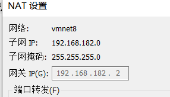

## 剩余时间完成下方题目，完成后截图

1. 创建用户student01，student02 ,student03,密码都是为1，3个用户要求如下

   - student01和student02加入students组中
   - student03不可以登录终端

   ```bash
   [root@localhost ~]# groupadd students
   [root@localhost ~]# useradd student01 -G students
   [root@localhost ~]# useradd student02 -G students
   [root@localhost ~]# useradd -s /sbin/nologin student03
   [root@localhost ~]# passwd student01
   Changing password for user student01.
   New password: 
   BAD PASSWORD: The password is a palindrome
   Retype new password: 
   passwd: all authentication tokens updated successfully.
   [root@localhost ~]# passwd student02
   Changing password for user student02.
   New password: 
   BAD PASSWORD: The password is a palindrome
   Retype new password: 
   passwd: all authentication tokens updated successfully.
   [root@localhost ~]# passwd student03
   Changing password for user student03.
   New password: 
   BAD PASSWORD: The password is a palindrome
   Retype new password: 
   passwd: all authentication tokens updated successfully.
   
   # 验证
   [root@localhost ~]# tail -n 3 /etc/passwd
   student01:x:1002:1003::/home/student01:/bin/bash
   student02:x:1003:1004::/home/student02:/bin/bash
   student03:x:1004:1005::/home/student03:/sbin/nologin
   [root@localhost ~]# id student01
   uid=1002(student01) gid=1003(student01) groups=1003(student01),1002(students)
   
   [root@localhost ~]# id student02
   uid=1003(student02) gid=1004(student02) groups=1004(student02),1002(students)
   
   ```

   

2. 在/opt目录下创建目录dirA,要求如下

   - dirA的文件所有者为root用户，rwx权限
   - dirA的文件所属组为student01组，具有读和执行权限，没有写的权限
   - 该目录下创建的文件的所属组会自动继承student01组
   - 其他用户没有任何权限，但是student02可以对dirA目录具有rw权限

   ```bash
   [root@localhost ~]# mkdir /opt/dirA
   [root@localhost ~]# ls -ld /opt/dirA/
   drwxr-xr-x. 2 root root 6 Jul 22 16:03 /opt/dirA/
   [root@localhost ~]# chown :student01 /opt/dirA/
   [root@localhost ~]# chmod o-rx /opt/dirA/
   [root@localhost ~]# chmod g+s /opt/dirA/
   [root@localhost ~]# setfacl -m u:student02:rw /opt/dirA/
   [root@localhost ~]# ls -ld /opt/dirA/
   drwxrws---+ 2 root student01 6 Jul 22 16:03 /opt/dirA/
   [root@localhost ~]# getfacl /opt/dirA/
   getfacl: Removing leading '/' from absolute path names
   # file: opt/dirA/
   # owner: root
   # group: student01
   # flags: -s-
   user::rwx
   user:student02:rw-
   group::r-x
   mask::rwx
   other::---
   
   ```

   

3. 修改系统的ip地址为 192.168.X.100 ，剩余配置根据当前环境自行设置，要求配置完毕后，可以访问外网。

首先查看自己的网关，子网，掩码等信息

vm上方点击编辑---->虚拟网络编辑器----->nat模式---->nat设置



```bash
# 查看当前使用的网络连接为ens160
[root@localhost ~]# nmcli connection show 
NAME         UUID                                  TYPE      DEVICE  >
ens160       c9c4dba3-1603-4f99-969c-56bc9f60da7f  ethernet  ens160  >
cni-podman0  e4a0b411-8128-4a40-9aff-188f8f484cd7  bridge    cni-podm>

# 修改为静态连接一级对应的ip地址
[root@localhost ~]# nmcli connection modify ens160 autoconnect yes ipv4.method manual ipv4.addresses 192.168.182.100/24 ipv4.gateway 192.168.182.2 ipv4.dns 114.114.114.114
[root@localhost ~]# nmcli connection up ens160 
Connection successfully activated (D-Bus active path: /org/freedesktop/NetworkManager/ActiveConnection/5)
[root@localhost ~]# ifconfig 
cni-podman0: flags=4163<UP,BROADCAST,RUNNING,MULTICAST>  mtu 1500
        inet 10.88.0.1  netmask 255.255.0.0  broadcast 10.88.255.255
        inet6 fe80::88fc:5dff:fe0e:10f3  prefixlen 64  scopeid 0x20<link>
        ether 8a:fc:5d:0e:10:f3  txqueuelen 1000  (Ethernet)
        RX packets 16  bytes 944 (944.0 B)
        RX errors 0  dropped 0  overruns 0  frame 0
        TX packets 54  bytes 6320 (6.1 KiB)
        TX errors 0  dropped 0 overruns 0  carrier 0  collisions 0

ens160: flags=4163<UP,BROADCAST,RUNNING,MULTICAST>  mtu 1500
        inet 192.168.182.100  netmask 255.255.255.0  broadcast 192.168.182.255
        inet6 fe80::20c:29ff:fe28:b02e  prefixlen 64  scopeid 0x20<link>
        ether 00:0c:29:28:b0:2e  txqueuelen 1000  (Ethernet)
        RX packets 385  bytes 61633 (60.1 KiB)
        RX errors 0  dropped 0  overruns 0  frame 0
        TX packets 303  bytes 29484 (28.7 KiB)
        TX errors 0  dropped 0 overruns 0  carrier 0  collisions 0

lo: flags=73<UP,LOOPBACK,RUNNING>  mtu 65536
        inet 127.0.0.1  netmask 255.0.0.0
        inet6 ::1  prefixlen 128  scopeid 0x10<host>
        loop  txqueuelen 1000  (Local Loopback)
        RX packets 12  bytes 936 (936.0 B)
        RX errors 0  dropped 0  overruns 0  frame 0
        TX packets 12  bytes 936 (936.0 B)
        TX errors 0  dropped 0 overruns 0  carrier 0  collisions 0

veth466f74d2: flags=4163<UP,BROADCAST,RUNNING,MULTICAST>  mtu 1500
        inet6 fe80::544f:78ff:fe0e:5841  prefixlen 64  scopeid 0x20<link>
        ether 56:4f:78:0e:58:41  txqueuelen 0  (Ethernet)
        RX packets 17  bytes 1258 (1.2 KiB)
        RX errors 0  dropped 0  overruns 0  frame 0
        TX packets 95  bytes 10593 (10.3 KiB)
        TX errors 0  dropped 0 overruns 0  carrier 0  collisions 0

virbr0: flags=4099<UP,BROADCAST,MULTICAST>  mtu 1500
        inet 192.168.122.1  netmask 255.255.255.0  broadcast 192.168.122.255
        ether 52:54:00:43:d9:bd  txqueuelen 1000  (Ethernet)
        RX packets 0  bytes 0 (0.0 B)
        RX errors 0  dropped 0  overruns 0  frame 0
        TX packets 0  bytes 0 (0.0 B)
        TX errors 0  dropped 0 overruns 0  carrier 0  collisions 0

[root@localhost ~]# ping www.baidu.com
PING www.a.shifen.com (180.101.49.11) 56(84) bytes of data.
64 bytes from 180.101.49.11 (180.101.49.11): icmp_seq=1 ttl=128 time=9.94 ms
64 bytes from 180.101.49.11 (180.101.49.11): icmp_seq=2 ttl=128 time=9.17 ms
64 bytes from 180.101.49.11 (180.101.49.11): icmp_seq=3 ttl=128 time=9.55 ms
^C
--- www.a.shifen.com ping statistics ---
3 packets transmitted, 3 received, 0% packet loss, time 11021ms
rtt min/avg/max/mdev = 9.169/9.553/9.938/0.313 ms

```

